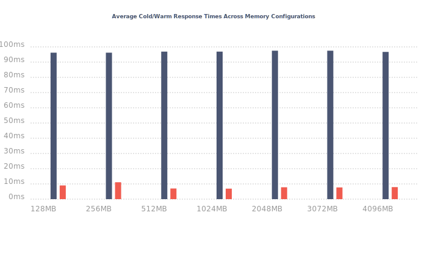
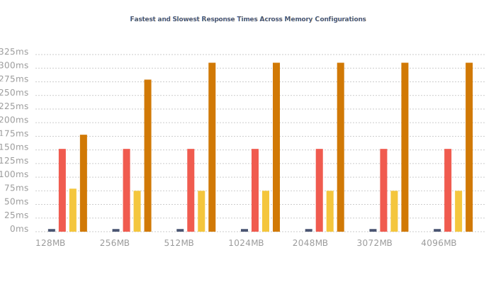

# Benchmark: Response Times

The following are the response time results from AWS XRay, generated after running `npm run benchmark`.

- 🔵: Average cold startup times
- 🔴: Average warm startup times

- 🔵: Fastest warm response time
- 🔴: Slowest warm response time
- 🟡: Fastest cold response time
- 🟠: Slowest cold response time

## Overview

  
- [Results for 128 MB](#results-for-128-mb)
- [Results for 256 MB](#results-for-256-mb)
- [Results for 512 MB](#results-for-512-mb)
- [Results for 1024 MB](#results-for-1024-mb)
- [Results for 2048 MB](#results-for-2048-mb)
- [Results for 3072 MB](#results-for-3072-mb)
- [Results for 4096 MB](#results-for-4096-mb)

## Results for 128 MB

| Measurement (128 MB) | Time (ms) |
|-------------|------|
| Average warm start response time | 6.9 ms |
| Average cold start response time | 96.4 ms |
| Fastest warm response time | 4.9 ms |
| Slowest warm response time | 20.9 ms |
| Fastest cold response time  | 77 ms |
| Slowest cold response time | 209 ms |
  

| Response time | Initialization | Invocation | Overhead | Cold/ Warm Start | Memory Size | Trace ID |
|---------------|----------------|------------|----------|------------------|-------------|----------|
| 5 ms |  | 0.3 ms | 0.1 ms | 🥵 | 128 MB | 1-5ff10963-2adebe350c5e03697912d0dd |
| 6 ms |  | 0.3 ms | 0.1 ms | 🥵 | 128 MB | 1-5ff1096b-5303f83333e51ae918bac1b7 |
| 91 ms | 17.7 ms | 0.4 ms | 0 ms | 🥶 | 128 MB | 1-5ff10998-3fa381925b7b82105f246318 |
| 5.9 ms |  | 0.4 ms | 0.1 ms | 🥵 | 128 MB | 1-5ff109ab-690ed8d9352be3d32dcd34e8 |
| 93.9 ms | 17.5 ms | 0.6 ms | 0.3 ms | 🥶 | 128 MB | 1-5ff1097f-2c5baf4104b1477e6273fd33 |
| 6 ms |  | 0.4 ms | 0.1 ms | 🥵 | 128 MB | 1-5ff109b9-326380ea1616f97d6c08f893 |
| 77 ms | 18.5 ms | 0.4 ms | 0.3 ms | 🥶 | 128 MB | 1-5ff1093e-5b71118352815ee6783c3272 |
| 6.9 ms |  | 0.4 ms | 0.1 ms | 🥵 | 128 MB | 1-5ff1096c-6215967c14870d5b3672cb9b |
| 6 ms |  | 0.3 ms | 0.1 ms | 🥵 | 128 MB | 1-5ff10965-516d3d386e61ea0b16bc2bb9 |
| 9 ms |  | 0.4 ms | 0.1 ms | 🥵 | 128 MB | 1-5ff109ac-76dea7bd40fc5ce67a723c8d |
| 6.9 ms |  | 0.4 ms | 0.1 ms | 🥵 | 128 MB | 1-5ff10913-38ea0f30300147693d1218df |
| 114 ms | 26.2 ms | 0.7 ms | 0.5 ms | 🥶 | 128 MB | 1-5ff1094a-5604de6378a232e3577ee48b |
| 97.9 ms | 19.7 ms | 0.6 ms | 0.5 ms | 🥶 | 128 MB | 1-5ff10949-298c771a5f3a83af1535ff39 |
| 105.9 ms | 20.6 ms | 0.4 ms | 0.3 ms | 🥶 | 128 MB | 1-5ff10932-6617b41978971fc63409ef03 |
| 100 ms | 20.5 ms | 1 ms | 0.6 ms | 🥶 | 128 MB | 1-5ff10937-713b2e16640e1a7857f55053 |
| 13 ms |  | 0.3 ms | 0 ms | 🥵 | 128 MB | 1-5ff10964-3c99c7d3486be5d85c1d61c0 |
| 95 ms | 19.4 ms | 0.5 ms | 0.5 ms | 🥶 | 128 MB | 1-5ff10952-28e1d4ad135c648b429d1109 |
| 8 ms |  | 0.5 ms | 0 ms | 🥵 | 128 MB | 1-5ff1092f-35e1d8384529184500c149b1 |
| 106 ms | 19.2 ms | 0.7 ms | 0.4 ms | 🥶 | 128 MB | 1-5ff109a0-6c343ece7b65ea1e425cacb2 |
| 113.9 ms | 22 ms | 0.4 ms | 0.5 ms | 🥶 | 128 MB | 1-5ff10902-448127be2aee9cc1499d78a9 |
| 6.9 ms |  | 0.3 ms | 0.1 ms | 🥵 | 128 MB | 1-5ff1092e-2262c64d00ea2c0d433d3e54 |
| 6.9 ms |  | 0.4 ms | 0.1 ms | 🥵 | 128 MB | 1-5ff109b4-4326ad87059824b257d2a91b |
| 6.9 ms |  | 0.4 ms | 0.1 ms | 🥵 | 128 MB | 1-5ff1091a-724fa3561dc744185d7ed5da |
| 6.9 ms |  | 0.3 ms | 0.1 ms | 🥵 | 128 MB | 1-5ff10916-18bd00816c63fc2b72e7ccf8 |
| 108 ms | 20.7 ms | 0.7 ms | 0.3 ms | 🥶 | 128 MB | 1-5ff1098c-6fb1cd244e8cdde4251105f3 |
| 100.9 ms | 24.1 ms | 0.6 ms | 0.5 ms | 🥶 | 128 MB | 1-5ff10900-1d6b499701b9fe0c1773936b |
| 92 ms | 25.7 ms | 0.4 ms | 0.2 ms | 🥶 | 128 MB | 1-5ff10914-29097d694a9364b924768767 |
| 88.9 ms | 20.1 ms | 0.4 ms | 0.1 ms | 🥶 | 128 MB | 1-5ff109a5-6e5924be0237de9827d960ad |
| 8 ms |  | 0.4 ms | 0.1 ms | 🥵 | 128 MB | 1-5ff1091a-123fad1b612de0d01d2957e3 |
| 102.9 ms | 19.1 ms | 0.5 ms | 0.3 ms | 🥶 | 128 MB | 1-5ff10983-1c0dffcc6518ae8b0dea4e05 |
| 5 ms |  | 0.3 ms | 0 ms | 🥵 | 128 MB | 1-5ff10979-2627e9a0052c65f565e2af33 |
| 6 ms |  | 0.3 ms | 0 ms | 🥵 | 128 MB | 1-5ff10973-1213c6cc32a4658317918705 |
| 89.9 ms | 18 ms | 0.5 ms | 0.2 ms | 🥶 | 128 MB | 1-5ff109a3-6f1135bb71da4f591f2c937e |
| 98 ms | 19.5 ms | 0.4 ms | 0.3 ms | 🥶 | 128 MB | 1-5ff1099d-541e3d125f47099434528075 |
| 101.9 ms | 21.6 ms | 0.7 ms | 0.4 ms | 🥶 | 128 MB | 1-5ff10946-3d9e4359377801bd2f0449dc |
| 107 ms | 19.7 ms | 0.7 ms | 0.3 ms | 🥶 | 128 MB | 1-5ff1097c-1c879cb237b538816843d97c |
| 13 ms |  | 0.7 ms | 0.4 ms | 🥵 | 128 MB | 1-5ff10915-3367a42504023bb42307a67b |
| 169 ms | 18.4 ms | 1 ms | 0.2 ms | 🥶 | 128 MB | 1-5ff1094e-098b34a1085a5ac55a66dbd4 |
| 88.9 ms | 18.3 ms | 0.5 ms | 0.4 ms | 🥶 | 128 MB | 1-5ff109a3-05edcf153ff98acb074a7812 |
| 6.9 ms |  | 0.4 ms | 0.1 ms | 🥵 | 128 MB | 1-5ff109c0-758b4d1d3481400d2f910d39 |
| 88 ms | 21.7 ms | 0.4 ms | 0.3 ms | 🥶 | 128 MB | 1-5ff10983-10ed0b8d4dfefb4b00b7ef35 |
| 92 ms | 18.8 ms | 0.5 ms | 0.3 ms | 🥶 | 128 MB | 1-5ff10907-205c051920f58693737e4b15 |
| 117 ms | 18 ms | 0.4 ms | 0.2 ms | 🥶 | 128 MB | 1-5ff10953-579bcaf96ae36e98395ce91d |
| 6 ms |  | 0.3 ms | 0.3 ms | 🥵 | 128 MB | 1-5ff109aa-7efc2d853f5ee4ce27f296f4 |
| 6 ms |  | 0.3 ms | 0.1 ms | 🥵 | 128 MB | 1-5ff109af-54b1435d1295d96860d2e2de |
| 6.9 ms |  | 0.4 ms | 0.1 ms | 🥵 | 128 MB | 1-5ff10970-6205ed772ce5770d0bdc937b |
| 6 ms |  | 0.4 ms | 0.1 ms | 🥵 | 128 MB | 1-5ff10967-624ae82a6c1003a75f3912ab |
| 14 ms |  | 0.4 ms | 0.1 ms | 🥵 | 128 MB | 1-5ff10928-3e3f979d1bc231f330434f89 |
| 111.9 ms | 19.8 ms | 0.4 ms | 0.3 ms | 🥶 | 128 MB | 1-5ff1095b-4d850ac4649cd07f669f1d26 |
| 78.9 ms | 16.9 ms | 0.5 ms | 0.2 ms | 🥶 | 128 MB | 1-5ff1093c-136b4e7229c762e075027235 |
| 98 ms | 20.1 ms | 0.6 ms | 0.2 ms | 🥶 | 128 MB | 1-5ff1098e-5f1ed16a787e98897148b2fa |
| 6 ms |  | 0.5 ms | 0.1 ms | 🥵 | 128 MB | 1-5ff109b7-4f50aff1719d682a5cd9ee9d |
| 89.9 ms | 20.9 ms | 0.6 ms | 0.5 ms | 🥶 | 128 MB | 1-5ff10954-33de7be06c067ff62ae7626f |
| 98.9 ms | 19.2 ms | 0.4 ms | 0 ms | 🥶 | 128 MB | 1-5ff1094c-7b7233435792b3f50aa2f359 |
| 5.9 ms |  | 0.3 ms | 0.1 ms | 🥵 | 128 MB | 1-5ff109af-53218b1c43b06d6279e31ea4 |
| 6.9 ms |  | 0.3 ms | 0.3 ms | 🥵 | 128 MB | 1-5ff10919-6eb32d8c016533321a9c9e47 |
| 6.9 ms |  | 0.4 ms | 0 ms | 🥵 | 128 MB | 1-5ff10920-7731e06e150b571d575dc590 |
| 6.9 ms |  | 0.4 ms | 0.1 ms | 🥵 | 128 MB | 1-5ff10915-59a8de05266e20670afa9840 |
| 7 ms |  | 0.3 ms | 0 ms | 🥵 | 128 MB | 1-5ff10971-5c1a2e71021715de6295ed36 |
| 6.9 ms |  | 0.4 ms | 0.1 ms | 🥵 | 128 MB | 1-5ff10929-07e1ed45121698377a916180 |
| 8 ms |  | 0.3 ms | 0.1 ms | 🥵 | 128 MB | 1-5ff10917-3eabda60648dd3b72903fbc0 |
| 95.9 ms | 25.9 ms | 0.4 ms | 0.3 ms | 🥶 | 128 MB | 1-5ff1090f-50dddda31ff5d48565ca7a48 |
| 4.9 ms |  | 0.4 ms | 0 ms | 🥵 | 128 MB | 1-5ff1096e-1fa8db9954c4a0fd7c8496ce |
| 105 ms | 19.5 ms | 0.7 ms | 0.6 ms | 🥶 | 128 MB | 1-5ff10984-108504955d48c5ea68c379a5 |
| 7.9 ms |  | 0.3 ms | 0.1 ms | 🥵 | 128 MB | 1-5ff10925-1321a3c30c4dd7935b4cb9e1 |
| 5 ms |  | 0.4 ms | 0.1 ms | 🥵 | 128 MB | 1-5ff109bd-409304a360825d761b3e4508 |
| 7 ms |  | 0.4 ms | 0.1 ms | 🥵 | 128 MB | 1-5ff109bb-3a9875fd041f0a1278c67aa7 |
| 98 ms | 18.9 ms | 0.5 ms | 0.4 ms | 🥶 | 128 MB | 1-5ff1090d-3ffd2b2279f69b192827e622 |
| 101.9 ms | 19.6 ms | 0.6 ms | 0.2 ms | 🥶 | 128 MB | 1-5ff1093e-70308be0283c45c219b69481 |
| 8 ms |  | 0.3 ms | 0 ms | 🥵 | 128 MB | 1-5ff10918-7790b59d0735c6e703e0b892 |
| 102.9 ms | 20.6 ms | 0.7 ms | 0.5 ms | 🥶 | 128 MB | 1-5ff10981-58af2a09780d88aa6e26c2d4 |
| 84 ms | 19.9 ms | 0.9 ms | 0.4 ms | 🥶 | 128 MB | 1-5ff10989-099957752e8c020d359013a5 |
| 6 ms |  | 0.4 ms | 0.2 ms | 🥵 | 128 MB | 1-5ff109a8-4690d3b95f2ded64586a7768 |
| 117 ms | 20.5 ms | 0.6 ms | 0.3 ms | 🥶 | 128 MB | 1-5ff1094f-618009e2271c0a984d550053 |
| 99.9 ms | 18.2 ms | 0.6 ms | 0.4 ms | 🥶 | 128 MB | 1-5ff1095a-4076c79c5a25327163ffc80d |
| 94 ms | 17.5 ms | 0.6 ms | 0.2 ms | 🥶 | 128 MB | 1-5ff10995-33fabf1962c4372d395670a3 |
| 6 ms |  | 0.4 ms | 0.1 ms | 🥵 | 128 MB | 1-5ff109ac-0d1858302ca5ea1d0f5831ca |
| 6 ms |  | 0.6 ms | 0.1 ms | 🥵 | 128 MB | 1-5ff109b5-25a34bd2380fc4ae4a1fbd75 |
| 116.9 ms | 18.5 ms | 0.5 ms | 0.2 ms | 🥶 | 128 MB | 1-5ff10936-4ce1f5496dea641f752377a7 |
| 6.9 ms |  | 0.4 ms | 0.1 ms | 🥵 | 128 MB | 1-5ff1096b-4cf4a52f30ad5e0a323ea396 |
| 8 ms |  | 0.3 ms | 0.1 ms | 🥵 | 128 MB | 1-5ff10912-1fe79dfc3072a00d1b357aaa |
| 6.9 ms |  | 0.3 ms | 0 ms | 🥵 | 128 MB | 1-5ff10973-7033ca25053620a2499c88ae |
| 9 ms |  | 0.3 ms | 0.1 ms | 🥵 | 128 MB | 1-5ff109ae-32c4ce640295b4b40680580b |
| 6.9 ms |  | 0.3 ms | 0 ms | 🥵 | 128 MB | 1-5ff10968-21b9eed45d40756270f65780 |
| 6.9 ms |  | 0.3 ms | 0.1 ms | 🥵 | 128 MB | 1-5ff10929-186fae224aa46ac2361fcd90 |
| 5 ms |  | 0.3 ms | 0 ms | 🥵 | 128 MB | 1-5ff10978-0150011c162873a97dc07b95 |
| 92.9 ms | 20.6 ms | 0.8 ms | 0.1 ms | 🥶 | 128 MB | 1-5ff10944-1573233136ecab2b130f1fd0 |
| 6.9 ms |  | 0.3 ms | 0.1 ms | 🥵 | 128 MB | 1-5ff1091b-088807cb7c9a1fab5a24d52b |
| 6.9 ms |  | 0.4 ms | 0.1 ms | 🥵 | 128 MB | 1-5ff10972-1d533a91383f0e79533dceda |
| 6.9 ms |  | 0.5 ms | 0 ms | 🥵 | 128 MB | 1-5ff10922-1f217b370c3a911e7ccc4646 |
| 7 ms |  | 0.3 ms | 0.1 ms | 🥵 | 128 MB | 1-5ff10977-3cc45a5c213d48297400c2df |
| 94 ms | 24.9 ms | 0.8 ms | 0.3 ms | 🥶 | 128 MB | 1-5ff1090c-3d2aed91439e93b076c39c5f |
| 6 ms |  | 0.3 ms | 0 ms | 🥵 | 128 MB | 1-5ff109b4-2d7b19a61d9c35045a111b57 |
| 4.9 ms |  | 0.3 ms | 0.1 ms | 🥵 | 128 MB | 1-5ff10979-4a417c1604d6a1c037301a93 |
| 6 ms |  | 0.3 ms | 0.1 ms | 🥵 | 128 MB | 1-5ff1095f-67edf3b84e49662c0ad26124 |
| 6 ms |  | 0.3 ms | 0.1 ms | 🥵 | 128 MB | 1-5ff109a8-1f6b2e6843f797936810b809 |
| 7 ms |  | 0.3 ms | 0 ms | 🥵 | 128 MB | 1-5ff1097a-113bbd1c25295244126f78ea |
| 95.9 ms | 26.8 ms | 0.6 ms | 0.1 ms | 🥶 | 128 MB | 1-5ff10905-398a969a2c281b5408c1765a |
| 108 ms | 18.8 ms | 0.3 ms | 0.1 ms | 🥶 | 128 MB | 1-5ff10904-15aa1e2c416435e937dc1725 |
| 5 ms |  | 0.3 ms | 0 ms | 🥵 | 128 MB | 1-5ff1096d-2cb8c1315f7ab83b6f3c68f9 |
| 101.9 ms | 19.4 ms | 0.8 ms | 0.6 ms | 🥶 | 128 MB | 1-5ff10987-74d83fa0066f80e208b6ee83 |
| 7 ms |  | 0.4 ms | 0.1 ms | 🥵 | 128 MB | 1-5ff109c2-1c4a6bd40ebab4e34b010afc |
| 6.9 ms |  | 0.3 ms | 0.1 ms | 🥵 | 128 MB | 1-5ff109c2-0f82edb932a41e316eee0e27 |
| 95.9 ms | 17.4 ms | 0.6 ms | 0.1 ms | 🥶 | 128 MB | 1-5ff10911-38d8737d2957fe337663af0d |
| 7 ms |  | 0.3 ms | 0 ms | 🥵 | 128 MB | 1-5ff10967-09ed12af4abe4f16469ac3f2 |
| 6.9 ms |  | 0.4 ms | 0.1 ms | 🥵 | 128 MB | 1-5ff109bc-3a5bd53176d2844f2654b29e |
| 7.9 ms |  | 0.3 ms | 0.1 ms | 🥵 | 128 MB | 1-5ff10926-36e0820b084a4c6d6d0d7883 |
| 93 ms | 20.1 ms | 0.8 ms | 0.2 ms | 🥶 | 128 MB | 1-5ff1099f-477e572c62ca3b1c78255bde |
| 95 ms | 17.6 ms | 0.4 ms | 0.2 ms | 🥶 | 128 MB | 1-5ff10909-5a4fae98710036326a415b91 |
| 5.9 ms |  | 0.3 ms | 0.1 ms | 🥵 | 128 MB | 1-5ff109b7-77b1d7db359e031c5bb9e0da |
| 7.9 ms |  | 0.3 ms | 0 ms | 🥵 | 128 MB | 1-5ff10925-44f7a50e277f85ec2ab2e1c3 |
| 108 ms | 17.6 ms | 0.6 ms | 0.5 ms | 🥶 | 128 MB | 1-5ff10941-42af695e54940c5b754ad75e |
| 111 ms | 28 ms | 0.7 ms | 0.6 ms | 🥶 | 128 MB | 1-5ff10906-6026abf47824d3ce0d3bcac6 |
| 20.9 ms |  | 0.3 ms | 0.1 ms | 🥵 | 128 MB | 1-5ff10923-6c3014c45e554470391a70ba |
| 8 ms |  | 0.5 ms | 0 ms | 🥵 | 128 MB | 1-5ff1092c-3187c5af23f977a34044c8a8 |
| 114 ms | 19.6 ms | 0.6 ms | 0.1 ms | 🥶 | 128 MB | 1-5ff10982-574331b32a335aa9368c619d |
| 6.9 ms |  | 0.3 ms | 0.1 ms | 🥵 | 128 MB | 1-5ff109bd-32bb93a934287b4b7fdc013f |
| 6.9 ms |  | 0.3 ms | 0.1 ms | 🥵 | 128 MB | 1-5ff109c0-2c642a1e03317dfc43fdeac0 |
| 6.9 ms |  | 0.4 ms | 0.1 ms | 🥵 | 128 MB | 1-5ff109ad-4bd08b263c5f02e63c75bd76 |
| 7.9 ms |  | 0.3 ms | 0.1 ms | 🥵 | 128 MB | 1-5ff1092c-282ac3b73a5bcaa13ab638d2 |
| 89.9 ms | 18.3 ms | 0.3 ms | 0.2 ms | 🥶 | 128 MB | 1-5ff10950-2b8c10d2080ea9054aa71f85 |
| 6 ms |  | 0.3 ms | 0.2 ms | 🥵 | 128 MB | 1-5ff109a9-2577d073736dbaee5e1c91aa |
| 118 ms | 19.8 ms | 0.5 ms | 0.3 ms | 🥶 | 128 MB | 1-5ff10937-0d55ad2a2e25cc700da9c544 |
| 5 ms |  | 0.3 ms | 0.1 ms | 🥵 | 128 MB | 1-5ff109b3-71f6b1a4453e966a4b9f5431 |
| 111.9 ms | 17.1 ms | 0.6 ms | 0.3 ms | 🥶 | 128 MB | 1-5ff1095a-51dd695e2c36ae0a56268008 |
| 6 ms |  | 0.3 ms | 0 ms | 🥵 | 128 MB | 1-5ff1091f-15a86146631e17bd1217ff8d |
| 101.9 ms | 20.2 ms | 0.7 ms | 0.4 ms | 🥶 | 128 MB | 1-5ff1098f-0bc231814119aa5b29ef05d5 |
| 6.9 ms |  | 0.4 ms | 0.1 ms | 🥵 | 128 MB | 1-5ff10975-0d21201d37ab678430d02493 |
| 8 ms |  | 0.4 ms | 0 ms | 🥵 | 128 MB | 1-5ff10921-1ac607db1085a0ee347a3831 |
| 102.9 ms | 19.3 ms | 0.4 ms | 0.1 ms | 🥶 | 128 MB | 1-5ff10980-453836041156fd767f0486da |
| 84 ms | 19.4 ms | 0.7 ms | 0.1 ms | 🥶 | 128 MB | 1-5ff1095c-630e12464207f46277a577cb |
| 8 ms |  | 0.3 ms | 0.1 ms | 🥵 | 128 MB | 1-5ff10971-57fe173e307786086c67c76a |
| 209 ms | 45.8 ms | 29.2 ms | 1 ms | 🥶 | 128 MB | 1-5ff10940-5248d8b2440a52d036d4dab3 |
| 5.9 ms |  | 0.3 ms | 0.2 ms | 🥵 | 128 MB | 1-5ff10966-265ddb845480cd5005f1fc50 |
| 4.9 ms |  | 0.3 ms | 0.1 ms | 🥵 | 128 MB | 1-5ff1096a-0523491e686139b9137779f0 |
| 98.9 ms | 19.3 ms | 0.4 ms | 0.2 ms | 🥶 | 128 MB | 1-5ff10985-4446c58a1684a09b29a595f0 |
| 107.9 ms | 19.2 ms | 0.7 ms | 0.8 ms | 🥶 | 128 MB | 1-5ff109a2-552918513671c3660a4857e5 |
| 5.9 ms |  | 0.4 ms | 0 ms | 🥵 | 128 MB | 1-5ff10968-53910f8b32f738c800e6636d |
| 6.9 ms |  | 0.3 ms | 0 ms | 🥵 | 128 MB | 1-5ff10920-298433b971f9226c601a959e |
| 138 ms | 19.5 ms | 0.5 ms | 0.3 ms | 🥶 | 128 MB | 1-5ff109a1-63cb23c92a61b3c34e561ace |
| 110.9 ms | 17.7 ms | 0.5 ms | 0.2 ms | 🥶 | 128 MB | 1-5ff10957-44ecf5250c4b522e57127f7c |
| 6 ms |  | 0.6 ms | 0.1 ms | 🥵 | 128 MB | 1-5ff10978-0db1c94c7100a8004e3afc95 |
| 92 ms | 22.7 ms | 0.3 ms | 0.3 ms | 🥶 | 128 MB | 1-5ff10999-58f01cf60f189ec769c493cc |
| 85 ms | 17.1 ms | 0.5 ms | 0.4 ms | 🥶 | 128 MB | 1-5ff10959-008aa6040aac50603f2f6c38 |
| 96 ms | 27.6 ms | 0.6 ms | 0.2 ms | 🥶 | 128 MB | 1-5ff1090d-7b5b87181ada8c59579621e7 |
| 7.9 ms |  | 0.3 ms | 0.1 ms | 🥵 | 128 MB | 1-5ff10913-05271e9c3074d0671542c89a |
| 6.9 ms |  | 0.4 ms | 0.1 ms | 🥵 | 128 MB | 1-5ff109ba-619c5c710c832a8b15eaa1bf |
| 8 ms |  | 0.3 ms | 0.1 ms | 🥵 | 128 MB | 1-5ff10923-4aa1a61f34e1804e4a95cdc4 |
| 90.9 ms | 18.2 ms | 0.4 ms | 0.5 ms | 🥶 | 128 MB | 1-5ff1099b-6c24c7007acdb4131086f188 |
| 7 ms |  | 0.3 ms | 0.1 ms | 🥵 | 128 MB | 1-5ff10924-1f836c2449cb8d89193e223d |
| 98.9 ms | 20.1 ms | 0.5 ms | 0.3 ms | 🥶 | 128 MB | 1-5ff10955-224d60b90ccd6f9b734c8fe7 |
| 5.9 ms |  | 0.4 ms | 0 ms | 🥵 | 128 MB | 1-5ff1095f-1849bf393d471b1265f1e767 |
| 6.9 ms |  | 0.4 ms | 0.1 ms | 🥵 | 128 MB | 1-5ff109b9-70f907325168870b07b65ecd |
| 101.9 ms | 26.3 ms | 0.4 ms | 0.2 ms | 🥶 | 128 MB | 1-5ff1090e-1963e65b3d8533d60cd1915d |
| 8 ms |  | 0.3 ms | 0 ms | 🥵 | 128 MB | 1-5ff1091d-50346198237d354019a0dcea |
| 101.9 ms | 25.5 ms | 0.5 ms | 0.2 ms | 🥶 | 128 MB | 1-5ff10908-74f126511ff781422a223776 |
| 5.9 ms |  | 0.4 ms | 0.1 ms | 🥵 | 128 MB | 1-5ff109c1-250c01c50c34d74e0554b93b |
| 82 ms | 17.6 ms | 0.6 ms | 0.2 ms | 🥶 | 128 MB | 1-5ff10935-172770f80fcd266542edc6a5 |
| 122.9 ms | 22.8 ms | 0.7 ms | 0.2 ms | 🥶 | 128 MB | 1-5ff10931-6183ed1b6fb344ed1df249ea |
| 6.9 ms |  | 0.4 ms | 0.1 ms | 🥵 | 128 MB | 1-5ff1091d-15ca68a04f6fd82f277ee98d |
| 95.9 ms | 19.4 ms | 0.3 ms | 0.1 ms | 🥶 | 128 MB | 1-5ff10988-798f7fbc3a9d45e740e5e4eb |
| 13.9 ms |  | 0.4 ms | 0.1 ms | 🥵 | 128 MB | 1-5ff10961-42a4e19179d0ea3f280664e1 |
| 6.9 ms |  | 0.3 ms | 0.1 ms | 🥵 | 128 MB | 1-5ff10918-698f009517058d6c6f093fde |
| 82.9 ms | 19.6 ms | 0.6 ms | 0.5 ms | 🥶 | 128 MB | 1-5ff10991-26eb941673adb6fc308a4e83 |
| 7.9 ms |  | 0.4 ms | 0.1 ms | 🥵 | 128 MB | 1-5ff109b0-545ed26177677c9b73eac693 |
| 89.9 ms | 21.4 ms | 0.7 ms | 0.1 ms | 🥶 | 128 MB | 1-5ff109a4-16ee85c937b2fe2028a6574e |
| 8 ms |  | 0.3 ms | 0.1 ms | 🥵 | 128 MB | 1-5ff10970-7535eee640cf3a220b9be19d |
| 8.9 ms |  | 0.4 ms | 0.1 ms | 🥵 | 128 MB | 1-5ff109a9-5a16f48d4631af38399f6a29 |
| 100 ms | 29 ms | 0.5 ms | 0.6 ms | 🥶 | 128 MB | 1-5ff10907-5c281ff255b3a1e50ca002bb |
| 7.9 ms |  | 0.4 ms | 0 ms | 🥵 | 128 MB | 1-5ff10928-33969f5303efa9dd7f523dcc |
| 94 ms | 19.1 ms | 0.5 ms | 0.3 ms | 🥶 | 128 MB | 1-5ff1099e-594f06286df6c16b61dbce10 |
| 6 ms |  | 0.4 ms | 0.2 ms | 🥵 | 128 MB | 1-5ff1095d-327bde047ec0cc3720ade0a2 |
| 6 ms |  | 0.3 ms | 0.1 ms | 🥵 | 128 MB | 1-5ff10969-0cbdc6c55f83966767af52e9 |
| 95.9 ms | 20.5 ms | 0.6 ms | 0.1 ms | 🥶 | 128 MB | 1-5ff10939-671b5e4838e5d1db1a71bb64 |
| 82 ms | 18.4 ms | 0.6 ms | 0.5 ms | 🥶 | 128 MB | 1-5ff10942-2c5511a666224f601b05940f |
| 6.9 ms |  | 0.4 ms | 0 ms | 🥵 | 128 MB | 1-5ff10962-5d61d3ec720b80c32c7293f7 |
| 97 ms | 21.7 ms | 1.5 ms | 0.2 ms | 🥶 | 128 MB | 1-5ff10954-162abb504cef85006833f4bf |
| 6.9 ms |  | 0.4 ms | 0.1 ms | 🥵 | 128 MB | 1-5ff109b2-12c602f416052b9f2ec2aa49 |
| 103.9 ms | 17.7 ms | 0.6 ms | 0.2 ms | 🥶 | 128 MB | 1-5ff10910-481747481aa6c5710bf1ab5c |
| 6.9 ms |  | 1 ms | 0.2 ms | 🥵 | 128 MB | 1-5ff109bf-54c8a6f61bc5912c0296c299 |
| 92 ms | 21 ms | 0.5 ms | 0.2 ms | 🥶 | 128 MB | 1-5ff10986-3cec7e0a414109083c009c6b |
| 92.9 ms | 17.7 ms | 0.5 ms | 0.4 ms | 🥶 | 128 MB | 1-5ff10958-33aa128474d22afd2a76aad2 |
| 95.9 ms | 19.8 ms | 1 ms | 0.3 ms | 🥶 | 128 MB | 1-5ff10996-44dd650852f2fd4d36b1d881 |
| 95 ms | 24.6 ms | 0.4 ms | 0.4 ms | 🥶 | 128 MB | 1-5ff1090a-045de7cd6848ef977177e7ed |
| 81 ms | 21.9 ms | 0.5 ms | 0.5 ms | 🥶 | 128 MB | 1-5ff10903-4cfd9f9954529f3306a67ffe |
| 4.9 ms |  | 0.3 ms | 0.1 ms | 🥵 | 128 MB | 1-5ff10962-00d9bb0249af83470b9fd426 |
| 7.9 ms |  | 0.3 ms | 0 ms | 🥵 | 128 MB | 1-5ff1091c-4d7c50dd33e249e71043bdd2 |
| 82 ms | 18.1 ms | 0.5 ms | 0.3 ms | 🥶 | 128 MB | 1-5ff1099c-013606c6505170555783a877 |
| 98.9 ms | 17.3 ms | 0.5 ms | 0.3 ms | 🥶 | 128 MB | 1-5ff10938-7047295b4c2a6e9178465796 |
| 6 ms |  | 0.4 ms | 0.1 ms | 🥵 | 128 MB | 1-5ff109ab-76c436ed1f8cf30e2b606f61 |
| 90 ms | 19.3 ms | 0.6 ms | 0.4 ms | 🥶 | 128 MB | 1-5ff10990-13805a286b7b47580bdca123 |
| 6.9 ms |  | 0.4 ms | 0.1 ms | 🥵 | 128 MB | 1-5ff10921-0f207cfd5805b7025940f63e |
| 107 ms | 22.1 ms | 0.6 ms | 0.3 ms | 🥶 | 128 MB | 1-5ff1093f-31bfc86d7ed379507a8878d1 |
| 104 ms | 19.1 ms | 0.5 ms | 0.3 ms | 🥶 | 128 MB | 1-5ff10933-6d9cf9cc2277548a41dbdfdb |
| 6.9 ms |  | 0.3 ms | 0.1 ms | 🥵 | 128 MB | 1-5ff10927-6ac9cb3b32ef7d1d19010f86 |
| 5 ms |  | 0.3 ms | 0.1 ms | 🥵 | 128 MB | 1-5ff10974-44f9e18c339422202d887390 |
| 89.9 ms | 17.9 ms | 0.5 ms | 0.1 ms | 🥶 | 128 MB | 1-5ff10989-0587fb703062bedc1e8bbb11 |
| 109.9 ms | 20.4 ms | 0.5 ms | 0.2 ms | 🥶 | 128 MB | 1-5ff10994-6b1374004facb33b1abc8f06 |
| 6.9 ms |  | 0.4 ms | 0 ms | 🥵 | 128 MB | 1-5ff1092f-2c6bd5cd55cf0019260265ba |
| 6.9 ms |  | 0.4 ms | 0.1 ms | 🥵 | 128 MB | 1-5ff109b8-5e39eaa0598daf1b586db9cf |
| 7.9 ms |  | 0.4 ms | 0.1 ms | 🥵 | 128 MB | 1-5ff1091e-61055ca76559d87f2dc6d3f4 |
| 4.9 ms |  | 0.3 ms | 0.1 ms | 🥵 | 128 MB | 1-5ff109b5-5e973d6a76c819362ccebfdb |
| 4.9 ms |  | 0.4 ms | 0.2 ms | 🥵 | 128 MB | 1-5ff1096f-54423b840a1acf7c651fec59 |
| 83.9 ms | 19.4 ms | 1.5 ms | 0.2 ms | 🥶 | 128 MB | 1-5ff109a7-236239221d797e650cffaa75 |
| 6.9 ms |  | 0.4 ms | 0.1 ms | 🥵 | 128 MB | 1-5ff1097b-02a7ee16454f84b74179ee7e |
| 112.9 ms | 20 ms | 0.7 ms | 0.3 ms | 🥶 | 128 MB | 1-5ff1098d-61a580773256544112cedfca |
| 108.9 ms | 23.6 ms | 0.5 ms | 0.4 ms | 🥶 | 128 MB | 1-5ff10945-4eba038254f968d54355bf85 |
| 6.9 ms |  | 0.4 ms | 0.1 ms | 🥵 | 128 MB | 1-5ff10926-0f54b8530396cdd15bbfb3af |
| 85 ms | 17.5 ms | 0.5 ms | 0.3 ms | 🥶 | 128 MB | 1-5ff1097e-41099c9a479f3a1b69d4da1b |
| 88.9 ms | 19.3 ms | 0.6 ms | 0.6 ms | 🥶 | 128 MB | 1-5ff10934-5c138288133c7b5604bd5437 |
| 5.9 ms |  | 0.5 ms | 0.1 ms | 🥵 | 128 MB | 1-5ff1096e-66555d715d95eee215c96ca0 |
| 95 ms | 18.6 ms | 0.6 ms | 0.2 ms | 🥶 | 128 MB | 1-5ff10948-1bc2780406cd18973d83cf7a |
| 6 ms |  | 0.3 ms | 0.1 ms | 🥵 | 128 MB | 1-5ff10961-39b265b36645fb637cda2580 |
| 123 ms | 21.2 ms | 0.6 ms | 0.2 ms | 🥶 | 128 MB | 1-5ff10943-642c823d3e08d9fe72547064 |
| 105 ms | 17.9 ms | 0.7 ms | 0.4 ms | 🥶 | 128 MB | 1-5ff1097d-06ee501a24fc834d1dbb08f5 |
| 5 ms |  | 0.4 ms | 0.1 ms | 🥵 | 128 MB | 1-5ff109ba-112c22fd6a9721560720b191 |
| 7 ms |  | 0.3 ms | 0.1 ms | 🥵 | 128 MB | 1-5ff109bf-2db56c2861eec8e00787c277 |
| 85 ms | 17.9 ms | 0.6 ms | 0.2 ms | 🥶 | 128 MB | 1-5ff10947-738a688c046e781a7a35cfac |
| 6.9 ms |  | 0.3 ms | 0.1 ms | 🥵 | 128 MB | 1-5ff109ae-5dce9bd16a066ae81392df0b |
| 136.9 ms | 19.6 ms | 0.6 ms | 0.3 ms | 🥶 | 128 MB | 1-5ff10997-1e0208fa684ba9347cf0b5ec |
| 93.9 ms | 18 ms | 0.5 ms | 0.3 ms | 🥶 | 128 MB | 1-5ff1093d-74cd61937d1691b72b71cb32 |
| 8.9 ms |  | 0.4 ms | 0.1 ms | 🥵 | 128 MB | 1-5ff109b1-65c1e75f5a5f03f80f76519a |
| 86.9 ms | 20.5 ms | 0.5 ms | 0.1 ms | 🥶 | 128 MB | 1-5ff1093a-299ee66d6e2054ab41d7b6a3 |
| 81 ms | 19.4 ms | 0.5 ms | 0.4 ms | 🥶 | 128 MB | 1-5ff109a6-602aaf5526e04dde483a9c4c |
| 9 ms |  | 0.3 ms | 0.1 ms | 🥵 | 128 MB | 1-5ff1092b-2ee7232b1f67672a1c35c695 |
| 7.9 ms |  | 0.3 ms | 0.1 ms | 🥵 | 128 MB | 1-5ff10917-3a1c72130e9d609056f0535c |
| 91 ms | 21.3 ms | 0.4 ms | 0.1 ms | 🥶 | 128 MB | 1-5ff1094d-6e2ebbe26e0e9b0847b3821b |
| 98 ms | 17.6 ms | 0.4 ms | 0 ms | 🥶 | 128 MB | 1-5ff1098a-2c7a5ed35091c90d28b804f5 |
| 6.9 ms |  | 0.3 ms | 0.1 ms | 🥵 | 128 MB | 1-5ff1092a-11d02cde678ee4ec4f8460fe |
| 98 ms | 17.8 ms | 0.4 ms | 0.3 ms | 🥶 | 128 MB | 1-5ff10901-5570d0927bf4e6cf20c358a7 |
| 6.9 ms |  | 0.3 ms | 0.1 ms | 🥵 | 128 MB | 1-5ff10976-494c1721716a50323f60d9d9 |
| 5 ms |  | 0.3 ms | 0.1 ms | 🥵 | 128 MB | 1-5ff10964-44f3814e2468964852555318 |
| 4.9 ms |  | 0.3 ms | 0.1 ms | 🥵 | 128 MB | 1-5ff1096d-1fc63568385e38fb0a8305d5 |
| 98.9 ms | 17.5 ms | 0.7 ms | 0.2 ms | 🥶 | 128 MB | 1-5ff10990-101355c8216c27635fddb8fe |
| 6 ms |  | 0.4 ms | 0.1 ms | 🥵 | 128 MB | 1-5ff109b6-72bad4fa68f362d256342b65 |
| 6 ms |  | 0.4 ms | 0 ms | 🥵 | 128 MB | 1-5ff109b1-7c50b3a275157ffd3396606a |
| 6.9 ms |  | 0.6 ms | 0.1 ms | 🥵 | 128 MB | 1-5ff109bc-19dc9ba1226122872e755beb |
| 92.9 ms | 20.7 ms | 0.5 ms | 0.4 ms | 🥶 | 128 MB | 1-5ff1094b-4cda70d4795a3252451d847e |
| 4.9 ms |  | 0.3 ms | 0.1 ms | 🥵 | 128 MB | 1-5ff1095d-081aa6ed659377430e57bcd8 |
| 95 ms | 19.7 ms | 0.4 ms | 0.1 ms | 🥶 | 128 MB | 1-5ff10992-61fc7d2f4fee37e27775ee60 |
| 87 ms | 17.2 ms | 0.5 ms | 0.4 ms | 🥶 | 128 MB | 1-5ff1090b-11cb821c635c4b3c282c4c12 |
| 6 ms |  | 0.4 ms | 0.1 ms | 🥵 | 128 MB | 1-5ff1095e-73a6f26077c5631c1ad443a9 |
| 92 ms | 22.8 ms | 0.5 ms | 0.3 ms | 🥶 | 128 MB | 1-5ff1093b-4d1d968931ffa7ae5d6fd5a6 |
| 107 ms | 29.4 ms | 0.7 ms | 0.1 ms | 🥶 | 128 MB | 1-5ff10996-13140199447537266d5bd39c |
| 6 ms |  | 0.3 ms | 0.1 ms | 🥵 | 128 MB | 1-5ff10976-6c9ed9073538079121b34b10 |
| 7.9 ms |  | 0.3 ms | 0 ms | 🥵 | 128 MB | 1-5ff10912-5421a8d942287e616e4b0c67 |
| 7 ms |  | 0.3 ms | 0 ms | 🥵 | 128 MB | 1-5ff1091e-7dadf2d53bd7ceee6bd37621 |
| 99.9 ms | 20.1 ms | 0.6 ms | 0.9 ms | 🥶 | 128 MB | 1-5ff10951-0de9558a243a2e010558f6e2 |
| 102 ms | 20.7 ms | 0.8 ms | 0.5 ms | 🥶 | 128 MB | 1-5ff1098b-2c2e457d64ac8670663e0cc6 |
| 6.9 ms |  | 0.4 ms | 0 ms | 🥵 | 128 MB | 1-5ff1091b-7e2cdbb6696cce5e67f2037f |
| 92 ms | 17.9 ms | 0.6 ms | 0.2 ms | 🥶 | 128 MB | 1-5ff1094d-13d061b20991cff52890a0a5 |

## Results for 256 MB

| Measurement (256 MB) | Time (ms) |
|-------------|------|
| Average warm start response time | 6.9 ms |
| Average cold start response time | 95.9 ms |
| Fastest warm response time | 4.9 ms |
| Slowest warm response time | 20.9 ms |
| Fastest cold response time  | 77 ms |
| Slowest cold response time | 209 ms |
  

| Response time | Initialization | Invocation | Overhead | Cold/ Warm Start | Memory Size | Trace ID |
|---------------|----------------|------------|----------|------------------|-------------|----------|
| 5 ms |  | 0.3 ms | 0.1 ms | 🥵 | 256 MB | 1-5ff10963-2adebe350c5e03697912d0dd |
| 6 ms |  | 0.3 ms | 0.1 ms | 🥵 | 256 MB | 1-5ff1096b-5303f83333e51ae918bac1b7 |
| 5.9 ms |  | 0.4 ms | 0.1 ms | 🥵 | 256 MB | 1-5ff109ab-690ed8d9352be3d32dcd34e8 |
| 91 ms | 17.7 ms | 0.4 ms | 0 ms | 🥶 | 256 MB | 1-5ff10998-3fa381925b7b82105f246318 |
| 93.9 ms | 17.5 ms | 0.6 ms | 0.3 ms | 🥶 | 256 MB | 1-5ff1097f-2c5baf4104b1477e6273fd33 |
| 6 ms |  | 0.4 ms | 0.1 ms | 🥵 | 256 MB | 1-5ff109b9-326380ea1616f97d6c08f893 |
| 77 ms | 18.5 ms | 0.4 ms | 0.3 ms | 🥶 | 256 MB | 1-5ff1093e-5b71118352815ee6783c3272 |
| 6.9 ms |  | 0.4 ms | 0.1 ms | 🥵 | 256 MB | 1-5ff1096c-6215967c14870d5b3672cb9b |
| 6 ms |  | 0.3 ms | 0.1 ms | 🥵 | 256 MB | 1-5ff10965-516d3d386e61ea0b16bc2bb9 |
| 9 ms |  | 0.4 ms | 0.1 ms | 🥵 | 256 MB | 1-5ff109ac-76dea7bd40fc5ce67a723c8d |
| 6.9 ms |  | 0.4 ms | 0.1 ms | 🥵 | 256 MB | 1-5ff10913-38ea0f30300147693d1218df |
| 114 ms | 26.2 ms | 0.7 ms | 0.5 ms | 🥶 | 256 MB | 1-5ff1094a-5604de6378a232e3577ee48b |
| 97.9 ms | 19.7 ms | 0.6 ms | 0.5 ms | 🥶 | 256 MB | 1-5ff10949-298c771a5f3a83af1535ff39 |
| 105.9 ms | 20.6 ms | 0.4 ms | 0.3 ms | 🥶 | 256 MB | 1-5ff10932-6617b41978971fc63409ef03 |
| 100 ms | 20.5 ms | 1 ms | 0.6 ms | 🥶 | 256 MB | 1-5ff10937-713b2e16640e1a7857f55053 |
| 13 ms |  | 0.3 ms | 0 ms | 🥵 | 256 MB | 1-5ff10964-3c99c7d3486be5d85c1d61c0 |
| 95 ms | 19.4 ms | 0.5 ms | 0.5 ms | 🥶 | 256 MB | 1-5ff10952-28e1d4ad135c648b429d1109 |
| 8 ms |  | 0.5 ms | 0 ms | 🥵 | 256 MB | 1-5ff1092f-35e1d8384529184500c149b1 |
| 106 ms | 19.2 ms | 0.7 ms | 0.4 ms | 🥶 | 256 MB | 1-5ff109a0-6c343ece7b65ea1e425cacb2 |
| 113.9 ms | 22 ms | 0.4 ms | 0.5 ms | 🥶 | 256 MB | 1-5ff10902-448127be2aee9cc1499d78a9 |
| 6.9 ms |  | 0.3 ms | 0.1 ms | 🥵 | 256 MB | 1-5ff1092e-2262c64d00ea2c0d433d3e54 |
| 6.9 ms |  | 0.4 ms | 0.1 ms | 🥵 | 256 MB | 1-5ff109b4-4326ad87059824b257d2a91b |
| 6.9 ms |  | 0.3 ms | 0.1 ms | 🥵 | 256 MB | 1-5ff10916-18bd00816c63fc2b72e7ccf8 |
| 6.9 ms |  | 0.4 ms | 0.1 ms | 🥵 | 256 MB | 1-5ff1091a-724fa3561dc744185d7ed5da |
| 108 ms | 20.7 ms | 0.7 ms | 0.3 ms | 🥶 | 256 MB | 1-5ff1098c-6fb1cd244e8cdde4251105f3 |
| 92 ms | 25.7 ms | 0.4 ms | 0.2 ms | 🥶 | 256 MB | 1-5ff10914-29097d694a9364b924768767 |
| 100.9 ms | 24.1 ms | 0.6 ms | 0.5 ms | 🥶 | 256 MB | 1-5ff10900-1d6b499701b9fe0c1773936b |
| 8 ms |  | 0.4 ms | 0.1 ms | 🥵 | 256 MB | 1-5ff1091a-123fad1b612de0d01d2957e3 |
| 88.9 ms | 20.1 ms | 0.4 ms | 0.1 ms | 🥶 | 256 MB | 1-5ff109a5-6e5924be0237de9827d960ad |
| 102.9 ms | 19.1 ms | 0.5 ms | 0.3 ms | 🥶 | 256 MB | 1-5ff10983-1c0dffcc6518ae8b0dea4e05 |
| 6 ms |  | 0.3 ms | 0 ms | 🥵 | 256 MB | 1-5ff10973-1213c6cc32a4658317918705 |
| 5 ms |  | 0.3 ms | 0 ms | 🥵 | 256 MB | 1-5ff10979-2627e9a0052c65f565e2af33 |
| 89.9 ms | 18 ms | 0.5 ms | 0.2 ms | 🥶 | 256 MB | 1-5ff109a3-6f1135bb71da4f591f2c937e |
| 98 ms | 19.5 ms | 0.4 ms | 0.3 ms | 🥶 | 256 MB | 1-5ff1099d-541e3d125f47099434528075 |
| 101.9 ms | 21.6 ms | 0.7 ms | 0.4 ms | 🥶 | 256 MB | 1-5ff10946-3d9e4359377801bd2f0449dc |
| 13 ms |  | 0.7 ms | 0.4 ms | 🥵 | 256 MB | 1-5ff10915-3367a42504023bb42307a67b |
| 169 ms | 18.4 ms | 1 ms | 0.2 ms | 🥶 | 256 MB | 1-5ff1094e-098b34a1085a5ac55a66dbd4 |
| 107 ms | 19.7 ms | 0.7 ms | 0.3 ms | 🥶 | 256 MB | 1-5ff1097c-1c879cb237b538816843d97c |
| 88.9 ms | 18.3 ms | 0.5 ms | 0.4 ms | 🥶 | 256 MB | 1-5ff109a3-05edcf153ff98acb074a7812 |
| 6.9 ms |  | 0.4 ms | 0.1 ms | 🥵 | 256 MB | 1-5ff109c0-758b4d1d3481400d2f910d39 |
| 92 ms | 18.8 ms | 0.5 ms | 0.3 ms | 🥶 | 256 MB | 1-5ff10907-205c051920f58693737e4b15 |
| 88 ms | 21.7 ms | 0.4 ms | 0.3 ms | 🥶 | 256 MB | 1-5ff10983-10ed0b8d4dfefb4b00b7ef35 |
| 117 ms | 18 ms | 0.4 ms | 0.2 ms | 🥶 | 256 MB | 1-5ff10953-579bcaf96ae36e98395ce91d |
| 14 ms |  | 0.4 ms | 0.1 ms | 🥵 | 256 MB | 1-5ff10928-3e3f979d1bc231f330434f89 |
| 6 ms |  | 0.3 ms | 0.1 ms | 🥵 | 256 MB | 1-5ff109af-54b1435d1295d96860d2e2de |
| 6.9 ms |  | 0.4 ms | 0.1 ms | 🥵 | 256 MB | 1-5ff10970-6205ed772ce5770d0bdc937b |
| 6 ms |  | 0.3 ms | 0.3 ms | 🥵 | 256 MB | 1-5ff109aa-7efc2d853f5ee4ce27f296f4 |
| 111.9 ms | 19.8 ms | 0.4 ms | 0.3 ms | 🥶 | 256 MB | 1-5ff1095b-4d850ac4649cd07f669f1d26 |
| 5.9 ms |  | 0.3 ms | 0.1 ms | 🥵 | 256 MB | 1-5ff109af-53218b1c43b06d6279e31ea4 |
| 78.9 ms | 16.9 ms | 0.5 ms | 0.2 ms | 🥶 | 256 MB | 1-5ff1093c-136b4e7229c762e075027235 |
| 6 ms |  | 0.5 ms | 0.1 ms | 🥵 | 256 MB | 1-5ff109b7-4f50aff1719d682a5cd9ee9d |
| 98 ms | 20.1 ms | 0.6 ms | 0.2 ms | 🥶 | 256 MB | 1-5ff1098e-5f1ed16a787e98897148b2fa |
| 89.9 ms | 20.9 ms | 0.6 ms | 0.5 ms | 🥶 | 256 MB | 1-5ff10954-33de7be06c067ff62ae7626f |
| 6 ms |  | 0.4 ms | 0.1 ms | 🥵 | 256 MB | 1-5ff10967-624ae82a6c1003a75f3912ab |
| 98.9 ms | 19.2 ms | 0.4 ms | 0 ms | 🥶 | 256 MB | 1-5ff1094c-7b7233435792b3f50aa2f359 |
| 6.9 ms |  | 0.3 ms | 0.3 ms | 🥵 | 256 MB | 1-5ff10919-6eb32d8c016533321a9c9e47 |
| 6.9 ms |  | 0.4 ms | 0 ms | 🥵 | 256 MB | 1-5ff10920-7731e06e150b571d575dc590 |
| 6.9 ms |  | 0.4 ms | 0.1 ms | 🥵 | 256 MB | 1-5ff10915-59a8de05266e20670afa9840 |
| 7 ms |  | 0.3 ms | 0 ms | 🥵 | 256 MB | 1-5ff10971-5c1a2e71021715de6295ed36 |
| 6.9 ms |  | 0.4 ms | 0.1 ms | 🥵 | 256 MB | 1-5ff10929-07e1ed45121698377a916180 |
| 8 ms |  | 0.3 ms | 0.1 ms | 🥵 | 256 MB | 1-5ff10917-3eabda60648dd3b72903fbc0 |
| 95.9 ms | 25.9 ms | 0.4 ms | 0.3 ms | 🥶 | 256 MB | 1-5ff1090f-50dddda31ff5d48565ca7a48 |
| 4.9 ms |  | 0.4 ms | 0 ms | 🥵 | 256 MB | 1-5ff1096e-1fa8db9954c4a0fd7c8496ce |
| 105 ms | 19.5 ms | 0.7 ms | 0.6 ms | 🥶 | 256 MB | 1-5ff10984-108504955d48c5ea68c379a5 |
| 7.9 ms |  | 0.3 ms | 0.1 ms | 🥵 | 256 MB | 1-5ff10925-1321a3c30c4dd7935b4cb9e1 |
| 5 ms |  | 0.4 ms | 0.1 ms | 🥵 | 256 MB | 1-5ff109bd-409304a360825d761b3e4508 |
| 7 ms |  | 0.4 ms | 0.1 ms | 🥵 | 256 MB | 1-5ff109bb-3a9875fd041f0a1278c67aa7 |
| 98 ms | 18.9 ms | 0.5 ms | 0.4 ms | 🥶 | 256 MB | 1-5ff1090d-3ffd2b2279f69b192827e622 |
| 101.9 ms | 19.6 ms | 0.6 ms | 0.2 ms | 🥶 | 256 MB | 1-5ff1093e-70308be0283c45c219b69481 |
| 8 ms |  | 0.3 ms | 0 ms | 🥵 | 256 MB | 1-5ff10918-7790b59d0735c6e703e0b892 |
| 4.9 ms |  | 0.3 ms | 0 ms | 🥵 | 256 MB | 1-5ff109c5-3a444fbd5ba941e52d2d8b14 |
| 102.9 ms | 20.6 ms | 0.7 ms | 0.5 ms | 🥶 | 256 MB | 1-5ff10981-58af2a09780d88aa6e26c2d4 |
| 84 ms | 19.9 ms | 0.9 ms | 0.4 ms | 🥶 | 256 MB | 1-5ff10989-099957752e8c020d359013a5 |
| 99.9 ms | 18.2 ms | 0.6 ms | 0.4 ms | 🥶 | 256 MB | 1-5ff1095a-4076c79c5a25327163ffc80d |
| 117 ms | 20.5 ms | 0.6 ms | 0.3 ms | 🥶 | 256 MB | 1-5ff1094f-618009e2271c0a984d550053 |
| 94 ms | 17.5 ms | 0.6 ms | 0.2 ms | 🥶 | 256 MB | 1-5ff10995-33fabf1962c4372d395670a3 |
| 6 ms |  | 0.4 ms | 0.1 ms | 🥵 | 256 MB | 1-5ff109ac-0d1858302ca5ea1d0f5831ca |
| 6 ms |  | 0.4 ms | 0.2 ms | 🥵 | 256 MB | 1-5ff109a8-4690d3b95f2ded64586a7768 |
| 116.9 ms | 18.5 ms | 0.5 ms | 0.2 ms | 🥶 | 256 MB | 1-5ff10936-4ce1f5496dea641f752377a7 |
| 6.9 ms |  | 0.4 ms | 0.1 ms | 🥵 | 256 MB | 1-5ff1096b-4cf4a52f30ad5e0a323ea396 |
| 8 ms |  | 0.3 ms | 0.1 ms | 🥵 | 256 MB | 1-5ff10912-1fe79dfc3072a00d1b357aaa |
| 6.9 ms |  | 0.3 ms | 0 ms | 🥵 | 256 MB | 1-5ff10973-7033ca25053620a2499c88ae |
| 6 ms |  | 0.6 ms | 0.1 ms | 🥵 | 256 MB | 1-5ff109b5-25a34bd2380fc4ae4a1fbd75 |
| 6.9 ms |  | 0.3 ms | 0 ms | 🥵 | 256 MB | 1-5ff10968-21b9eed45d40756270f65780 |
| 6.9 ms |  | 0.3 ms | 0.1 ms | 🥵 | 256 MB | 1-5ff10929-186fae224aa46ac2361fcd90 |
| 5 ms |  | 0.3 ms | 0 ms | 🥵 | 256 MB | 1-5ff10978-0150011c162873a97dc07b95 |
| 92.9 ms | 20.6 ms | 0.8 ms | 0.1 ms | 🥶 | 256 MB | 1-5ff10944-1573233136ecab2b130f1fd0 |
| 6.9 ms |  | 0.5 ms | 0 ms | 🥵 | 256 MB | 1-5ff10922-1f217b370c3a911e7ccc4646 |
| 9 ms |  | 0.3 ms | 0.1 ms | 🥵 | 256 MB | 1-5ff109ae-32c4ce640295b4b40680580b |
| 6.9 ms |  | 0.4 ms | 0.1 ms | 🥵 | 256 MB | 1-5ff10972-1d533a91383f0e79533dceda |
| 7 ms |  | 0.3 ms | 0.1 ms | 🥵 | 256 MB | 1-5ff10977-3cc45a5c213d48297400c2df |
| 94 ms | 24.9 ms | 0.8 ms | 0.3 ms | 🥶 | 256 MB | 1-5ff1090c-3d2aed91439e93b076c39c5f |
| 6.9 ms |  | 0.3 ms | 0.1 ms | 🥵 | 256 MB | 1-5ff1091b-088807cb7c9a1fab5a24d52b |
| 6 ms |  | 0.3 ms | 0 ms | 🥵 | 256 MB | 1-5ff109b4-2d7b19a61d9c35045a111b57 |
| 6 ms |  | 0.3 ms | 0.1 ms | 🥵 | 256 MB | 1-5ff1095f-67edf3b84e49662c0ad26124 |
| 7 ms |  | 0.3 ms | 0 ms | 🥵 | 256 MB | 1-5ff1097a-113bbd1c25295244126f78ea |
| 6 ms |  | 0.3 ms | 0.1 ms | 🥵 | 256 MB | 1-5ff109a8-1f6b2e6843f797936810b809 |
| 108 ms | 18.8 ms | 0.3 ms | 0.1 ms | 🥶 | 256 MB | 1-5ff10904-15aa1e2c416435e937dc1725 |
| 4.9 ms |  | 0.3 ms | 0.1 ms | 🥵 | 256 MB | 1-5ff10979-4a417c1604d6a1c037301a93 |
| 5 ms |  | 0.3 ms | 0 ms | 🥵 | 256 MB | 1-5ff1096d-2cb8c1315f7ab83b6f3c68f9 |
| 101.9 ms | 19.4 ms | 0.8 ms | 0.6 ms | 🥶 | 256 MB | 1-5ff10987-74d83fa0066f80e208b6ee83 |
| 8 ms |  | 0.4 ms | 0.2 ms | 🥵 | 256 MB | 1-5ff109c4-5ee535e86b6aac48238890ff |
| 7 ms |  | 0.4 ms | 0.1 ms | 🥵 | 256 MB | 1-5ff109c2-1c4a6bd40ebab4e34b010afc |
| 95.9 ms | 26.8 ms | 0.6 ms | 0.1 ms | 🥶 | 256 MB | 1-5ff10905-398a969a2c281b5408c1765a |
| 6.9 ms |  | 0.3 ms | 0.1 ms | 🥵 | 256 MB | 1-5ff109c2-0f82edb932a41e316eee0e27 |
| 7.9 ms |  | 0.3 ms | 0.1 ms | 🥵 | 256 MB | 1-5ff10926-36e0820b084a4c6d6d0d7883 |
| 93 ms | 20.1 ms | 0.8 ms | 0.2 ms | 🥶 | 256 MB | 1-5ff1099f-477e572c62ca3b1c78255bde |
| 95 ms | 17.6 ms | 0.4 ms | 0.2 ms | 🥶 | 256 MB | 1-5ff10909-5a4fae98710036326a415b91 |
| 7 ms |  | 0.3 ms | 0 ms | 🥵 | 256 MB | 1-5ff10967-09ed12af4abe4f16469ac3f2 |
| 95.9 ms | 17.4 ms | 0.6 ms | 0.1 ms | 🥶 | 256 MB | 1-5ff10911-38d8737d2957fe337663af0d |
| 6.9 ms |  | 0.4 ms | 0.1 ms | 🥵 | 256 MB | 1-5ff109bc-3a5bd53176d2844f2654b29e |
| 7.9 ms |  | 0.3 ms | 0 ms | 🥵 | 256 MB | 1-5ff10925-44f7a50e277f85ec2ab2e1c3 |
| 111 ms | 28 ms | 0.7 ms | 0.6 ms | 🥶 | 256 MB | 1-5ff10906-6026abf47824d3ce0d3bcac6 |
| 5.9 ms |  | 0.3 ms | 0.1 ms | 🥵 | 256 MB | 1-5ff109b7-77b1d7db359e031c5bb9e0da |
| 8 ms |  | 0.5 ms | 0 ms | 🥵 | 256 MB | 1-5ff1092c-3187c5af23f977a34044c8a8 |
| 6.9 ms |  | 0.3 ms | 0.1 ms | 🥵 | 256 MB | 1-5ff109bd-32bb93a934287b4b7fdc013f |
| 108 ms | 17.6 ms | 0.6 ms | 0.5 ms | 🥶 | 256 MB | 1-5ff10941-42af695e54940c5b754ad75e |
| 6.9 ms |  | 0.4 ms | 0.1 ms | 🥵 | 256 MB | 1-5ff109ad-4bd08b263c5f02e63c75bd76 |
| 20.9 ms |  | 0.3 ms | 0.1 ms | 🥵 | 256 MB | 1-5ff10923-6c3014c45e554470391a70ba |
| 7.9 ms |  | 0.3 ms | 0.1 ms | 🥵 | 256 MB | 1-5ff1092c-282ac3b73a5bcaa13ab638d2 |
| 114 ms | 19.6 ms | 0.6 ms | 0.1 ms | 🥶 | 256 MB | 1-5ff10982-574331b32a335aa9368c619d |
| 6.9 ms |  | 0.3 ms | 0.1 ms | 🥵 | 256 MB | 1-5ff109c0-2c642a1e03317dfc43fdeac0 |
| 118 ms | 19.8 ms | 0.5 ms | 0.3 ms | 🥶 | 256 MB | 1-5ff10937-0d55ad2a2e25cc700da9c544 |
| 5 ms |  | 0.3 ms | 0.1 ms | 🥵 | 256 MB | 1-5ff109b3-71f6b1a4453e966a4b9f5431 |
| 111.9 ms | 17.1 ms | 0.6 ms | 0.3 ms | 🥶 | 256 MB | 1-5ff1095a-51dd695e2c36ae0a56268008 |
| 89.9 ms | 18.3 ms | 0.3 ms | 0.2 ms | 🥶 | 256 MB | 1-5ff10950-2b8c10d2080ea9054aa71f85 |
| 101.9 ms | 20.2 ms | 0.7 ms | 0.4 ms | 🥶 | 256 MB | 1-5ff1098f-0bc231814119aa5b29ef05d5 |
| 6.9 ms |  | 0.4 ms | 0.1 ms | 🥵 | 256 MB | 1-5ff10975-0d21201d37ab678430d02493 |
| 8 ms |  | 0.4 ms | 0 ms | 🥵 | 256 MB | 1-5ff10921-1ac607db1085a0ee347a3831 |
| 6 ms |  | 0.3 ms | 0.2 ms | 🥵 | 256 MB | 1-5ff109a9-2577d073736dbaee5e1c91aa |
| 6 ms |  | 0.3 ms | 0 ms | 🥵 | 256 MB | 1-5ff1091f-15a86146631e17bd1217ff8d |
| 84 ms | 19.4 ms | 0.7 ms | 0.1 ms | 🥶 | 256 MB | 1-5ff1095c-630e12464207f46277a577cb |
| 5.9 ms |  | 0.3 ms | 0.2 ms | 🥵 | 256 MB | 1-5ff10966-265ddb845480cd5005f1fc50 |
| 209 ms | 45.8 ms | 29.2 ms | 1 ms | 🥶 | 256 MB | 1-5ff10940-5248d8b2440a52d036d4dab3 |
| 102.9 ms | 19.3 ms | 0.4 ms | 0.1 ms | 🥶 | 256 MB | 1-5ff10980-453836041156fd767f0486da |
| 98.9 ms | 19.3 ms | 0.4 ms | 0.2 ms | 🥶 | 256 MB | 1-5ff10985-4446c58a1684a09b29a595f0 |
| 107.9 ms | 19.2 ms | 0.7 ms | 0.8 ms | 🥶 | 256 MB | 1-5ff109a2-552918513671c3660a4857e5 |
| 8 ms |  | 0.3 ms | 0.1 ms | 🥵 | 256 MB | 1-5ff10971-57fe173e307786086c67c76a |
| 6.9 ms |  | 0.3 ms | 0 ms | 🥵 | 256 MB | 1-5ff10920-298433b971f9226c601a959e |
| 4.9 ms |  | 0.3 ms | 0.1 ms | 🥵 | 256 MB | 1-5ff1096a-0523491e686139b9137779f0 |
| 110.9 ms | 17.7 ms | 0.5 ms | 0.2 ms | 🥶 | 256 MB | 1-5ff10957-44ecf5250c4b522e57127f7c |
| 5.9 ms |  | 0.4 ms | 0 ms | 🥵 | 256 MB | 1-5ff10968-53910f8b32f738c800e6636d |
| 6 ms |  | 0.6 ms | 0.1 ms | 🥵 | 256 MB | 1-5ff10978-0db1c94c7100a8004e3afc95 |
| 92 ms | 22.7 ms | 0.3 ms | 0.3 ms | 🥶 | 256 MB | 1-5ff10999-58f01cf60f189ec769c493cc |
| 138 ms | 19.5 ms | 0.5 ms | 0.3 ms | 🥶 | 256 MB | 1-5ff109a1-63cb23c92a61b3c34e561ace |
| 7.9 ms |  | 0.3 ms | 0.1 ms | 🥵 | 256 MB | 1-5ff10913-05271e9c3074d0671542c89a |
| 6.9 ms |  | 0.4 ms | 0.1 ms | 🥵 | 256 MB | 1-5ff109ba-619c5c710c832a8b15eaa1bf |
| 8 ms |  | 0.3 ms | 0.1 ms | 🥵 | 256 MB | 1-5ff10923-4aa1a61f34e1804e4a95cdc4 |
| 85 ms | 17.1 ms | 0.5 ms | 0.4 ms | 🥶 | 256 MB | 1-5ff10959-008aa6040aac50603f2f6c38 |
| 96 ms | 27.6 ms | 0.6 ms | 0.2 ms | 🥶 | 256 MB | 1-5ff1090d-7b5b87181ada8c59579621e7 |
| 98.9 ms | 20.1 ms | 0.5 ms | 0.3 ms | 🥶 | 256 MB | 1-5ff10955-224d60b90ccd6f9b734c8fe7 |
| 6.9 ms |  | 0.4 ms | 0.1 ms | 🥵 | 256 MB | 1-5ff109b9-70f907325168870b07b65ecd |
| 8 ms |  | 0.3 ms | 0 ms | 🥵 | 256 MB | 1-5ff1091d-50346198237d354019a0dcea |
| 90.9 ms | 18.2 ms | 0.4 ms | 0.5 ms | 🥶 | 256 MB | 1-5ff1099b-6c24c7007acdb4131086f188 |
| 7 ms |  | 0.3 ms | 0.1 ms | 🥵 | 256 MB | 1-5ff10924-1f836c2449cb8d89193e223d |
| 101.9 ms | 25.5 ms | 0.5 ms | 0.2 ms | 🥶 | 256 MB | 1-5ff10908-74f126511ff781422a223776 |
| 82 ms | 17.6 ms | 0.6 ms | 0.2 ms | 🥶 | 256 MB | 1-5ff10935-172770f80fcd266542edc6a5 |
| 5.9 ms |  | 0.4 ms | 0.1 ms | 🥵 | 256 MB | 1-5ff109c1-250c01c50c34d74e0554b93b |
| 5.9 ms |  | 0.4 ms | 0 ms | 🥵 | 256 MB | 1-5ff1095f-1849bf393d471b1265f1e767 |
| 101.9 ms | 26.3 ms | 0.4 ms | 0.2 ms | 🥶 | 256 MB | 1-5ff1090e-1963e65b3d8533d60cd1915d |
| 95.9 ms | 19.4 ms | 0.3 ms | 0.1 ms | 🥶 | 256 MB | 1-5ff10988-798f7fbc3a9d45e740e5e4eb |
| 13.9 ms |  | 0.4 ms | 0.1 ms | 🥵 | 256 MB | 1-5ff10961-42a4e19179d0ea3f280664e1 |
| 122.9 ms | 22.8 ms | 0.7 ms | 0.2 ms | 🥶 | 256 MB | 1-5ff10931-6183ed1b6fb344ed1df249ea |
| 6.9 ms |  | 0.4 ms | 0.1 ms | 🥵 | 256 MB | 1-5ff1091d-15ca68a04f6fd82f277ee98d |
| 82.9 ms | 19.6 ms | 0.6 ms | 0.5 ms | 🥶 | 256 MB | 1-5ff10991-26eb941673adb6fc308a4e83 |
| 8 ms |  | 0.3 ms | 0.1 ms | 🥵 | 256 MB | 1-5ff10970-7535eee640cf3a220b9be19d |
| 6.9 ms |  | 0.3 ms | 0.1 ms | 🥵 | 256 MB | 1-5ff10918-698f009517058d6c6f093fde |
| 100 ms | 29 ms | 0.5 ms | 0.6 ms | 🥶 | 256 MB | 1-5ff10907-5c281ff255b3a1e50ca002bb |
| 7.9 ms |  | 0.4 ms | 0.1 ms | 🥵 | 256 MB | 1-5ff109b0-545ed26177677c9b73eac693 |
| 89.9 ms | 21.4 ms | 0.7 ms | 0.1 ms | 🥶 | 256 MB | 1-5ff109a4-16ee85c937b2fe2028a6574e |
| 8.9 ms |  | 0.4 ms | 0.1 ms | 🥵 | 256 MB | 1-5ff109a9-5a16f48d4631af38399f6a29 |
| 6 ms |  | 0.4 ms | 0.2 ms | 🥵 | 256 MB | 1-5ff1095d-327bde047ec0cc3720ade0a2 |
| 6 ms |  | 0.3 ms | 0.1 ms | 🥵 | 256 MB | 1-5ff10969-0cbdc6c55f83966767af52e9 |
| 95.9 ms | 20.5 ms | 0.6 ms | 0.1 ms | 🥶 | 256 MB | 1-5ff10939-671b5e4838e5d1db1a71bb64 |
| 7.9 ms |  | 0.4 ms | 0 ms | 🥵 | 256 MB | 1-5ff10928-33969f5303efa9dd7f523dcc |
| 94 ms | 19.1 ms | 0.5 ms | 0.3 ms | 🥶 | 256 MB | 1-5ff1099e-594f06286df6c16b61dbce10 |
| 6.9 ms |  | 0.4 ms | 0 ms | 🥵 | 256 MB | 1-5ff10962-5d61d3ec720b80c32c7293f7 |
| 97 ms | 21.7 ms | 1.5 ms | 0.2 ms | 🥶 | 256 MB | 1-5ff10954-162abb504cef85006833f4bf |
| 6.9 ms |  | 0.4 ms | 0.1 ms | 🥵 | 256 MB | 1-5ff109b2-12c602f416052b9f2ec2aa49 |
| 82 ms | 18.4 ms | 0.6 ms | 0.5 ms | 🥶 | 256 MB | 1-5ff10942-2c5511a666224f601b05940f |
| 103.9 ms | 17.7 ms | 0.6 ms | 0.2 ms | 🥶 | 256 MB | 1-5ff10910-481747481aa6c5710bf1ab5c |
| 95.9 ms | 19.8 ms | 1 ms | 0.3 ms | 🥶 | 256 MB | 1-5ff10996-44dd650852f2fd4d36b1d881 |
| 95 ms | 24.6 ms | 0.4 ms | 0.4 ms | 🥶 | 256 MB | 1-5ff1090a-045de7cd6848ef977177e7ed |
| 81 ms | 21.9 ms | 0.5 ms | 0.5 ms | 🥶 | 256 MB | 1-5ff10903-4cfd9f9954529f3306a67ffe |
| 6.9 ms |  | 1 ms | 0.2 ms | 🥵 | 256 MB | 1-5ff109bf-54c8a6f61bc5912c0296c299 |
| 92 ms | 21 ms | 0.5 ms | 0.2 ms | 🥶 | 256 MB | 1-5ff10986-3cec7e0a414109083c009c6b |
| 82 ms | 18.1 ms | 0.5 ms | 0.3 ms | 🥶 | 256 MB | 1-5ff1099c-013606c6505170555783a877 |
| 92.9 ms | 17.7 ms | 0.5 ms | 0.4 ms | 🥶 | 256 MB | 1-5ff10958-33aa128474d22afd2a76aad2 |
| 6 ms |  | 0.4 ms | 0.1 ms | 🥵 | 256 MB | 1-5ff109ab-76c436ed1f8cf30e2b606f61 |
| 8 ms |  | 0.3 ms | 0 ms | 🥵 | 256 MB | 1-5ff109c3-779c3c525910b72442ad8e80 |
| 4.9 ms |  | 0.3 ms | 0.1 ms | 🥵 | 256 MB | 1-5ff10962-00d9bb0249af83470b9fd426 |
| 90 ms | 19.3 ms | 0.6 ms | 0.4 ms | 🥶 | 256 MB | 1-5ff10990-13805a286b7b47580bdca123 |
| 7.9 ms |  | 0.3 ms | 0 ms | 🥵 | 256 MB | 1-5ff1091c-4d7c50dd33e249e71043bdd2 |
| 98.9 ms | 17.3 ms | 0.5 ms | 0.3 ms | 🥶 | 256 MB | 1-5ff10938-7047295b4c2a6e9178465796 |
| 6.9 ms |  | 0.3 ms | 0.1 ms | 🥵 | 256 MB | 1-5ff10927-6ac9cb3b32ef7d1d19010f86 |
| 5 ms |  | 0.3 ms | 0.1 ms | 🥵 | 256 MB | 1-5ff10974-44f9e18c339422202d887390 |
| 6.9 ms |  | 0.4 ms | 0.1 ms | 🥵 | 256 MB | 1-5ff10921-0f207cfd5805b7025940f63e |
| 6.9 ms |  | 0.4 ms | 0.1 ms | 🥵 | 256 MB | 1-5ff109b8-5e39eaa0598daf1b586db9cf |
| 107 ms | 22.1 ms | 0.6 ms | 0.3 ms | 🥶 | 256 MB | 1-5ff1093f-31bfc86d7ed379507a8878d1 |
| 104 ms | 19.1 ms | 0.5 ms | 0.3 ms | 🥶 | 256 MB | 1-5ff10933-6d9cf9cc2277548a41dbdfdb |
| 7.9 ms |  | 0.4 ms | 0.1 ms | 🥵 | 256 MB | 1-5ff1091e-61055ca76559d87f2dc6d3f4 |
| 89.9 ms | 17.9 ms | 0.5 ms | 0.1 ms | 🥶 | 256 MB | 1-5ff10989-0587fb703062bedc1e8bbb11 |
| 109.9 ms | 20.4 ms | 0.5 ms | 0.2 ms | 🥶 | 256 MB | 1-5ff10994-6b1374004facb33b1abc8f06 |
| 6.9 ms |  | 0.4 ms | 0 ms | 🥵 | 256 MB | 1-5ff1092f-2c6bd5cd55cf0019260265ba |
| 6.9 ms |  | 0.3 ms | 0.1 ms | 🥵 | 256 MB | 1-5ff109c3-423b001779c5e2ad3c264bd3 |
| 108.9 ms | 23.6 ms | 0.5 ms | 0.4 ms | 🥶 | 256 MB | 1-5ff10945-4eba038254f968d54355bf85 |
| 4.9 ms |  | 0.4 ms | 0.2 ms | 🥵 | 256 MB | 1-5ff1096f-54423b840a1acf7c651fec59 |
| 4.9 ms |  | 0.3 ms | 0.1 ms | 🥵 | 256 MB | 1-5ff109b5-5e973d6a76c819362ccebfdb |
| 83.9 ms | 19.4 ms | 1.5 ms | 0.2 ms | 🥶 | 256 MB | 1-5ff109a7-236239221d797e650cffaa75 |
| 6.9 ms |  | 0.4 ms | 0.1 ms | 🥵 | 256 MB | 1-5ff1097b-02a7ee16454f84b74179ee7e |
| 112.9 ms | 20 ms | 0.7 ms | 0.3 ms | 🥶 | 256 MB | 1-5ff1098d-61a580773256544112cedfca |
| 6.9 ms |  | 0.4 ms | 0.1 ms | 🥵 | 256 MB | 1-5ff10926-0f54b8530396cdd15bbfb3af |
| 85 ms | 17.5 ms | 0.5 ms | 0.3 ms | 🥶 | 256 MB | 1-5ff1097e-41099c9a479f3a1b69d4da1b |
| 123 ms | 21.2 ms | 0.6 ms | 0.2 ms | 🥶 | 256 MB | 1-5ff10943-642c823d3e08d9fe72547064 |
| 88.9 ms | 19.3 ms | 0.6 ms | 0.6 ms | 🥶 | 256 MB | 1-5ff10934-5c138288133c7b5604bd5437 |
| 95 ms | 18.6 ms | 0.6 ms | 0.2 ms | 🥶 | 256 MB | 1-5ff10948-1bc2780406cd18973d83cf7a |
| 5.9 ms |  | 0.5 ms | 0.1 ms | 🥵 | 256 MB | 1-5ff1096e-66555d715d95eee215c96ca0 |
| 7 ms |  | 0.3 ms | 0.1 ms | 🥵 | 256 MB | 1-5ff109bf-2db56c2861eec8e00787c277 |
| 6 ms |  | 0.3 ms | 0.1 ms | 🥵 | 256 MB | 1-5ff10961-39b265b36645fb637cda2580 |
| 105 ms | 17.9 ms | 0.7 ms | 0.4 ms | 🥶 | 256 MB | 1-5ff1097d-06ee501a24fc834d1dbb08f5 |
| 5 ms |  | 0.4 ms | 0.1 ms | 🥵 | 256 MB | 1-5ff109ba-112c22fd6a9721560720b191 |
| 81 ms | 19.4 ms | 0.5 ms | 0.4 ms | 🥶 | 256 MB | 1-5ff109a6-602aaf5526e04dde483a9c4c |
| 6.9 ms |  | 0.3 ms | 0.1 ms | 🥵 | 256 MB | 1-5ff109ae-5dce9bd16a066ae81392df0b |
| 85 ms | 17.9 ms | 0.6 ms | 0.2 ms | 🥶 | 256 MB | 1-5ff10947-738a688c046e781a7a35cfac |
| 136.9 ms | 19.6 ms | 0.6 ms | 0.3 ms | 🥶 | 256 MB | 1-5ff10997-1e0208fa684ba9347cf0b5ec |
| 93.9 ms | 18 ms | 0.5 ms | 0.3 ms | 🥶 | 256 MB | 1-5ff1093d-74cd61937d1691b72b71cb32 |
| 6 ms |  | 0.3 ms | 0.1 ms | 🥵 | 256 MB | 1-5ff109c5-0fc172421eb1e31c3a580224 |
| 86.9 ms | 20.5 ms | 0.5 ms | 0.1 ms | 🥶 | 256 MB | 1-5ff1093a-299ee66d6e2054ab41d7b6a3 |
| 8.9 ms |  | 0.4 ms | 0.1 ms | 🥵 | 256 MB | 1-5ff109b1-65c1e75f5a5f03f80f76519a |
| 9 ms |  | 0.3 ms | 0.1 ms | 🥵 | 256 MB | 1-5ff1092b-2ee7232b1f67672a1c35c695 |
| 91 ms | 21.3 ms | 0.4 ms | 0.1 ms | 🥶 | 256 MB | 1-5ff1094d-6e2ebbe26e0e9b0847b3821b |
| 7.9 ms |  | 0.3 ms | 0.1 ms | 🥵 | 256 MB | 1-5ff10917-3a1c72130e9d609056f0535c |
| 98 ms | 17.6 ms | 0.4 ms | 0 ms | 🥶 | 256 MB | 1-5ff1098a-2c7a5ed35091c90d28b804f5 |
| 6.9 ms |  | 0.3 ms | 0.1 ms | 🥵 | 256 MB | 1-5ff1092a-11d02cde678ee4ec4f8460fe |
| 98 ms | 17.8 ms | 0.4 ms | 0.3 ms | 🥶 | 256 MB | 1-5ff10901-5570d0927bf4e6cf20c358a7 |
| 6.9 ms |  | 0.3 ms | 0.1 ms | 🥵 | 256 MB | 1-5ff10976-494c1721716a50323f60d9d9 |
| 6 ms |  | 0.4 ms | 0.1 ms | 🥵 | 256 MB | 1-5ff109b6-72bad4fa68f362d256342b65 |
| 5 ms |  | 0.3 ms | 0.1 ms | 🥵 | 256 MB | 1-5ff10964-44f3814e2468964852555318 |
| 4.9 ms |  | 0.3 ms | 0.1 ms | 🥵 | 256 MB | 1-5ff1096d-1fc63568385e38fb0a8305d5 |
| 98.9 ms | 17.5 ms | 0.7 ms | 0.2 ms | 🥶 | 256 MB | 1-5ff10990-101355c8216c27635fddb8fe |
| 6 ms |  | 0.4 ms | 0 ms | 🥵 | 256 MB | 1-5ff109b1-7c50b3a275157ffd3396606a |
| 6.9 ms |  | 0.6 ms | 0.1 ms | 🥵 | 256 MB | 1-5ff109bc-19dc9ba1226122872e755beb |
| 92.9 ms | 20.7 ms | 0.5 ms | 0.4 ms | 🥶 | 256 MB | 1-5ff1094b-4cda70d4795a3252451d847e |
| 4.9 ms |  | 0.3 ms | 0.1 ms | 🥵 | 256 MB | 1-5ff1095d-081aa6ed659377430e57bcd8 |
| 95 ms | 19.7 ms | 0.4 ms | 0.1 ms | 🥶 | 256 MB | 1-5ff10992-61fc7d2f4fee37e27775ee60 |
| 87 ms | 17.2 ms | 0.5 ms | 0.4 ms | 🥶 | 256 MB | 1-5ff1090b-11cb821c635c4b3c282c4c12 |
| 6 ms |  | 0.4 ms | 0.1 ms | 🥵 | 256 MB | 1-5ff1095e-73a6f26077c5631c1ad443a9 |
| 107 ms | 29.4 ms | 0.7 ms | 0.1 ms | 🥶 | 256 MB | 1-5ff10996-13140199447537266d5bd39c |
| 92 ms | 22.8 ms | 0.5 ms | 0.3 ms | 🥶 | 256 MB | 1-5ff1093b-4d1d968931ffa7ae5d6fd5a6 |
| 6 ms |  | 0.3 ms | 0.1 ms | 🥵 | 256 MB | 1-5ff10976-6c9ed9073538079121b34b10 |
| 7.9 ms |  | 0.3 ms | 0 ms | 🥵 | 256 MB | 1-5ff10912-5421a8d942287e616e4b0c67 |
| 7 ms |  | 0.3 ms | 0 ms | 🥵 | 256 MB | 1-5ff1091e-7dadf2d53bd7ceee6bd37621 |
| 99.9 ms | 20.1 ms | 0.6 ms | 0.9 ms | 🥶 | 256 MB | 1-5ff10951-0de9558a243a2e010558f6e2 |
| 102 ms | 20.7 ms | 0.8 ms | 0.5 ms | 🥶 | 256 MB | 1-5ff1098b-2c2e457d64ac8670663e0cc6 |
| 6.9 ms |  | 0.4 ms | 0 ms | 🥵 | 256 MB | 1-5ff1091b-7e2cdbb6696cce5e67f2037f |
| 92 ms | 17.9 ms | 0.6 ms | 0.2 ms | 🥶 | 256 MB | 1-5ff1094d-13d061b20991cff52890a0a5 |

## Results for 512 MB

| Measurement (512 MB) | Time (ms) |
|-------------|------|
| Average warm start response time | 6.5 ms |
| Average cold start response time | 96.1 ms |
| Fastest warm response time | 4.9 ms |
| Slowest warm response time | 20.9 ms |
| Fastest cold response time  | 77 ms |
| Slowest cold response time | 209 ms |
  

| Response time | Initialization | Invocation | Overhead | Cold/ Warm Start | Memory Size | Trace ID |
|---------------|----------------|------------|----------|------------------|-------------|----------|
| 5 ms |  | 0.3 ms | 0.1 ms | 🥵 | 512 MB | 1-5ff10963-2adebe350c5e03697912d0dd |
| 6 ms |  | 0.3 ms | 0.1 ms | 🥵 | 512 MB | 1-5ff1096b-5303f83333e51ae918bac1b7 |
| 5.9 ms |  | 0.4 ms | 0.1 ms | 🥵 | 512 MB | 1-5ff109ab-690ed8d9352be3d32dcd34e8 |
| 91 ms | 17.7 ms | 0.4 ms | 0 ms | 🥶 | 512 MB | 1-5ff10998-3fa381925b7b82105f246318 |
| 93.9 ms | 17.5 ms | 0.6 ms | 0.3 ms | 🥶 | 512 MB | 1-5ff1097f-2c5baf4104b1477e6273fd33 |
| 77 ms | 18.5 ms | 0.4 ms | 0.3 ms | 🥶 | 512 MB | 1-5ff1093e-5b71118352815ee6783c3272 |
| 6 ms |  | 0.4 ms | 0.1 ms | 🥵 | 512 MB | 1-5ff109b9-326380ea1616f97d6c08f893 |
| 6 ms |  | 0.3 ms | 0.1 ms | 🥵 | 512 MB | 1-5ff10965-516d3d386e61ea0b16bc2bb9 |
| 6.9 ms |  | 0.4 ms | 0.1 ms | 🥵 | 512 MB | 1-5ff1096c-6215967c14870d5b3672cb9b |
| 9 ms |  | 0.4 ms | 0.1 ms | 🥵 | 512 MB | 1-5ff109ac-76dea7bd40fc5ce67a723c8d |
| 6.9 ms |  | 0.4 ms | 0.1 ms | 🥵 | 512 MB | 1-5ff10913-38ea0f30300147693d1218df |
| 114 ms | 26.2 ms | 0.7 ms | 0.5 ms | 🥶 | 512 MB | 1-5ff1094a-5604de6378a232e3577ee48b |
| 97.9 ms | 19.7 ms | 0.6 ms | 0.5 ms | 🥶 | 512 MB | 1-5ff10949-298c771a5f3a83af1535ff39 |
| 105.9 ms | 20.6 ms | 0.4 ms | 0.3 ms | 🥶 | 512 MB | 1-5ff10932-6617b41978971fc63409ef03 |
| 100 ms | 20.5 ms | 1 ms | 0.6 ms | 🥶 | 512 MB | 1-5ff10937-713b2e16640e1a7857f55053 |
| 13 ms |  | 0.3 ms | 0 ms | 🥵 | 512 MB | 1-5ff10964-3c99c7d3486be5d85c1d61c0 |
| 95 ms | 19.4 ms | 0.5 ms | 0.5 ms | 🥶 | 512 MB | 1-5ff10952-28e1d4ad135c648b429d1109 |
| 8 ms |  | 0.5 ms | 0 ms | 🥵 | 512 MB | 1-5ff1092f-35e1d8384529184500c149b1 |
| 106 ms | 19.2 ms | 0.7 ms | 0.4 ms | 🥶 | 512 MB | 1-5ff109a0-6c343ece7b65ea1e425cacb2 |
| 113.9 ms | 22 ms | 0.4 ms | 0.5 ms | 🥶 | 512 MB | 1-5ff10902-448127be2aee9cc1499d78a9 |
| 6.9 ms |  | 0.4 ms | 0.1 ms | 🥵 | 512 MB | 1-5ff1091a-724fa3561dc744185d7ed5da |
| 6.9 ms |  | 0.4 ms | 0.1 ms | 🥵 | 512 MB | 1-5ff109b4-4326ad87059824b257d2a91b |
| 6.9 ms |  | 0.3 ms | 0.1 ms | 🥵 | 512 MB | 1-5ff1092e-2262c64d00ea2c0d433d3e54 |
| 6.9 ms |  | 0.3 ms | 0.1 ms | 🥵 | 512 MB | 1-5ff10916-18bd00816c63fc2b72e7ccf8 |
| 108 ms | 20.7 ms | 0.7 ms | 0.3 ms | 🥶 | 512 MB | 1-5ff1098c-6fb1cd244e8cdde4251105f3 |
| 100.9 ms | 24.1 ms | 0.6 ms | 0.5 ms | 🥶 | 512 MB | 1-5ff10900-1d6b499701b9fe0c1773936b |
| 92 ms | 25.7 ms | 0.4 ms | 0.2 ms | 🥶 | 512 MB | 1-5ff10914-29097d694a9364b924768767 |
| 8 ms |  | 0.4 ms | 0.1 ms | 🥵 | 512 MB | 1-5ff1091a-123fad1b612de0d01d2957e3 |
| 88.9 ms | 20.1 ms | 0.4 ms | 0.1 ms | 🥶 | 512 MB | 1-5ff109a5-6e5924be0237de9827d960ad |
| 102.9 ms | 19.1 ms | 0.5 ms | 0.3 ms | 🥶 | 512 MB | 1-5ff10983-1c0dffcc6518ae8b0dea4e05 |
| 5 ms |  | 0.3 ms | 0 ms | 🥵 | 512 MB | 1-5ff10979-2627e9a0052c65f565e2af33 |
| 6 ms |  | 0.3 ms | 0 ms | 🥵 | 512 MB | 1-5ff10973-1213c6cc32a4658317918705 |
| 89.9 ms | 18 ms | 0.5 ms | 0.2 ms | 🥶 | 512 MB | 1-5ff109a3-6f1135bb71da4f591f2c937e |
| 101.9 ms | 21.6 ms | 0.7 ms | 0.4 ms | 🥶 | 512 MB | 1-5ff10946-3d9e4359377801bd2f0449dc |
| 98 ms | 19.5 ms | 0.4 ms | 0.3 ms | 🥶 | 512 MB | 1-5ff1099d-541e3d125f47099434528075 |
| 107 ms | 19.7 ms | 0.7 ms | 0.3 ms | 🥶 | 512 MB | 1-5ff1097c-1c879cb237b538816843d97c |
| 13 ms |  | 0.7 ms | 0.4 ms | 🥵 | 512 MB | 1-5ff10915-3367a42504023bb42307a67b |
| 169 ms | 18.4 ms | 1 ms | 0.2 ms | 🥶 | 512 MB | 1-5ff1094e-098b34a1085a5ac55a66dbd4 |
| 88.9 ms | 18.3 ms | 0.5 ms | 0.4 ms | 🥶 | 512 MB | 1-5ff109a3-05edcf153ff98acb074a7812 |
| 6.9 ms |  | 0.4 ms | 0.1 ms | 🥵 | 512 MB | 1-5ff109c0-758b4d1d3481400d2f910d39 |
| 92 ms | 18.8 ms | 0.5 ms | 0.3 ms | 🥶 | 512 MB | 1-5ff10907-205c051920f58693737e4b15 |
| 88 ms | 21.7 ms | 0.4 ms | 0.3 ms | 🥶 | 512 MB | 1-5ff10983-10ed0b8d4dfefb4b00b7ef35 |
| 117 ms | 18 ms | 0.4 ms | 0.2 ms | 🥶 | 512 MB | 1-5ff10953-579bcaf96ae36e98395ce91d |
| 6 ms |  | 0.3 ms | 0.3 ms | 🥵 | 512 MB | 1-5ff109aa-7efc2d853f5ee4ce27f296f4 |
| 6 ms |  | 0.3 ms | 0.1 ms | 🥵 | 512 MB | 1-5ff109af-54b1435d1295d96860d2e2de |
| 6.9 ms |  | 0.4 ms | 0.1 ms | 🥵 | 512 MB | 1-5ff10970-6205ed772ce5770d0bdc937b |
| 6 ms |  | 0.4 ms | 0.1 ms | 🥵 | 512 MB | 1-5ff10967-624ae82a6c1003a75f3912ab |
| 14 ms |  | 0.4 ms | 0.1 ms | 🥵 | 512 MB | 1-5ff10928-3e3f979d1bc231f330434f89 |
| 111.9 ms | 19.8 ms | 0.4 ms | 0.3 ms | 🥶 | 512 MB | 1-5ff1095b-4d850ac4649cd07f669f1d26 |
| 78.9 ms | 16.9 ms | 0.5 ms | 0.2 ms | 🥶 | 512 MB | 1-5ff1093c-136b4e7229c762e075027235 |
| 98 ms | 20.1 ms | 0.6 ms | 0.2 ms | 🥶 | 512 MB | 1-5ff1098e-5f1ed16a787e98897148b2fa |
| 6 ms |  | 0.5 ms | 0.1 ms | 🥵 | 512 MB | 1-5ff109b7-4f50aff1719d682a5cd9ee9d |
| 89.9 ms | 20.9 ms | 0.6 ms | 0.5 ms | 🥶 | 512 MB | 1-5ff10954-33de7be06c067ff62ae7626f |
| 98.9 ms | 19.2 ms | 0.4 ms | 0 ms | 🥶 | 512 MB | 1-5ff1094c-7b7233435792b3f50aa2f359 |
| 5.9 ms |  | 0.3 ms | 0.1 ms | 🥵 | 512 MB | 1-5ff109af-53218b1c43b06d6279e31ea4 |
| 6.9 ms |  | 0.3 ms | 0.3 ms | 🥵 | 512 MB | 1-5ff10919-6eb32d8c016533321a9c9e47 |
| 6.9 ms |  | 0.4 ms | 0 ms | 🥵 | 512 MB | 1-5ff10920-7731e06e150b571d575dc590 |
| 6.9 ms |  | 0.4 ms | 0.1 ms | 🥵 | 512 MB | 1-5ff10915-59a8de05266e20670afa9840 |
| 7 ms |  | 0.3 ms | 0 ms | 🥵 | 512 MB | 1-5ff10971-5c1a2e71021715de6295ed36 |
| 6.9 ms |  | 0.4 ms | 0.1 ms | 🥵 | 512 MB | 1-5ff10929-07e1ed45121698377a916180 |
| 95.9 ms | 25.9 ms | 0.4 ms | 0.3 ms | 🥶 | 512 MB | 1-5ff1090f-50dddda31ff5d48565ca7a48 |
| 8 ms |  | 0.3 ms | 0.1 ms | 🥵 | 512 MB | 1-5ff10917-3eabda60648dd3b72903fbc0 |
| 4.9 ms |  | 0.4 ms | 0 ms | 🥵 | 512 MB | 1-5ff1096e-1fa8db9954c4a0fd7c8496ce |
| 105 ms | 19.5 ms | 0.7 ms | 0.6 ms | 🥶 | 512 MB | 1-5ff10984-108504955d48c5ea68c379a5 |
| 7.9 ms |  | 0.3 ms | 0.1 ms | 🥵 | 512 MB | 1-5ff10925-1321a3c30c4dd7935b4cb9e1 |
| 5 ms |  | 0.4 ms | 0.1 ms | 🥵 | 512 MB | 1-5ff109bd-409304a360825d761b3e4508 |
| 7 ms |  | 0.4 ms | 0.1 ms | 🥵 | 512 MB | 1-5ff109bb-3a9875fd041f0a1278c67aa7 |
| 101.9 ms | 19.6 ms | 0.6 ms | 0.2 ms | 🥶 | 512 MB | 1-5ff1093e-70308be0283c45c219b69481 |
| 98 ms | 18.9 ms | 0.5 ms | 0.4 ms | 🥶 | 512 MB | 1-5ff1090d-3ffd2b2279f69b192827e622 |
| 8 ms |  | 0.3 ms | 0 ms | 🥵 | 512 MB | 1-5ff10918-7790b59d0735c6e703e0b892 |
| 4.9 ms |  | 0.3 ms | 0 ms | 🥵 | 512 MB | 1-5ff109c5-3a444fbd5ba941e52d2d8b14 |
| 102.9 ms | 20.6 ms | 0.7 ms | 0.5 ms | 🥶 | 512 MB | 1-5ff10981-58af2a09780d88aa6e26c2d4 |
| 84 ms | 19.9 ms | 0.9 ms | 0.4 ms | 🥶 | 512 MB | 1-5ff10989-099957752e8c020d359013a5 |
| 99.9 ms | 18.2 ms | 0.6 ms | 0.4 ms | 🥶 | 512 MB | 1-5ff1095a-4076c79c5a25327163ffc80d |
| 117 ms | 20.5 ms | 0.6 ms | 0.3 ms | 🥶 | 512 MB | 1-5ff1094f-618009e2271c0a984d550053 |
| 94 ms | 17.5 ms | 0.6 ms | 0.2 ms | 🥶 | 512 MB | 1-5ff10995-33fabf1962c4372d395670a3 |
| 6 ms |  | 0.4 ms | 0.1 ms | 🥵 | 512 MB | 1-5ff109ac-0d1858302ca5ea1d0f5831ca |
| 6 ms |  | 0.4 ms | 0.2 ms | 🥵 | 512 MB | 1-5ff109a8-4690d3b95f2ded64586a7768 |
| 6.9 ms |  | 0.4 ms | 0.1 ms | 🥵 | 512 MB | 1-5ff1096b-4cf4a52f30ad5e0a323ea396 |
| 116.9 ms | 18.5 ms | 0.5 ms | 0.2 ms | 🥶 | 512 MB | 1-5ff10936-4ce1f5496dea641f752377a7 |
| 8 ms |  | 0.3 ms | 0.1 ms | 🥵 | 512 MB | 1-5ff10912-1fe79dfc3072a00d1b357aaa |
| 6.9 ms |  | 0.3 ms | 0 ms | 🥵 | 512 MB | 1-5ff10973-7033ca25053620a2499c88ae |
| 6 ms |  | 0.6 ms | 0.1 ms | 🥵 | 512 MB | 1-5ff109b5-25a34bd2380fc4ae4a1fbd75 |
| 6.9 ms |  | 0.3 ms | 0.1 ms | 🥵 | 512 MB | 1-5ff10929-186fae224aa46ac2361fcd90 |
| 6.9 ms |  | 0.3 ms | 0 ms | 🥵 | 512 MB | 1-5ff10968-21b9eed45d40756270f65780 |
| 5 ms |  | 0.3 ms | 0 ms | 🥵 | 512 MB | 1-5ff10978-0150011c162873a97dc07b95 |
| 92.9 ms | 20.6 ms | 0.8 ms | 0.1 ms | 🥶 | 512 MB | 1-5ff10944-1573233136ecab2b130f1fd0 |
| 6.9 ms |  | 0.4 ms | 0.1 ms | 🥵 | 512 MB | 1-5ff10972-1d533a91383f0e79533dceda |
| 9 ms |  | 0.3 ms | 0.1 ms | 🥵 | 512 MB | 1-5ff109ae-32c4ce640295b4b40680580b |
| 6.9 ms |  | 0.5 ms | 0 ms | 🥵 | 512 MB | 1-5ff10922-1f217b370c3a911e7ccc4646 |
| 7 ms |  | 0.3 ms | 0.1 ms | 🥵 | 512 MB | 1-5ff10977-3cc45a5c213d48297400c2df |
| 94 ms | 24.9 ms | 0.8 ms | 0.3 ms | 🥶 | 512 MB | 1-5ff1090c-3d2aed91439e93b076c39c5f |
| 6.9 ms |  | 0.3 ms | 0.1 ms | 🥵 | 512 MB | 1-5ff1091b-088807cb7c9a1fab5a24d52b |
| 6 ms |  | 0.3 ms | 0 ms | 🥵 | 512 MB | 1-5ff109b4-2d7b19a61d9c35045a111b57 |
| 6 ms |  | 0.3 ms | 0.1 ms | 🥵 | 512 MB | 1-5ff1095f-67edf3b84e49662c0ad26124 |
| 7 ms |  | 0.3 ms | 0 ms | 🥵 | 512 MB | 1-5ff1097a-113bbd1c25295244126f78ea |
| 6 ms |  | 0.3 ms | 0.1 ms | 🥵 | 512 MB | 1-5ff109a8-1f6b2e6843f797936810b809 |
| 108 ms | 18.8 ms | 0.3 ms | 0.1 ms | 🥶 | 512 MB | 1-5ff10904-15aa1e2c416435e937dc1725 |
| 4.9 ms |  | 0.3 ms | 0.1 ms | 🥵 | 512 MB | 1-5ff10979-4a417c1604d6a1c037301a93 |
| 5 ms |  | 0.3 ms | 0 ms | 🥵 | 512 MB | 1-5ff1096d-2cb8c1315f7ab83b6f3c68f9 |
| 8 ms |  | 0.4 ms | 0.2 ms | 🥵 | 512 MB | 1-5ff109c4-5ee535e86b6aac48238890ff |
| 101.9 ms | 19.4 ms | 0.8 ms | 0.6 ms | 🥶 | 512 MB | 1-5ff10987-74d83fa0066f80e208b6ee83 |
| 7 ms |  | 0.4 ms | 0.1 ms | 🥵 | 512 MB | 1-5ff109c2-1c4a6bd40ebab4e34b010afc |
| 95.9 ms | 26.8 ms | 0.6 ms | 0.1 ms | 🥶 | 512 MB | 1-5ff10905-398a969a2c281b5408c1765a |
| 6.9 ms |  | 0.3 ms | 0.1 ms | 🥵 | 512 MB | 1-5ff109c2-0f82edb932a41e316eee0e27 |
| 7.9 ms |  | 0.3 ms | 0.1 ms | 🥵 | 512 MB | 1-5ff10926-36e0820b084a4c6d6d0d7883 |
| 93 ms | 20.1 ms | 0.8 ms | 0.2 ms | 🥶 | 512 MB | 1-5ff1099f-477e572c62ca3b1c78255bde |
| 95 ms | 17.6 ms | 0.4 ms | 0.2 ms | 🥶 | 512 MB | 1-5ff10909-5a4fae98710036326a415b91 |
| 7 ms |  | 0.3 ms | 0 ms | 🥵 | 512 MB | 1-5ff10967-09ed12af4abe4f16469ac3f2 |
| 95.9 ms | 17.4 ms | 0.6 ms | 0.1 ms | 🥶 | 512 MB | 1-5ff10911-38d8737d2957fe337663af0d |
| 7.9 ms |  | 0.3 ms | 0 ms | 🥵 | 512 MB | 1-5ff10925-44f7a50e277f85ec2ab2e1c3 |
| 6.9 ms |  | 0.4 ms | 0.1 ms | 🥵 | 512 MB | 1-5ff109bc-3a5bd53176d2844f2654b29e |
| 111 ms | 28 ms | 0.7 ms | 0.6 ms | 🥶 | 512 MB | 1-5ff10906-6026abf47824d3ce0d3bcac6 |
| 5.9 ms |  | 0.3 ms | 0.1 ms | 🥵 | 512 MB | 1-5ff109b7-77b1d7db359e031c5bb9e0da |
| 8 ms |  | 0.5 ms | 0 ms | 🥵 | 512 MB | 1-5ff1092c-3187c5af23f977a34044c8a8 |
| 6.9 ms |  | 0.3 ms | 0.1 ms | 🥵 | 512 MB | 1-5ff109bd-32bb93a934287b4b7fdc013f |
| 108 ms | 17.6 ms | 0.6 ms | 0.5 ms | 🥶 | 512 MB | 1-5ff10941-42af695e54940c5b754ad75e |
| 20.9 ms |  | 0.3 ms | 0.1 ms | 🥵 | 512 MB | 1-5ff10923-6c3014c45e554470391a70ba |
| 6.9 ms |  | 0.4 ms | 0.1 ms | 🥵 | 512 MB | 1-5ff109ad-4bd08b263c5f02e63c75bd76 |
| 7.9 ms |  | 0.3 ms | 0.1 ms | 🥵 | 512 MB | 1-5ff1092c-282ac3b73a5bcaa13ab638d2 |
| 114 ms | 19.6 ms | 0.6 ms | 0.1 ms | 🥶 | 512 MB | 1-5ff10982-574331b32a335aa9368c619d |
| 6.9 ms |  | 0.3 ms | 0.1 ms | 🥵 | 512 MB | 1-5ff109c0-2c642a1e03317dfc43fdeac0 |
| 118 ms | 19.8 ms | 0.5 ms | 0.3 ms | 🥶 | 512 MB | 1-5ff10937-0d55ad2a2e25cc700da9c544 |
| 5 ms |  | 0.3 ms | 0.1 ms | 🥵 | 512 MB | 1-5ff109b3-71f6b1a4453e966a4b9f5431 |
| 111.9 ms | 17.1 ms | 0.6 ms | 0.3 ms | 🥶 | 512 MB | 1-5ff1095a-51dd695e2c36ae0a56268008 |
| 89.9 ms | 18.3 ms | 0.3 ms | 0.2 ms | 🥶 | 512 MB | 1-5ff10950-2b8c10d2080ea9054aa71f85 |
| 6.9 ms |  | 0.4 ms | 0.1 ms | 🥵 | 512 MB | 1-5ff10975-0d21201d37ab678430d02493 |
| 8 ms |  | 0.4 ms | 0 ms | 🥵 | 512 MB | 1-5ff10921-1ac607db1085a0ee347a3831 |
| 6 ms |  | 0.3 ms | 0.2 ms | 🥵 | 512 MB | 1-5ff109a9-2577d073736dbaee5e1c91aa |
| 102.9 ms | 19.3 ms | 0.4 ms | 0.1 ms | 🥶 | 512 MB | 1-5ff10980-453836041156fd767f0486da |
| 6 ms |  | 0.3 ms | 0 ms | 🥵 | 512 MB | 1-5ff1091f-15a86146631e17bd1217ff8d |
| 84 ms | 19.4 ms | 0.7 ms | 0.1 ms | 🥶 | 512 MB | 1-5ff1095c-630e12464207f46277a577cb |
| 101.9 ms | 20.2 ms | 0.7 ms | 0.4 ms | 🥶 | 512 MB | 1-5ff1098f-0bc231814119aa5b29ef05d5 |
| 8 ms |  | 0.3 ms | 0.1 ms | 🥵 | 512 MB | 1-5ff10971-57fe173e307786086c67c76a |
| 5.9 ms |  | 0.3 ms | 0.2 ms | 🥵 | 512 MB | 1-5ff10966-265ddb845480cd5005f1fc50 |
| 98.9 ms | 19.3 ms | 0.4 ms | 0.2 ms | 🥶 | 512 MB | 1-5ff10985-4446c58a1684a09b29a595f0 |
| 6.9 ms |  | 0.3 ms | 0 ms | 🥵 | 512 MB | 1-5ff10920-298433b971f9226c601a959e |
| 4.9 ms |  | 0.3 ms | 0.1 ms | 🥵 | 512 MB | 1-5ff1096a-0523491e686139b9137779f0 |
| 107.9 ms | 19.2 ms | 0.7 ms | 0.8 ms | 🥶 | 512 MB | 1-5ff109a2-552918513671c3660a4857e5 |
| 209 ms | 45.8 ms | 29.2 ms | 1 ms | 🥶 | 512 MB | 1-5ff10940-5248d8b2440a52d036d4dab3 |
| 110.9 ms | 17.7 ms | 0.5 ms | 0.2 ms | 🥶 | 512 MB | 1-5ff10957-44ecf5250c4b522e57127f7c |
| 5.9 ms |  | 0.4 ms | 0 ms | 🥵 | 512 MB | 1-5ff10968-53910f8b32f738c800e6636d |
| 6 ms |  | 0.6 ms | 0.1 ms | 🥵 | 512 MB | 1-5ff10978-0db1c94c7100a8004e3afc95 |
| 92 ms | 22.7 ms | 0.3 ms | 0.3 ms | 🥶 | 512 MB | 1-5ff10999-58f01cf60f189ec769c493cc |
| 138 ms | 19.5 ms | 0.5 ms | 0.3 ms | 🥶 | 512 MB | 1-5ff109a1-63cb23c92a61b3c34e561ace |
| 7.9 ms |  | 0.3 ms | 0.1 ms | 🥵 | 512 MB | 1-5ff10913-05271e9c3074d0671542c89a |
| 6.9 ms |  | 0.4 ms | 0.1 ms | 🥵 | 512 MB | 1-5ff109ba-619c5c710c832a8b15eaa1bf |
| 8 ms |  | 0.3 ms | 0.1 ms | 🥵 | 512 MB | 1-5ff10923-4aa1a61f34e1804e4a95cdc4 |
| 85 ms | 17.1 ms | 0.5 ms | 0.4 ms | 🥶 | 512 MB | 1-5ff10959-008aa6040aac50603f2f6c38 |
| 96 ms | 27.6 ms | 0.6 ms | 0.2 ms | 🥶 | 512 MB | 1-5ff1090d-7b5b87181ada8c59579621e7 |
| 98.9 ms | 20.1 ms | 0.5 ms | 0.3 ms | 🥶 | 512 MB | 1-5ff10955-224d60b90ccd6f9b734c8fe7 |
| 6.9 ms |  | 0.4 ms | 0.1 ms | 🥵 | 512 MB | 1-5ff109b9-70f907325168870b07b65ecd |
| 8 ms |  | 0.3 ms | 0 ms | 🥵 | 512 MB | 1-5ff1091d-50346198237d354019a0dcea |
| 90.9 ms | 18.2 ms | 0.4 ms | 0.5 ms | 🥶 | 512 MB | 1-5ff1099b-6c24c7007acdb4131086f188 |
| 7 ms |  | 0.3 ms | 0.1 ms | 🥵 | 512 MB | 1-5ff10924-1f836c2449cb8d89193e223d |
| 101.9 ms | 25.5 ms | 0.5 ms | 0.2 ms | 🥶 | 512 MB | 1-5ff10908-74f126511ff781422a223776 |
| 82 ms | 17.6 ms | 0.6 ms | 0.2 ms | 🥶 | 512 MB | 1-5ff10935-172770f80fcd266542edc6a5 |
| 5.9 ms |  | 0.4 ms | 0.1 ms | 🥵 | 512 MB | 1-5ff109c1-250c01c50c34d74e0554b93b |
| 5.9 ms |  | 0.4 ms | 0 ms | 🥵 | 512 MB | 1-5ff1095f-1849bf393d471b1265f1e767 |
| 101.9 ms | 26.3 ms | 0.4 ms | 0.2 ms | 🥶 | 512 MB | 1-5ff1090e-1963e65b3d8533d60cd1915d |
| 13.9 ms |  | 0.4 ms | 0.1 ms | 🥵 | 512 MB | 1-5ff10961-42a4e19179d0ea3f280664e1 |
| 95.9 ms | 19.4 ms | 0.3 ms | 0.1 ms | 🥶 | 512 MB | 1-5ff10988-798f7fbc3a9d45e740e5e4eb |
| 122.9 ms | 22.8 ms | 0.7 ms | 0.2 ms | 🥶 | 512 MB | 1-5ff10931-6183ed1b6fb344ed1df249ea |
| 6.9 ms |  | 0.4 ms | 0.1 ms | 🥵 | 512 MB | 1-5ff1091d-15ca68a04f6fd82f277ee98d |
| 82.9 ms | 19.6 ms | 0.6 ms | 0.5 ms | 🥶 | 512 MB | 1-5ff10991-26eb941673adb6fc308a4e83 |
| 8 ms |  | 0.3 ms | 0.1 ms | 🥵 | 512 MB | 1-5ff10970-7535eee640cf3a220b9be19d |
| 89.9 ms | 21.4 ms | 0.7 ms | 0.1 ms | 🥶 | 512 MB | 1-5ff109a4-16ee85c937b2fe2028a6574e |
| 100 ms | 29 ms | 0.5 ms | 0.6 ms | 🥶 | 512 MB | 1-5ff10907-5c281ff255b3a1e50ca002bb |
| 6.9 ms |  | 0.3 ms | 0.1 ms | 🥵 | 512 MB | 1-5ff10918-698f009517058d6c6f093fde |
| 7.9 ms |  | 0.4 ms | 0.1 ms | 🥵 | 512 MB | 1-5ff109b0-545ed26177677c9b73eac693 |
| 6 ms |  | 0.4 ms | 0.2 ms | 🥵 | 512 MB | 1-5ff1095d-327bde047ec0cc3720ade0a2 |
| 8.9 ms |  | 0.4 ms | 0.1 ms | 🥵 | 512 MB | 1-5ff109a9-5a16f48d4631af38399f6a29 |
| 6 ms |  | 0.3 ms | 0.1 ms | 🥵 | 512 MB | 1-5ff10969-0cbdc6c55f83966767af52e9 |
| 95.9 ms | 20.5 ms | 0.6 ms | 0.1 ms | 🥶 | 512 MB | 1-5ff10939-671b5e4838e5d1db1a71bb64 |
| 7.9 ms |  | 0.4 ms | 0 ms | 🥵 | 512 MB | 1-5ff10928-33969f5303efa9dd7f523dcc |
| 94 ms | 19.1 ms | 0.5 ms | 0.3 ms | 🥶 | 512 MB | 1-5ff1099e-594f06286df6c16b61dbce10 |
| 6.9 ms |  | 0.4 ms | 0 ms | 🥵 | 512 MB | 1-5ff10962-5d61d3ec720b80c32c7293f7 |
| 97 ms | 21.7 ms | 1.5 ms | 0.2 ms | 🥶 | 512 MB | 1-5ff10954-162abb504cef85006833f4bf |
| 6.9 ms |  | 0.4 ms | 0.1 ms | 🥵 | 512 MB | 1-5ff109b2-12c602f416052b9f2ec2aa49 |
| 82 ms | 18.4 ms | 0.6 ms | 0.5 ms | 🥶 | 512 MB | 1-5ff10942-2c5511a666224f601b05940f |
| 103.9 ms | 17.7 ms | 0.6 ms | 0.2 ms | 🥶 | 512 MB | 1-5ff10910-481747481aa6c5710bf1ab5c |
| 95.9 ms | 19.8 ms | 1 ms | 0.3 ms | 🥶 | 512 MB | 1-5ff10996-44dd650852f2fd4d36b1d881 |
| 95 ms | 24.6 ms | 0.4 ms | 0.4 ms | 🥶 | 512 MB | 1-5ff1090a-045de7cd6848ef977177e7ed |
| 81 ms | 21.9 ms | 0.5 ms | 0.5 ms | 🥶 | 512 MB | 1-5ff10903-4cfd9f9954529f3306a67ffe |
| 6.9 ms |  | 1 ms | 0.2 ms | 🥵 | 512 MB | 1-5ff109bf-54c8a6f61bc5912c0296c299 |
| 92 ms | 21 ms | 0.5 ms | 0.2 ms | 🥶 | 512 MB | 1-5ff10986-3cec7e0a414109083c009c6b |
| 82 ms | 18.1 ms | 0.5 ms | 0.3 ms | 🥶 | 512 MB | 1-5ff1099c-013606c6505170555783a877 |
| 92.9 ms | 17.7 ms | 0.5 ms | 0.4 ms | 🥶 | 512 MB | 1-5ff10958-33aa128474d22afd2a76aad2 |
| 6 ms |  | 0.4 ms | 0.1 ms | 🥵 | 512 MB | 1-5ff109ab-76c436ed1f8cf30e2b606f61 |
| 8 ms |  | 0.3 ms | 0 ms | 🥵 | 512 MB | 1-5ff109c3-779c3c525910b72442ad8e80 |
| 4.9 ms |  | 0.3 ms | 0.1 ms | 🥵 | 512 MB | 1-5ff10962-00d9bb0249af83470b9fd426 |
| 90 ms | 19.3 ms | 0.6 ms | 0.4 ms | 🥶 | 512 MB | 1-5ff10990-13805a286b7b47580bdca123 |
| 7.9 ms |  | 0.3 ms | 0 ms | 🥵 | 512 MB | 1-5ff1091c-4d7c50dd33e249e71043bdd2 |
| 98.9 ms | 17.3 ms | 0.5 ms | 0.3 ms | 🥶 | 512 MB | 1-5ff10938-7047295b4c2a6e9178465796 |
| 6.9 ms |  | 0.3 ms | 0.1 ms | 🥵 | 512 MB | 1-5ff10927-6ac9cb3b32ef7d1d19010f86 |
| 5 ms |  | 0.3 ms | 0.1 ms | 🥵 | 512 MB | 1-5ff10974-44f9e18c339422202d887390 |
| 6.9 ms |  | 0.4 ms | 0.1 ms | 🥵 | 512 MB | 1-5ff109b8-5e39eaa0598daf1b586db9cf |
| 6.9 ms |  | 0.4 ms | 0.1 ms | 🥵 | 512 MB | 1-5ff10921-0f207cfd5805b7025940f63e |
| 104 ms | 19.1 ms | 0.5 ms | 0.3 ms | 🥶 | 512 MB | 1-5ff10933-6d9cf9cc2277548a41dbdfdb |
| 107 ms | 22.1 ms | 0.6 ms | 0.3 ms | 🥶 | 512 MB | 1-5ff1093f-31bfc86d7ed379507a8878d1 |
| 7.9 ms |  | 0.4 ms | 0.1 ms | 🥵 | 512 MB | 1-5ff1091e-61055ca76559d87f2dc6d3f4 |
| 89.9 ms | 17.9 ms | 0.5 ms | 0.1 ms | 🥶 | 512 MB | 1-5ff10989-0587fb703062bedc1e8bbb11 |
| 109.9 ms | 20.4 ms | 0.5 ms | 0.2 ms | 🥶 | 512 MB | 1-5ff10994-6b1374004facb33b1abc8f06 |
| 6.9 ms |  | 0.4 ms | 0 ms | 🥵 | 512 MB | 1-5ff1092f-2c6bd5cd55cf0019260265ba |
| 6.9 ms |  | 0.3 ms | 0.1 ms | 🥵 | 512 MB | 1-5ff109c3-423b001779c5e2ad3c264bd3 |
| 108.9 ms | 23.6 ms | 0.5 ms | 0.4 ms | 🥶 | 512 MB | 1-5ff10945-4eba038254f968d54355bf85 |
| 4.9 ms |  | 0.4 ms | 0.2 ms | 🥵 | 512 MB | 1-5ff1096f-54423b840a1acf7c651fec59 |
| 4.9 ms |  | 0.3 ms | 0.1 ms | 🥵 | 512 MB | 1-5ff109b5-5e973d6a76c819362ccebfdb |
| 83.9 ms | 19.4 ms | 1.5 ms | 0.2 ms | 🥶 | 512 MB | 1-5ff109a7-236239221d797e650cffaa75 |
| 6.9 ms |  | 0.4 ms | 0.1 ms | 🥵 | 512 MB | 1-5ff1097b-02a7ee16454f84b74179ee7e |
| 112.9 ms | 20 ms | 0.7 ms | 0.3 ms | 🥶 | 512 MB | 1-5ff1098d-61a580773256544112cedfca |
| 6.9 ms |  | 0.4 ms | 0.1 ms | 🥵 | 512 MB | 1-5ff10926-0f54b8530396cdd15bbfb3af |
| 85 ms | 17.5 ms | 0.5 ms | 0.3 ms | 🥶 | 512 MB | 1-5ff1097e-41099c9a479f3a1b69d4da1b |
| 88.9 ms | 19.3 ms | 0.6 ms | 0.6 ms | 🥶 | 512 MB | 1-5ff10934-5c138288133c7b5604bd5437 |
| 123 ms | 21.2 ms | 0.6 ms | 0.2 ms | 🥶 | 512 MB | 1-5ff10943-642c823d3e08d9fe72547064 |
| 95 ms | 18.6 ms | 0.6 ms | 0.2 ms | 🥶 | 512 MB | 1-5ff10948-1bc2780406cd18973d83cf7a |
| 5.9 ms |  | 0.5 ms | 0.1 ms | 🥵 | 512 MB | 1-5ff1096e-66555d715d95eee215c96ca0 |
| 7 ms |  | 0.3 ms | 0.1 ms | 🥵 | 512 MB | 1-5ff109bf-2db56c2861eec8e00787c277 |
| 6 ms |  | 0.3 ms | 0.1 ms | 🥵 | 512 MB | 1-5ff10961-39b265b36645fb637cda2580 |
| 105 ms | 17.9 ms | 0.7 ms | 0.4 ms | 🥶 | 512 MB | 1-5ff1097d-06ee501a24fc834d1dbb08f5 |
| 5 ms |  | 0.4 ms | 0.1 ms | 🥵 | 512 MB | 1-5ff109ba-112c22fd6a9721560720b191 |
| 81 ms | 19.4 ms | 0.5 ms | 0.4 ms | 🥶 | 512 MB | 1-5ff109a6-602aaf5526e04dde483a9c4c |
| 6.9 ms |  | 0.3 ms | 0.1 ms | 🥵 | 512 MB | 1-5ff109ae-5dce9bd16a066ae81392df0b |
| 85 ms | 17.9 ms | 0.6 ms | 0.2 ms | 🥶 | 512 MB | 1-5ff10947-738a688c046e781a7a35cfac |
| 136.9 ms | 19.6 ms | 0.6 ms | 0.3 ms | 🥶 | 512 MB | 1-5ff10997-1e0208fa684ba9347cf0b5ec |
| 93.9 ms | 18 ms | 0.5 ms | 0.3 ms | 🥶 | 512 MB | 1-5ff1093d-74cd61937d1691b72b71cb32 |
| 6 ms |  | 0.3 ms | 0.1 ms | 🥵 | 512 MB | 1-5ff109c5-0fc172421eb1e31c3a580224 |
| 86.9 ms | 20.5 ms | 0.5 ms | 0.1 ms | 🥶 | 512 MB | 1-5ff1093a-299ee66d6e2054ab41d7b6a3 |
| 8.9 ms |  | 0.4 ms | 0.1 ms | 🥵 | 512 MB | 1-5ff109b1-65c1e75f5a5f03f80f76519a |
| 9 ms |  | 0.3 ms | 0.1 ms | 🥵 | 512 MB | 1-5ff1092b-2ee7232b1f67672a1c35c695 |
| 7.9 ms |  | 0.3 ms | 0.1 ms | 🥵 | 512 MB | 1-5ff10917-3a1c72130e9d609056f0535c |
| 91 ms | 21.3 ms | 0.4 ms | 0.1 ms | 🥶 | 512 MB | 1-5ff1094d-6e2ebbe26e0e9b0847b3821b |
| 6.9 ms |  | 0.3 ms | 0.1 ms | 🥵 | 512 MB | 1-5ff1092a-11d02cde678ee4ec4f8460fe |
| 98 ms | 17.6 ms | 0.4 ms | 0 ms | 🥶 | 512 MB | 1-5ff1098a-2c7a5ed35091c90d28b804f5 |
| 98 ms | 17.8 ms | 0.4 ms | 0.3 ms | 🥶 | 512 MB | 1-5ff10901-5570d0927bf4e6cf20c358a7 |
| 6 ms |  | 0.4 ms | 0.1 ms | 🥵 | 512 MB | 1-5ff109b6-72bad4fa68f362d256342b65 |
| 6.9 ms |  | 0.3 ms | 0.1 ms | 🥵 | 512 MB | 1-5ff10976-494c1721716a50323f60d9d9 |
| 5 ms |  | 0.3 ms | 0.1 ms | 🥵 | 512 MB | 1-5ff10964-44f3814e2468964852555318 |
| 4.9 ms |  | 0.3 ms | 0.1 ms | 🥵 | 512 MB | 1-5ff1096d-1fc63568385e38fb0a8305d5 |
| 98.9 ms | 17.5 ms | 0.7 ms | 0.2 ms | 🥶 | 512 MB | 1-5ff10990-101355c8216c27635fddb8fe |
| 6 ms |  | 0.4 ms | 0 ms | 🥵 | 512 MB | 1-5ff109b1-7c50b3a275157ffd3396606a |
| 6.9 ms |  | 0.6 ms | 0.1 ms | 🥵 | 512 MB | 1-5ff109bc-19dc9ba1226122872e755beb |
| 92.9 ms | 20.7 ms | 0.5 ms | 0.4 ms | 🥶 | 512 MB | 1-5ff1094b-4cda70d4795a3252451d847e |
| 4.9 ms |  | 0.3 ms | 0.1 ms | 🥵 | 512 MB | 1-5ff1095d-081aa6ed659377430e57bcd8 |
| 95 ms | 19.7 ms | 0.4 ms | 0.1 ms | 🥶 | 512 MB | 1-5ff10992-61fc7d2f4fee37e27775ee60 |
| 87 ms | 17.2 ms | 0.5 ms | 0.4 ms | 🥶 | 512 MB | 1-5ff1090b-11cb821c635c4b3c282c4c12 |
| 6.9 ms |  | 0.4 ms | 0 ms | 🥵 | 512 MB | 1-5ff1091b-7e2cdbb6696cce5e67f2037f |
| 92 ms | 22.8 ms | 0.5 ms | 0.3 ms | 🥶 | 512 MB | 1-5ff1093b-4d1d968931ffa7ae5d6fd5a6 |
| 107 ms | 29.4 ms | 0.7 ms | 0.1 ms | 🥶 | 512 MB | 1-5ff10996-13140199447537266d5bd39c |
| 6 ms |  | 0.3 ms | 0.1 ms | 🥵 | 512 MB | 1-5ff10976-6c9ed9073538079121b34b10 |
| 7.9 ms |  | 0.3 ms | 0 ms | 🥵 | 512 MB | 1-5ff10912-5421a8d942287e616e4b0c67 |
| 7 ms |  | 0.3 ms | 0 ms | 🥵 | 512 MB | 1-5ff1091e-7dadf2d53bd7ceee6bd37621 |
| 102 ms | 20.7 ms | 0.8 ms | 0.5 ms | 🥶 | 512 MB | 1-5ff1098b-2c2e457d64ac8670663e0cc6 |
| 99.9 ms | 20.1 ms | 0.6 ms | 0.9 ms | 🥶 | 512 MB | 1-5ff10951-0de9558a243a2e010558f6e2 |
| 6 ms |  | 0.4 ms | 0.1 ms | 🥵 | 512 MB | 1-5ff1095e-73a6f26077c5631c1ad443a9 |
| 92 ms | 17.9 ms | 0.6 ms | 0.2 ms | 🥶 | 512 MB | 1-5ff1094d-13d061b20991cff52890a0a5 |

## Results for 1024 MB

| Measurement (1024 MB) | Time (ms) |
|-------------|------|
| Average warm start response time | 6.9 ms |
| Average cold start response time | 96.1 ms |
| Fastest warm response time | 4.9 ms |
| Slowest warm response time | 20.9 ms |
| Fastest cold response time  | 77 ms |
| Slowest cold response time | 209 ms |
  

| Response time | Initialization | Invocation | Overhead | Cold/ Warm Start | Memory Size | Trace ID |
|---------------|----------------|------------|----------|------------------|-------------|----------|
| 5 ms |  | 0.3 ms | 0.1 ms | 🥵 | 1024 MB | 1-5ff10963-2adebe350c5e03697912d0dd |
| 6 ms |  | 0.3 ms | 0.1 ms | 🥵 | 1024 MB | 1-5ff1096b-5303f83333e51ae918bac1b7 |
| 5.9 ms |  | 0.4 ms | 0.1 ms | 🥵 | 1024 MB | 1-5ff109ab-690ed8d9352be3d32dcd34e8 |
| 91 ms | 17.7 ms | 0.4 ms | 0 ms | 🥶 | 1024 MB | 1-5ff10998-3fa381925b7b82105f246318 |
| 93.9 ms | 17.5 ms | 0.6 ms | 0.3 ms | 🥶 | 1024 MB | 1-5ff1097f-2c5baf4104b1477e6273fd33 |
| 6 ms |  | 0.4 ms | 0.1 ms | 🥵 | 1024 MB | 1-5ff109b9-326380ea1616f97d6c08f893 |
| 77 ms | 18.5 ms | 0.4 ms | 0.3 ms | 🥶 | 1024 MB | 1-5ff1093e-5b71118352815ee6783c3272 |
| 6.9 ms |  | 0.4 ms | 0.1 ms | 🥵 | 1024 MB | 1-5ff1096c-6215967c14870d5b3672cb9b |
| 6 ms |  | 0.3 ms | 0.1 ms | 🥵 | 1024 MB | 1-5ff10965-516d3d386e61ea0b16bc2bb9 |
| 9 ms |  | 0.4 ms | 0.1 ms | 🥵 | 1024 MB | 1-5ff109ac-76dea7bd40fc5ce67a723c8d |
| 6.9 ms |  | 0.4 ms | 0.1 ms | 🥵 | 1024 MB | 1-5ff10913-38ea0f30300147693d1218df |
| 114 ms | 26.2 ms | 0.7 ms | 0.5 ms | 🥶 | 1024 MB | 1-5ff1094a-5604de6378a232e3577ee48b |
| 97.9 ms | 19.7 ms | 0.6 ms | 0.5 ms | 🥶 | 1024 MB | 1-5ff10949-298c771a5f3a83af1535ff39 |
| 105.9 ms | 20.6 ms | 0.4 ms | 0.3 ms | 🥶 | 1024 MB | 1-5ff10932-6617b41978971fc63409ef03 |
| 100 ms | 20.5 ms | 1 ms | 0.6 ms | 🥶 | 1024 MB | 1-5ff10937-713b2e16640e1a7857f55053 |
| 13 ms |  | 0.3 ms | 0 ms | 🥵 | 1024 MB | 1-5ff10964-3c99c7d3486be5d85c1d61c0 |
| 95 ms | 19.4 ms | 0.5 ms | 0.5 ms | 🥶 | 1024 MB | 1-5ff10952-28e1d4ad135c648b429d1109 |
| 8 ms |  | 0.5 ms | 0 ms | 🥵 | 1024 MB | 1-5ff1092f-35e1d8384529184500c149b1 |
| 106 ms | 19.2 ms | 0.7 ms | 0.4 ms | 🥶 | 1024 MB | 1-5ff109a0-6c343ece7b65ea1e425cacb2 |
| 113.9 ms | 22 ms | 0.4 ms | 0.5 ms | 🥶 | 1024 MB | 1-5ff10902-448127be2aee9cc1499d78a9 |
| 6.9 ms |  | 0.3 ms | 0.1 ms | 🥵 | 1024 MB | 1-5ff1092e-2262c64d00ea2c0d433d3e54 |
| 6.9 ms |  | 0.4 ms | 0.1 ms | 🥵 | 1024 MB | 1-5ff109b4-4326ad87059824b257d2a91b |
| 6.9 ms |  | 0.4 ms | 0.1 ms | 🥵 | 1024 MB | 1-5ff1091a-724fa3561dc744185d7ed5da |
| 6.9 ms |  | 0.3 ms | 0.1 ms | 🥵 | 1024 MB | 1-5ff10916-18bd00816c63fc2b72e7ccf8 |
| 108 ms | 20.7 ms | 0.7 ms | 0.3 ms | 🥶 | 1024 MB | 1-5ff1098c-6fb1cd244e8cdde4251105f3 |
| 100.9 ms | 24.1 ms | 0.6 ms | 0.5 ms | 🥶 | 1024 MB | 1-5ff10900-1d6b499701b9fe0c1773936b |
| 92 ms | 25.7 ms | 0.4 ms | 0.2 ms | 🥶 | 1024 MB | 1-5ff10914-29097d694a9364b924768767 |
| 88.9 ms | 20.1 ms | 0.4 ms | 0.1 ms | 🥶 | 1024 MB | 1-5ff109a5-6e5924be0237de9827d960ad |
| 8 ms |  | 0.4 ms | 0.1 ms | 🥵 | 1024 MB | 1-5ff1091a-123fad1b612de0d01d2957e3 |
| 101.9 ms | 21.6 ms | 0.7 ms | 0.4 ms | 🥶 | 1024 MB | 1-5ff10946-3d9e4359377801bd2f0449dc |
| 5 ms |  | 0.3 ms | 0 ms | 🥵 | 1024 MB | 1-5ff10979-2627e9a0052c65f565e2af33 |
| 6 ms |  | 0.3 ms | 0 ms | 🥵 | 1024 MB | 1-5ff10973-1213c6cc32a4658317918705 |
| 89.9 ms | 18 ms | 0.5 ms | 0.2 ms | 🥶 | 1024 MB | 1-5ff109a3-6f1135bb71da4f591f2c937e |
| 98 ms | 19.5 ms | 0.4 ms | 0.3 ms | 🥶 | 1024 MB | 1-5ff1099d-541e3d125f47099434528075 |
| 102.9 ms | 19.1 ms | 0.5 ms | 0.3 ms | 🥶 | 1024 MB | 1-5ff10983-1c0dffcc6518ae8b0dea4e05 |
| 107 ms | 19.7 ms | 0.7 ms | 0.3 ms | 🥶 | 1024 MB | 1-5ff1097c-1c879cb237b538816843d97c |
| 169 ms | 18.4 ms | 1 ms | 0.2 ms | 🥶 | 1024 MB | 1-5ff1094e-098b34a1085a5ac55a66dbd4 |
| 13 ms |  | 0.7 ms | 0.4 ms | 🥵 | 1024 MB | 1-5ff10915-3367a42504023bb42307a67b |
| 88.9 ms | 18.3 ms | 0.5 ms | 0.4 ms | 🥶 | 1024 MB | 1-5ff109a3-05edcf153ff98acb074a7812 |
| 6.9 ms |  | 0.4 ms | 0.1 ms | 🥵 | 1024 MB | 1-5ff109c0-758b4d1d3481400d2f910d39 |
| 88 ms | 21.7 ms | 0.4 ms | 0.3 ms | 🥶 | 1024 MB | 1-5ff10983-10ed0b8d4dfefb4b00b7ef35 |
| 92 ms | 18.8 ms | 0.5 ms | 0.3 ms | 🥶 | 1024 MB | 1-5ff10907-205c051920f58693737e4b15 |
| 117 ms | 18 ms | 0.4 ms | 0.2 ms | 🥶 | 1024 MB | 1-5ff10953-579bcaf96ae36e98395ce91d |
| 111.9 ms | 19.8 ms | 0.4 ms | 0.3 ms | 🥶 | 1024 MB | 1-5ff1095b-4d850ac4649cd07f669f1d26 |
| 6 ms |  | 0.3 ms | 0.1 ms | 🥵 | 1024 MB | 1-5ff109af-54b1435d1295d96860d2e2de |
| 6 ms |  | 0.3 ms | 0.3 ms | 🥵 | 1024 MB | 1-5ff109aa-7efc2d853f5ee4ce27f296f4 |
| 6.9 ms |  | 0.4 ms | 0.1 ms | 🥵 | 1024 MB | 1-5ff10970-6205ed772ce5770d0bdc937b |
| 6 ms |  | 0.4 ms | 0.1 ms | 🥵 | 1024 MB | 1-5ff10967-624ae82a6c1003a75f3912ab |
| 14 ms |  | 0.4 ms | 0.1 ms | 🥵 | 1024 MB | 1-5ff10928-3e3f979d1bc231f330434f89 |
| 78.9 ms | 16.9 ms | 0.5 ms | 0.2 ms | 🥶 | 1024 MB | 1-5ff1093c-136b4e7229c762e075027235 |
| 6 ms |  | 0.5 ms | 0.1 ms | 🥵 | 1024 MB | 1-5ff109b7-4f50aff1719d682a5cd9ee9d |
| 89.9 ms | 20.9 ms | 0.6 ms | 0.5 ms | 🥶 | 1024 MB | 1-5ff10954-33de7be06c067ff62ae7626f |
| 98.9 ms | 19.2 ms | 0.4 ms | 0 ms | 🥶 | 1024 MB | 1-5ff1094c-7b7233435792b3f50aa2f359 |
| 5.9 ms |  | 0.3 ms | 0.1 ms | 🥵 | 1024 MB | 1-5ff109af-53218b1c43b06d6279e31ea4 |
| 98 ms | 20.1 ms | 0.6 ms | 0.2 ms | 🥶 | 1024 MB | 1-5ff1098e-5f1ed16a787e98897148b2fa |
| 6.9 ms |  | 0.3 ms | 0.3 ms | 🥵 | 1024 MB | 1-5ff10919-6eb32d8c016533321a9c9e47 |
| 6.9 ms |  | 0.4 ms | 0 ms | 🥵 | 1024 MB | 1-5ff10920-7731e06e150b571d575dc590 |
| 6.9 ms |  | 0.4 ms | 0.1 ms | 🥵 | 1024 MB | 1-5ff10915-59a8de05266e20670afa9840 |
| 7 ms |  | 0.3 ms | 0 ms | 🥵 | 1024 MB | 1-5ff10971-5c1a2e71021715de6295ed36 |
| 6.9 ms |  | 0.4 ms | 0.1 ms | 🥵 | 1024 MB | 1-5ff10929-07e1ed45121698377a916180 |
| 8 ms |  | 0.3 ms | 0.1 ms | 🥵 | 1024 MB | 1-5ff10917-3eabda60648dd3b72903fbc0 |
| 95.9 ms | 25.9 ms | 0.4 ms | 0.3 ms | 🥶 | 1024 MB | 1-5ff1090f-50dddda31ff5d48565ca7a48 |
| 4.9 ms |  | 0.4 ms | 0 ms | 🥵 | 1024 MB | 1-5ff1096e-1fa8db9954c4a0fd7c8496ce |
| 105 ms | 19.5 ms | 0.7 ms | 0.6 ms | 🥶 | 1024 MB | 1-5ff10984-108504955d48c5ea68c379a5 |
| 7.9 ms |  | 0.3 ms | 0.1 ms | 🥵 | 1024 MB | 1-5ff10925-1321a3c30c4dd7935b4cb9e1 |
| 5 ms |  | 0.4 ms | 0.1 ms | 🥵 | 1024 MB | 1-5ff109bd-409304a360825d761b3e4508 |
| 7 ms |  | 0.4 ms | 0.1 ms | 🥵 | 1024 MB | 1-5ff109bb-3a9875fd041f0a1278c67aa7 |
| 98 ms | 18.9 ms | 0.5 ms | 0.4 ms | 🥶 | 1024 MB | 1-5ff1090d-3ffd2b2279f69b192827e622 |
| 101.9 ms | 19.6 ms | 0.6 ms | 0.2 ms | 🥶 | 1024 MB | 1-5ff1093e-70308be0283c45c219b69481 |
| 8 ms |  | 0.3 ms | 0 ms | 🥵 | 1024 MB | 1-5ff10918-7790b59d0735c6e703e0b892 |
| 4.9 ms |  | 0.3 ms | 0 ms | 🥵 | 1024 MB | 1-5ff109c5-3a444fbd5ba941e52d2d8b14 |
| 102.9 ms | 20.6 ms | 0.7 ms | 0.5 ms | 🥶 | 1024 MB | 1-5ff10981-58af2a09780d88aa6e26c2d4 |
| 84 ms | 19.9 ms | 0.9 ms | 0.4 ms | 🥶 | 1024 MB | 1-5ff10989-099957752e8c020d359013a5 |
| 99.9 ms | 18.2 ms | 0.6 ms | 0.4 ms | 🥶 | 1024 MB | 1-5ff1095a-4076c79c5a25327163ffc80d |
| 117 ms | 20.5 ms | 0.6 ms | 0.3 ms | 🥶 | 1024 MB | 1-5ff1094f-618009e2271c0a984d550053 |
| 94 ms | 17.5 ms | 0.6 ms | 0.2 ms | 🥶 | 1024 MB | 1-5ff10995-33fabf1962c4372d395670a3 |
| 6 ms |  | 0.4 ms | 0.1 ms | 🥵 | 1024 MB | 1-5ff109ac-0d1858302ca5ea1d0f5831ca |
| 6 ms |  | 0.4 ms | 0.2 ms | 🥵 | 1024 MB | 1-5ff109a8-4690d3b95f2ded64586a7768 |
| 6.9 ms |  | 0.4 ms | 0.1 ms | 🥵 | 1024 MB | 1-5ff1096b-4cf4a52f30ad5e0a323ea396 |
| 116.9 ms | 18.5 ms | 0.5 ms | 0.2 ms | 🥶 | 1024 MB | 1-5ff10936-4ce1f5496dea641f752377a7 |
| 8 ms |  | 0.3 ms | 0.1 ms | 🥵 | 1024 MB | 1-5ff10912-1fe79dfc3072a00d1b357aaa |
| 6.9 ms |  | 0.3 ms | 0 ms | 🥵 | 1024 MB | 1-5ff10973-7033ca25053620a2499c88ae |
| 6 ms |  | 0.6 ms | 0.1 ms | 🥵 | 1024 MB | 1-5ff109b5-25a34bd2380fc4ae4a1fbd75 |
| 6.9 ms |  | 0.3 ms | 0 ms | 🥵 | 1024 MB | 1-5ff10968-21b9eed45d40756270f65780 |
| 6.9 ms |  | 0.3 ms | 0.1 ms | 🥵 | 1024 MB | 1-5ff10929-186fae224aa46ac2361fcd90 |
| 5 ms |  | 0.3 ms | 0 ms | 🥵 | 1024 MB | 1-5ff10978-0150011c162873a97dc07b95 |
| 92.9 ms | 20.6 ms | 0.8 ms | 0.1 ms | 🥶 | 1024 MB | 1-5ff10944-1573233136ecab2b130f1fd0 |
| 6.9 ms |  | 0.5 ms | 0 ms | 🥵 | 1024 MB | 1-5ff10922-1f217b370c3a911e7ccc4646 |
| 6.9 ms |  | 0.4 ms | 0.1 ms | 🥵 | 1024 MB | 1-5ff10972-1d533a91383f0e79533dceda |
| 9 ms |  | 0.3 ms | 0.1 ms | 🥵 | 1024 MB | 1-5ff109ae-32c4ce640295b4b40680580b |
| 7 ms |  | 0.3 ms | 0.1 ms | 🥵 | 1024 MB | 1-5ff10977-3cc45a5c213d48297400c2df |
| 94 ms | 24.9 ms | 0.8 ms | 0.3 ms | 🥶 | 1024 MB | 1-5ff1090c-3d2aed91439e93b076c39c5f |
| 6.9 ms |  | 0.3 ms | 0.1 ms | 🥵 | 1024 MB | 1-5ff1091b-088807cb7c9a1fab5a24d52b |
| 6 ms |  | 0.3 ms | 0 ms | 🥵 | 1024 MB | 1-5ff109b4-2d7b19a61d9c35045a111b57 |
| 6 ms |  | 0.3 ms | 0.1 ms | 🥵 | 1024 MB | 1-5ff1095f-67edf3b84e49662c0ad26124 |
| 7 ms |  | 0.3 ms | 0 ms | 🥵 | 1024 MB | 1-5ff1097a-113bbd1c25295244126f78ea |
| 6 ms |  | 0.3 ms | 0.1 ms | 🥵 | 1024 MB | 1-5ff109a8-1f6b2e6843f797936810b809 |
| 108 ms | 18.8 ms | 0.3 ms | 0.1 ms | 🥶 | 1024 MB | 1-5ff10904-15aa1e2c416435e937dc1725 |
| 4.9 ms |  | 0.3 ms | 0.1 ms | 🥵 | 1024 MB | 1-5ff10979-4a417c1604d6a1c037301a93 |
| 5 ms |  | 0.3 ms | 0 ms | 🥵 | 1024 MB | 1-5ff1096d-2cb8c1315f7ab83b6f3c68f9 |
| 101.9 ms | 19.4 ms | 0.8 ms | 0.6 ms | 🥶 | 1024 MB | 1-5ff10987-74d83fa0066f80e208b6ee83 |
| 8 ms |  | 0.4 ms | 0.2 ms | 🥵 | 1024 MB | 1-5ff109c4-5ee535e86b6aac48238890ff |
| 7 ms |  | 0.4 ms | 0.1 ms | 🥵 | 1024 MB | 1-5ff109c2-1c4a6bd40ebab4e34b010afc |
| 95.9 ms | 26.8 ms | 0.6 ms | 0.1 ms | 🥶 | 1024 MB | 1-5ff10905-398a969a2c281b5408c1765a |
| 6.9 ms |  | 0.3 ms | 0.1 ms | 🥵 | 1024 MB | 1-5ff109c2-0f82edb932a41e316eee0e27 |
| 7.9 ms |  | 0.3 ms | 0.1 ms | 🥵 | 1024 MB | 1-5ff10926-36e0820b084a4c6d6d0d7883 |
| 93 ms | 20.1 ms | 0.8 ms | 0.2 ms | 🥶 | 1024 MB | 1-5ff1099f-477e572c62ca3b1c78255bde |
| 95 ms | 17.6 ms | 0.4 ms | 0.2 ms | 🥶 | 1024 MB | 1-5ff10909-5a4fae98710036326a415b91 |
| 7 ms |  | 0.3 ms | 0 ms | 🥵 | 1024 MB | 1-5ff10967-09ed12af4abe4f16469ac3f2 |
| 95.9 ms | 17.4 ms | 0.6 ms | 0.1 ms | 🥶 | 1024 MB | 1-5ff10911-38d8737d2957fe337663af0d |
| 7.9 ms |  | 0.3 ms | 0 ms | 🥵 | 1024 MB | 1-5ff10925-44f7a50e277f85ec2ab2e1c3 |
| 6.9 ms |  | 0.4 ms | 0.1 ms | 🥵 | 1024 MB | 1-5ff109bc-3a5bd53176d2844f2654b29e |
| 111 ms | 28 ms | 0.7 ms | 0.6 ms | 🥶 | 1024 MB | 1-5ff10906-6026abf47824d3ce0d3bcac6 |
| 5.9 ms |  | 0.3 ms | 0.1 ms | 🥵 | 1024 MB | 1-5ff109b7-77b1d7db359e031c5bb9e0da |
| 8 ms |  | 0.5 ms | 0 ms | 🥵 | 1024 MB | 1-5ff1092c-3187c5af23f977a34044c8a8 |
| 6.9 ms |  | 0.3 ms | 0.1 ms | 🥵 | 1024 MB | 1-5ff109bd-32bb93a934287b4b7fdc013f |
| 108 ms | 17.6 ms | 0.6 ms | 0.5 ms | 🥶 | 1024 MB | 1-5ff10941-42af695e54940c5b754ad75e |
| 20.9 ms |  | 0.3 ms | 0.1 ms | 🥵 | 1024 MB | 1-5ff10923-6c3014c45e554470391a70ba |
| 7.9 ms |  | 0.3 ms | 0.1 ms | 🥵 | 1024 MB | 1-5ff1092c-282ac3b73a5bcaa13ab638d2 |
| 6.9 ms |  | 0.4 ms | 0.1 ms | 🥵 | 1024 MB | 1-5ff109ad-4bd08b263c5f02e63c75bd76 |
| 114 ms | 19.6 ms | 0.6 ms | 0.1 ms | 🥶 | 1024 MB | 1-5ff10982-574331b32a335aa9368c619d |
| 89.9 ms | 18.3 ms | 0.3 ms | 0.2 ms | 🥶 | 1024 MB | 1-5ff10950-2b8c10d2080ea9054aa71f85 |
| 6.9 ms |  | 0.3 ms | 0.1 ms | 🥵 | 1024 MB | 1-5ff109c0-2c642a1e03317dfc43fdeac0 |
| 118 ms | 19.8 ms | 0.5 ms | 0.3 ms | 🥶 | 1024 MB | 1-5ff10937-0d55ad2a2e25cc700da9c544 |
| 111.9 ms | 17.1 ms | 0.6 ms | 0.3 ms | 🥶 | 1024 MB | 1-5ff1095a-51dd695e2c36ae0a56268008 |
| 101.9 ms | 20.2 ms | 0.7 ms | 0.4 ms | 🥶 | 1024 MB | 1-5ff1098f-0bc231814119aa5b29ef05d5 |
| 6.9 ms |  | 0.4 ms | 0.1 ms | 🥵 | 1024 MB | 1-5ff10975-0d21201d37ab678430d02493 |
| 8 ms |  | 0.4 ms | 0 ms | 🥵 | 1024 MB | 1-5ff10921-1ac607db1085a0ee347a3831 |
| 6 ms |  | 0.3 ms | 0.2 ms | 🥵 | 1024 MB | 1-5ff109a9-2577d073736dbaee5e1c91aa |
| 5 ms |  | 0.3 ms | 0.1 ms | 🥵 | 1024 MB | 1-5ff109b3-71f6b1a4453e966a4b9f5431 |
| 107.9 ms | 19.2 ms | 0.7 ms | 0.8 ms | 🥶 | 1024 MB | 1-5ff109a2-552918513671c3660a4857e5 |
| 6 ms |  | 0.3 ms | 0 ms | 🥵 | 1024 MB | 1-5ff1091f-15a86146631e17bd1217ff8d |
| 84 ms | 19.4 ms | 0.7 ms | 0.1 ms | 🥶 | 1024 MB | 1-5ff1095c-630e12464207f46277a577cb |
| 5.9 ms |  | 0.3 ms | 0.2 ms | 🥵 | 1024 MB | 1-5ff10966-265ddb845480cd5005f1fc50 |
| 102.9 ms | 19.3 ms | 0.4 ms | 0.1 ms | 🥶 | 1024 MB | 1-5ff10980-453836041156fd767f0486da |
| 98.9 ms | 19.3 ms | 0.4 ms | 0.2 ms | 🥶 | 1024 MB | 1-5ff10985-4446c58a1684a09b29a595f0 |
| 5.9 ms |  | 0.4 ms | 0 ms | 🥵 | 1024 MB | 1-5ff10968-53910f8b32f738c800e6636d |
| 8 ms |  | 0.3 ms | 0.1 ms | 🥵 | 1024 MB | 1-5ff10971-57fe173e307786086c67c76a |
| 209 ms | 45.8 ms | 29.2 ms | 1 ms | 🥶 | 1024 MB | 1-5ff10940-5248d8b2440a52d036d4dab3 |
| 4.9 ms |  | 0.3 ms | 0.1 ms | 🥵 | 1024 MB | 1-5ff1096a-0523491e686139b9137779f0 |
| 110.9 ms | 17.7 ms | 0.5 ms | 0.2 ms | 🥶 | 1024 MB | 1-5ff10957-44ecf5250c4b522e57127f7c |
| 6 ms |  | 0.6 ms | 0.1 ms | 🥵 | 1024 MB | 1-5ff10978-0db1c94c7100a8004e3afc95 |
| 92 ms | 22.7 ms | 0.3 ms | 0.3 ms | 🥶 | 1024 MB | 1-5ff10999-58f01cf60f189ec769c493cc |
| 138 ms | 19.5 ms | 0.5 ms | 0.3 ms | 🥶 | 1024 MB | 1-5ff109a1-63cb23c92a61b3c34e561ace |
| 6.9 ms |  | 0.3 ms | 0 ms | 🥵 | 1024 MB | 1-5ff10920-298433b971f9226c601a959e |
| 7.9 ms |  | 0.3 ms | 0.1 ms | 🥵 | 1024 MB | 1-5ff10913-05271e9c3074d0671542c89a |
| 6.9 ms |  | 0.4 ms | 0.1 ms | 🥵 | 1024 MB | 1-5ff109ba-619c5c710c832a8b15eaa1bf |
| 8 ms |  | 0.3 ms | 0.1 ms | 🥵 | 1024 MB | 1-5ff10923-4aa1a61f34e1804e4a95cdc4 |
| 85 ms | 17.1 ms | 0.5 ms | 0.4 ms | 🥶 | 1024 MB | 1-5ff10959-008aa6040aac50603f2f6c38 |
| 96 ms | 27.6 ms | 0.6 ms | 0.2 ms | 🥶 | 1024 MB | 1-5ff1090d-7b5b87181ada8c59579621e7 |
| 98.9 ms | 20.1 ms | 0.5 ms | 0.3 ms | 🥶 | 1024 MB | 1-5ff10955-224d60b90ccd6f9b734c8fe7 |
| 6.9 ms |  | 0.4 ms | 0.1 ms | 🥵 | 1024 MB | 1-5ff109b9-70f907325168870b07b65ecd |
| 8 ms |  | 0.3 ms | 0 ms | 🥵 | 1024 MB | 1-5ff1091d-50346198237d354019a0dcea |
| 90.9 ms | 18.2 ms | 0.4 ms | 0.5 ms | 🥶 | 1024 MB | 1-5ff1099b-6c24c7007acdb4131086f188 |
| 7 ms |  | 0.3 ms | 0.1 ms | 🥵 | 1024 MB | 1-5ff10924-1f836c2449cb8d89193e223d |
| 101.9 ms | 25.5 ms | 0.5 ms | 0.2 ms | 🥶 | 1024 MB | 1-5ff10908-74f126511ff781422a223776 |
| 5.9 ms |  | 0.4 ms | 0.1 ms | 🥵 | 1024 MB | 1-5ff109c1-250c01c50c34d74e0554b93b |
| 5.9 ms |  | 0.4 ms | 0 ms | 🥵 | 1024 MB | 1-5ff1095f-1849bf393d471b1265f1e767 |
| 82 ms | 17.6 ms | 0.6 ms | 0.2 ms | 🥶 | 1024 MB | 1-5ff10935-172770f80fcd266542edc6a5 |
| 101.9 ms | 26.3 ms | 0.4 ms | 0.2 ms | 🥶 | 1024 MB | 1-5ff1090e-1963e65b3d8533d60cd1915d |
| 95.9 ms | 19.4 ms | 0.3 ms | 0.1 ms | 🥶 | 1024 MB | 1-5ff10988-798f7fbc3a9d45e740e5e4eb |
| 13.9 ms |  | 0.4 ms | 0.1 ms | 🥵 | 1024 MB | 1-5ff10961-42a4e19179d0ea3f280664e1 |
| 122.9 ms | 22.8 ms | 0.7 ms | 0.2 ms | 🥶 | 1024 MB | 1-5ff10931-6183ed1b6fb344ed1df249ea |
| 6.9 ms |  | 0.4 ms | 0.1 ms | 🥵 | 1024 MB | 1-5ff1091d-15ca68a04f6fd82f277ee98d |
| 82.9 ms | 19.6 ms | 0.6 ms | 0.5 ms | 🥶 | 1024 MB | 1-5ff10991-26eb941673adb6fc308a4e83 |
| 89.9 ms | 21.4 ms | 0.7 ms | 0.1 ms | 🥶 | 1024 MB | 1-5ff109a4-16ee85c937b2fe2028a6574e |
| 8 ms |  | 0.3 ms | 0.1 ms | 🥵 | 1024 MB | 1-5ff10970-7535eee640cf3a220b9be19d |
| 6.9 ms |  | 0.3 ms | 0.1 ms | 🥵 | 1024 MB | 1-5ff10918-698f009517058d6c6f093fde |
| 100 ms | 29 ms | 0.5 ms | 0.6 ms | 🥶 | 1024 MB | 1-5ff10907-5c281ff255b3a1e50ca002bb |
| 7.9 ms |  | 0.4 ms | 0.1 ms | 🥵 | 1024 MB | 1-5ff109b0-545ed26177677c9b73eac693 |
| 8.9 ms |  | 0.4 ms | 0.1 ms | 🥵 | 1024 MB | 1-5ff109a9-5a16f48d4631af38399f6a29 |
| 6 ms |  | 0.4 ms | 0.2 ms | 🥵 | 1024 MB | 1-5ff1095d-327bde047ec0cc3720ade0a2 |
| 6 ms |  | 0.3 ms | 0.1 ms | 🥵 | 1024 MB | 1-5ff10969-0cbdc6c55f83966767af52e9 |
| 95.9 ms | 20.5 ms | 0.6 ms | 0.1 ms | 🥶 | 1024 MB | 1-5ff10939-671b5e4838e5d1db1a71bb64 |
| 7.9 ms |  | 0.4 ms | 0 ms | 🥵 | 1024 MB | 1-5ff10928-33969f5303efa9dd7f523dcc |
| 94 ms | 19.1 ms | 0.5 ms | 0.3 ms | 🥶 | 1024 MB | 1-5ff1099e-594f06286df6c16b61dbce10 |
| 97 ms | 21.7 ms | 1.5 ms | 0.2 ms | 🥶 | 1024 MB | 1-5ff10954-162abb504cef85006833f4bf |
| 6.9 ms |  | 0.4 ms | 0.1 ms | 🥵 | 1024 MB | 1-5ff109b2-12c602f416052b9f2ec2aa49 |
| 103.9 ms | 17.7 ms | 0.6 ms | 0.2 ms | 🥶 | 1024 MB | 1-5ff10910-481747481aa6c5710bf1ab5c |
| 82 ms | 18.4 ms | 0.6 ms | 0.5 ms | 🥶 | 1024 MB | 1-5ff10942-2c5511a666224f601b05940f |
| 6.9 ms |  | 0.4 ms | 0 ms | 🥵 | 1024 MB | 1-5ff10962-5d61d3ec720b80c32c7293f7 |
| 95.9 ms | 19.8 ms | 1 ms | 0.3 ms | 🥶 | 1024 MB | 1-5ff10996-44dd650852f2fd4d36b1d881 |
| 95 ms | 24.6 ms | 0.4 ms | 0.4 ms | 🥶 | 1024 MB | 1-5ff1090a-045de7cd6848ef977177e7ed |
| 81 ms | 21.9 ms | 0.5 ms | 0.5 ms | 🥶 | 1024 MB | 1-5ff10903-4cfd9f9954529f3306a67ffe |
| 6.9 ms |  | 1 ms | 0.2 ms | 🥵 | 1024 MB | 1-5ff109bf-54c8a6f61bc5912c0296c299 |
| 92 ms | 21 ms | 0.5 ms | 0.2 ms | 🥶 | 1024 MB | 1-5ff10986-3cec7e0a414109083c009c6b |
| 92.9 ms | 17.7 ms | 0.5 ms | 0.4 ms | 🥶 | 1024 MB | 1-5ff10958-33aa128474d22afd2a76aad2 |
| 82 ms | 18.1 ms | 0.5 ms | 0.3 ms | 🥶 | 1024 MB | 1-5ff1099c-013606c6505170555783a877 |
| 6 ms |  | 0.4 ms | 0.1 ms | 🥵 | 1024 MB | 1-5ff109ab-76c436ed1f8cf30e2b606f61 |
| 8 ms |  | 0.3 ms | 0 ms | 🥵 | 1024 MB | 1-5ff109c3-779c3c525910b72442ad8e80 |
| 4.9 ms |  | 0.3 ms | 0.1 ms | 🥵 | 1024 MB | 1-5ff10962-00d9bb0249af83470b9fd426 |
| 90 ms | 19.3 ms | 0.6 ms | 0.4 ms | 🥶 | 1024 MB | 1-5ff10990-13805a286b7b47580bdca123 |
| 7.9 ms |  | 0.3 ms | 0 ms | 🥵 | 1024 MB | 1-5ff1091c-4d7c50dd33e249e71043bdd2 |
| 98.9 ms | 17.3 ms | 0.5 ms | 0.3 ms | 🥶 | 1024 MB | 1-5ff10938-7047295b4c2a6e9178465796 |
| 6.9 ms |  | 0.3 ms | 0.1 ms | 🥵 | 1024 MB | 1-5ff10927-6ac9cb3b32ef7d1d19010f86 |
| 5 ms |  | 0.3 ms | 0.1 ms | 🥵 | 1024 MB | 1-5ff10974-44f9e18c339422202d887390 |
| 6.9 ms |  | 0.4 ms | 0.1 ms | 🥵 | 1024 MB | 1-5ff10921-0f207cfd5805b7025940f63e |
| 6.9 ms |  | 0.4 ms | 0.1 ms | 🥵 | 1024 MB | 1-5ff109b8-5e39eaa0598daf1b586db9cf |
| 107 ms | 22.1 ms | 0.6 ms | 0.3 ms | 🥶 | 1024 MB | 1-5ff1093f-31bfc86d7ed379507a8878d1 |
| 104 ms | 19.1 ms | 0.5 ms | 0.3 ms | 🥶 | 1024 MB | 1-5ff10933-6d9cf9cc2277548a41dbdfdb |
| 7.9 ms |  | 0.4 ms | 0.1 ms | 🥵 | 1024 MB | 1-5ff1091e-61055ca76559d87f2dc6d3f4 |
| 89.9 ms | 17.9 ms | 0.5 ms | 0.1 ms | 🥶 | 1024 MB | 1-5ff10989-0587fb703062bedc1e8bbb11 |
| 109.9 ms | 20.4 ms | 0.5 ms | 0.2 ms | 🥶 | 1024 MB | 1-5ff10994-6b1374004facb33b1abc8f06 |
| 6.9 ms |  | 0.4 ms | 0 ms | 🥵 | 1024 MB | 1-5ff1092f-2c6bd5cd55cf0019260265ba |
| 6.9 ms |  | 0.3 ms | 0.1 ms | 🥵 | 1024 MB | 1-5ff109c3-423b001779c5e2ad3c264bd3 |
| 108.9 ms | 23.6 ms | 0.5 ms | 0.4 ms | 🥶 | 1024 MB | 1-5ff10945-4eba038254f968d54355bf85 |
| 4.9 ms |  | 0.4 ms | 0.2 ms | 🥵 | 1024 MB | 1-5ff1096f-54423b840a1acf7c651fec59 |
| 4.9 ms |  | 0.3 ms | 0.1 ms | 🥵 | 1024 MB | 1-5ff109b5-5e973d6a76c819362ccebfdb |
| 83.9 ms | 19.4 ms | 1.5 ms | 0.2 ms | 🥶 | 1024 MB | 1-5ff109a7-236239221d797e650cffaa75 |
| 6.9 ms |  | 0.4 ms | 0.1 ms | 🥵 | 1024 MB | 1-5ff1097b-02a7ee16454f84b74179ee7e |
| 112.9 ms | 20 ms | 0.7 ms | 0.3 ms | 🥶 | 1024 MB | 1-5ff1098d-61a580773256544112cedfca |
| 6.9 ms |  | 0.4 ms | 0.1 ms | 🥵 | 1024 MB | 1-5ff10926-0f54b8530396cdd15bbfb3af |
| 85 ms | 17.5 ms | 0.5 ms | 0.3 ms | 🥶 | 1024 MB | 1-5ff1097e-41099c9a479f3a1b69d4da1b |
| 88.9 ms | 19.3 ms | 0.6 ms | 0.6 ms | 🥶 | 1024 MB | 1-5ff10934-5c138288133c7b5604bd5437 |
| 123 ms | 21.2 ms | 0.6 ms | 0.2 ms | 🥶 | 1024 MB | 1-5ff10943-642c823d3e08d9fe72547064 |
| 5.9 ms |  | 0.5 ms | 0.1 ms | 🥵 | 1024 MB | 1-5ff1096e-66555d715d95eee215c96ca0 |
| 95 ms | 18.6 ms | 0.6 ms | 0.2 ms | 🥶 | 1024 MB | 1-5ff10948-1bc2780406cd18973d83cf7a |
| 6 ms |  | 0.3 ms | 0.1 ms | 🥵 | 1024 MB | 1-5ff10961-39b265b36645fb637cda2580 |
| 85 ms | 17.9 ms | 0.6 ms | 0.2 ms | 🥶 | 1024 MB | 1-5ff10947-738a688c046e781a7a35cfac |
| 105 ms | 17.9 ms | 0.7 ms | 0.4 ms | 🥶 | 1024 MB | 1-5ff1097d-06ee501a24fc834d1dbb08f5 |
| 5 ms |  | 0.4 ms | 0.1 ms | 🥵 | 1024 MB | 1-5ff109ba-112c22fd6a9721560720b191 |
| 7 ms |  | 0.3 ms | 0.1 ms | 🥵 | 1024 MB | 1-5ff109bf-2db56c2861eec8e00787c277 |
| 81 ms | 19.4 ms | 0.5 ms | 0.4 ms | 🥶 | 1024 MB | 1-5ff109a6-602aaf5526e04dde483a9c4c |
| 6.9 ms |  | 0.3 ms | 0.1 ms | 🥵 | 1024 MB | 1-5ff109ae-5dce9bd16a066ae81392df0b |
| 136.9 ms | 19.6 ms | 0.6 ms | 0.3 ms | 🥶 | 1024 MB | 1-5ff10997-1e0208fa684ba9347cf0b5ec |
| 6 ms |  | 0.3 ms | 0.1 ms | 🥵 | 1024 MB | 1-5ff109c5-0fc172421eb1e31c3a580224 |
| 86.9 ms | 20.5 ms | 0.5 ms | 0.1 ms | 🥶 | 1024 MB | 1-5ff1093a-299ee66d6e2054ab41d7b6a3 |
| 8.9 ms |  | 0.4 ms | 0.1 ms | 🥵 | 1024 MB | 1-5ff109b1-65c1e75f5a5f03f80f76519a |
| 93.9 ms | 18 ms | 0.5 ms | 0.3 ms | 🥶 | 1024 MB | 1-5ff1093d-74cd61937d1691b72b71cb32 |
| 9 ms |  | 0.3 ms | 0.1 ms | 🥵 | 1024 MB | 1-5ff1092b-2ee7232b1f67672a1c35c695 |
| 91 ms | 21.3 ms | 0.4 ms | 0.1 ms | 🥶 | 1024 MB | 1-5ff1094d-6e2ebbe26e0e9b0847b3821b |
| 7.9 ms |  | 0.3 ms | 0.1 ms | 🥵 | 1024 MB | 1-5ff10917-3a1c72130e9d609056f0535c |
| 98 ms | 17.6 ms | 0.4 ms | 0 ms | 🥶 | 1024 MB | 1-5ff1098a-2c7a5ed35091c90d28b804f5 |
| 6.9 ms |  | 0.3 ms | 0.1 ms | 🥵 | 1024 MB | 1-5ff1092a-11d02cde678ee4ec4f8460fe |
| 98 ms | 17.8 ms | 0.4 ms | 0.3 ms | 🥶 | 1024 MB | 1-5ff10901-5570d0927bf4e6cf20c358a7 |
| 6.9 ms |  | 0.3 ms | 0.1 ms | 🥵 | 1024 MB | 1-5ff10976-494c1721716a50323f60d9d9 |
| 6 ms |  | 0.4 ms | 0.1 ms | 🥵 | 1024 MB | 1-5ff109b6-72bad4fa68f362d256342b65 |
| 5 ms |  | 0.3 ms | 0.1 ms | 🥵 | 1024 MB | 1-5ff10964-44f3814e2468964852555318 |
| 4.9 ms |  | 0.3 ms | 0.1 ms | 🥵 | 1024 MB | 1-5ff1096d-1fc63568385e38fb0a8305d5 |
| 98.9 ms | 17.5 ms | 0.7 ms | 0.2 ms | 🥶 | 1024 MB | 1-5ff10990-101355c8216c27635fddb8fe |
| 6.9 ms |  | 0.6 ms | 0.1 ms | 🥵 | 1024 MB | 1-5ff109bc-19dc9ba1226122872e755beb |
| 6 ms |  | 0.4 ms | 0 ms | 🥵 | 1024 MB | 1-5ff109b1-7c50b3a275157ffd3396606a |
| 92.9 ms | 20.7 ms | 0.5 ms | 0.4 ms | 🥶 | 1024 MB | 1-5ff1094b-4cda70d4795a3252451d847e |
| 4.9 ms |  | 0.3 ms | 0.1 ms | 🥵 | 1024 MB | 1-5ff1095d-081aa6ed659377430e57bcd8 |
| 95 ms | 19.7 ms | 0.4 ms | 0.1 ms | 🥶 | 1024 MB | 1-5ff10992-61fc7d2f4fee37e27775ee60 |
| 87 ms | 17.2 ms | 0.5 ms | 0.4 ms | 🥶 | 1024 MB | 1-5ff1090b-11cb821c635c4b3c282c4c12 |
| 6 ms |  | 0.4 ms | 0.1 ms | 🥵 | 1024 MB | 1-5ff1095e-73a6f26077c5631c1ad443a9 |
| 92 ms | 22.8 ms | 0.5 ms | 0.3 ms | 🥶 | 1024 MB | 1-5ff1093b-4d1d968931ffa7ae5d6fd5a6 |
| 107 ms | 29.4 ms | 0.7 ms | 0.1 ms | 🥶 | 1024 MB | 1-5ff10996-13140199447537266d5bd39c |
| 6 ms |  | 0.3 ms | 0.1 ms | 🥵 | 1024 MB | 1-5ff10976-6c9ed9073538079121b34b10 |
| 7.9 ms |  | 0.3 ms | 0 ms | 🥵 | 1024 MB | 1-5ff10912-5421a8d942287e616e4b0c67 |
| 7 ms |  | 0.3 ms | 0 ms | 🥵 | 1024 MB | 1-5ff1091e-7dadf2d53bd7ceee6bd37621 |
| 102 ms | 20.7 ms | 0.8 ms | 0.5 ms | 🥶 | 1024 MB | 1-5ff1098b-2c2e457d64ac8670663e0cc6 |
| 99.9 ms | 20.1 ms | 0.6 ms | 0.9 ms | 🥶 | 1024 MB | 1-5ff10951-0de9558a243a2e010558f6e2 |
| 6.9 ms |  | 0.4 ms | 0 ms | 🥵 | 1024 MB | 1-5ff1091b-7e2cdbb6696cce5e67f2037f |
| 92 ms | 17.9 ms | 0.6 ms | 0.2 ms | 🥶 | 1024 MB | 1-5ff1094d-13d061b20991cff52890a0a5 |

## Results for 2048 MB

| Measurement (2048 MB) | Time (ms) |
|-------------|------|
| Average warm start response time | 6.5 ms |
| Average cold start response time | 95.6 ms |
| Fastest warm response time | 4.9 ms |
| Slowest warm response time | 20.9 ms |
| Fastest cold response time  | 77 ms |
| Slowest cold response time | 209 ms |
  

| Response time | Initialization | Invocation | Overhead | Cold/ Warm Start | Memory Size | Trace ID |
|---------------|----------------|------------|----------|------------------|-------------|----------|
| 5 ms |  | 0.3 ms | 0.1 ms | 🥵 | 2048 MB | 1-5ff10963-2adebe350c5e03697912d0dd |
| 6 ms |  | 0.3 ms | 0.1 ms | 🥵 | 2048 MB | 1-5ff1096b-5303f83333e51ae918bac1b7 |
| 5.9 ms |  | 0.4 ms | 0.1 ms | 🥵 | 2048 MB | 1-5ff109ab-690ed8d9352be3d32dcd34e8 |
| 91 ms | 17.7 ms | 0.4 ms | 0 ms | 🥶 | 2048 MB | 1-5ff10998-3fa381925b7b82105f246318 |
| 93.9 ms | 17.5 ms | 0.6 ms | 0.3 ms | 🥶 | 2048 MB | 1-5ff1097f-2c5baf4104b1477e6273fd33 |
| 77 ms | 18.5 ms | 0.4 ms | 0.3 ms | 🥶 | 2048 MB | 1-5ff1093e-5b71118352815ee6783c3272 |
| 6 ms |  | 0.4 ms | 0.1 ms | 🥵 | 2048 MB | 1-5ff109b9-326380ea1616f97d6c08f893 |
| 6.9 ms |  | 0.4 ms | 0.1 ms | 🥵 | 2048 MB | 1-5ff1096c-6215967c14870d5b3672cb9b |
| 6 ms |  | 0.3 ms | 0.1 ms | 🥵 | 2048 MB | 1-5ff10965-516d3d386e61ea0b16bc2bb9 |
| 9 ms |  | 0.4 ms | 0.1 ms | 🥵 | 2048 MB | 1-5ff109ac-76dea7bd40fc5ce67a723c8d |
| 6.9 ms |  | 0.4 ms | 0.1 ms | 🥵 | 2048 MB | 1-5ff10913-38ea0f30300147693d1218df |
| 114 ms | 26.2 ms | 0.7 ms | 0.5 ms | 🥶 | 2048 MB | 1-5ff1094a-5604de6378a232e3577ee48b |
| 97.9 ms | 19.7 ms | 0.6 ms | 0.5 ms | 🥶 | 2048 MB | 1-5ff10949-298c771a5f3a83af1535ff39 |
| 105.9 ms | 20.6 ms | 0.4 ms | 0.3 ms | 🥶 | 2048 MB | 1-5ff10932-6617b41978971fc63409ef03 |
| 100 ms | 20.5 ms | 1 ms | 0.6 ms | 🥶 | 2048 MB | 1-5ff10937-713b2e16640e1a7857f55053 |
| 13 ms |  | 0.3 ms | 0 ms | 🥵 | 2048 MB | 1-5ff10964-3c99c7d3486be5d85c1d61c0 |
| 95 ms | 19.4 ms | 0.5 ms | 0.5 ms | 🥶 | 2048 MB | 1-5ff10952-28e1d4ad135c648b429d1109 |
| 8 ms |  | 0.5 ms | 0 ms | 🥵 | 2048 MB | 1-5ff1092f-35e1d8384529184500c149b1 |
| 106 ms | 19.2 ms | 0.7 ms | 0.4 ms | 🥶 | 2048 MB | 1-5ff109a0-6c343ece7b65ea1e425cacb2 |
| 113.9 ms | 22 ms | 0.4 ms | 0.5 ms | 🥶 | 2048 MB | 1-5ff10902-448127be2aee9cc1499d78a9 |
| 6.9 ms |  | 0.3 ms | 0.1 ms | 🥵 | 2048 MB | 1-5ff1092e-2262c64d00ea2c0d433d3e54 |
| 6.9 ms |  | 0.4 ms | 0.1 ms | 🥵 | 2048 MB | 1-5ff109b4-4326ad87059824b257d2a91b |
| 6.9 ms |  | 0.4 ms | 0.1 ms | 🥵 | 2048 MB | 1-5ff1091a-724fa3561dc744185d7ed5da |
| 6.9 ms |  | 0.3 ms | 0.1 ms | 🥵 | 2048 MB | 1-5ff10916-18bd00816c63fc2b72e7ccf8 |
| 108 ms | 20.7 ms | 0.7 ms | 0.3 ms | 🥶 | 2048 MB | 1-5ff1098c-6fb1cd244e8cdde4251105f3 |
| 92 ms | 25.7 ms | 0.4 ms | 0.2 ms | 🥶 | 2048 MB | 1-5ff10914-29097d694a9364b924768767 |
| 100.9 ms | 24.1 ms | 0.6 ms | 0.5 ms | 🥶 | 2048 MB | 1-5ff10900-1d6b499701b9fe0c1773936b |
| 8 ms |  | 0.4 ms | 0.1 ms | 🥵 | 2048 MB | 1-5ff1091a-123fad1b612de0d01d2957e3 |
| 88.9 ms | 20.1 ms | 0.4 ms | 0.1 ms | 🥶 | 2048 MB | 1-5ff109a5-6e5924be0237de9827d960ad |
| 101.9 ms | 21.6 ms | 0.7 ms | 0.4 ms | 🥶 | 2048 MB | 1-5ff10946-3d9e4359377801bd2f0449dc |
| 6 ms |  | 0.3 ms | 0 ms | 🥵 | 2048 MB | 1-5ff10973-1213c6cc32a4658317918705 |
| 5 ms |  | 0.3 ms | 0 ms | 🥵 | 2048 MB | 1-5ff10979-2627e9a0052c65f565e2af33 |
| 89.9 ms | 18 ms | 0.5 ms | 0.2 ms | 🥶 | 2048 MB | 1-5ff109a3-6f1135bb71da4f591f2c937e |
| 98 ms | 19.5 ms | 0.4 ms | 0.3 ms | 🥶 | 2048 MB | 1-5ff1099d-541e3d125f47099434528075 |
| 102.9 ms | 19.1 ms | 0.5 ms | 0.3 ms | 🥶 | 2048 MB | 1-5ff10983-1c0dffcc6518ae8b0dea4e05 |
| 107 ms | 19.7 ms | 0.7 ms | 0.3 ms | 🥶 | 2048 MB | 1-5ff1097c-1c879cb237b538816843d97c |
| 13 ms |  | 0.7 ms | 0.4 ms | 🥵 | 2048 MB | 1-5ff10915-3367a42504023bb42307a67b |
| 169 ms | 18.4 ms | 1 ms | 0.2 ms | 🥶 | 2048 MB | 1-5ff1094e-098b34a1085a5ac55a66dbd4 |
| 88.9 ms | 18.3 ms | 0.5 ms | 0.4 ms | 🥶 | 2048 MB | 1-5ff109a3-05edcf153ff98acb074a7812 |
| 6.9 ms |  | 0.4 ms | 0.1 ms | 🥵 | 2048 MB | 1-5ff109c0-758b4d1d3481400d2f910d39 |
| 92 ms | 18.8 ms | 0.5 ms | 0.3 ms | 🥶 | 2048 MB | 1-5ff10907-205c051920f58693737e4b15 |
| 88 ms | 21.7 ms | 0.4 ms | 0.3 ms | 🥶 | 2048 MB | 1-5ff10983-10ed0b8d4dfefb4b00b7ef35 |
| 117 ms | 18 ms | 0.4 ms | 0.2 ms | 🥶 | 2048 MB | 1-5ff10953-579bcaf96ae36e98395ce91d |
| 6 ms |  | 0.3 ms | 0.3 ms | 🥵 | 2048 MB | 1-5ff109aa-7efc2d853f5ee4ce27f296f4 |
| 6 ms |  | 0.3 ms | 0.1 ms | 🥵 | 2048 MB | 1-5ff109af-54b1435d1295d96860d2e2de |
| 6.9 ms |  | 0.4 ms | 0.1 ms | 🥵 | 2048 MB | 1-5ff10970-6205ed772ce5770d0bdc937b |
| 6 ms |  | 0.4 ms | 0.1 ms | 🥵 | 2048 MB | 1-5ff10967-624ae82a6c1003a75f3912ab |
| 111.9 ms | 19.8 ms | 0.4 ms | 0.3 ms | 🥶 | 2048 MB | 1-5ff1095b-4d850ac4649cd07f669f1d26 |
| 14 ms |  | 0.4 ms | 0.1 ms | 🥵 | 2048 MB | 1-5ff10928-3e3f979d1bc231f330434f89 |
| 78.9 ms | 16.9 ms | 0.5 ms | 0.2 ms | 🥶 | 2048 MB | 1-5ff1093c-136b4e7229c762e075027235 |
| 98 ms | 20.1 ms | 0.6 ms | 0.2 ms | 🥶 | 2048 MB | 1-5ff1098e-5f1ed16a787e98897148b2fa |
| 6 ms |  | 0.5 ms | 0.1 ms | 🥵 | 2048 MB | 1-5ff109b7-4f50aff1719d682a5cd9ee9d |
| 89.9 ms | 20.9 ms | 0.6 ms | 0.5 ms | 🥶 | 2048 MB | 1-5ff10954-33de7be06c067ff62ae7626f |
| 98.9 ms | 19.2 ms | 0.4 ms | 0 ms | 🥶 | 2048 MB | 1-5ff1094c-7b7233435792b3f50aa2f359 |
| 5.9 ms |  | 0.3 ms | 0.1 ms | 🥵 | 2048 MB | 1-5ff109af-53218b1c43b06d6279e31ea4 |
| 6.9 ms |  | 0.3 ms | 0.3 ms | 🥵 | 2048 MB | 1-5ff10919-6eb32d8c016533321a9c9e47 |
| 6.9 ms |  | 0.4 ms | 0 ms | 🥵 | 2048 MB | 1-5ff10920-7731e06e150b571d575dc590 |
| 6.9 ms |  | 0.4 ms | 0.1 ms | 🥵 | 2048 MB | 1-5ff10915-59a8de05266e20670afa9840 |
| 7 ms |  | 0.3 ms | 0 ms | 🥵 | 2048 MB | 1-5ff10971-5c1a2e71021715de6295ed36 |
| 6.9 ms |  | 0.4 ms | 0.1 ms | 🥵 | 2048 MB | 1-5ff10929-07e1ed45121698377a916180 |
| 8 ms |  | 0.3 ms | 0.1 ms | 🥵 | 2048 MB | 1-5ff10917-3eabda60648dd3b72903fbc0 |
| 95.9 ms | 25.9 ms | 0.4 ms | 0.3 ms | 🥶 | 2048 MB | 1-5ff1090f-50dddda31ff5d48565ca7a48 |
| 4.9 ms |  | 0.4 ms | 0 ms | 🥵 | 2048 MB | 1-5ff1096e-1fa8db9954c4a0fd7c8496ce |
| 105 ms | 19.5 ms | 0.7 ms | 0.6 ms | 🥶 | 2048 MB | 1-5ff10984-108504955d48c5ea68c379a5 |
| 7.9 ms |  | 0.3 ms | 0.1 ms | 🥵 | 2048 MB | 1-5ff10925-1321a3c30c4dd7935b4cb9e1 |
| 5 ms |  | 0.4 ms | 0.1 ms | 🥵 | 2048 MB | 1-5ff109bd-409304a360825d761b3e4508 |
| 7 ms |  | 0.4 ms | 0.1 ms | 🥵 | 2048 MB | 1-5ff109bb-3a9875fd041f0a1278c67aa7 |
| 98 ms | 18.9 ms | 0.5 ms | 0.4 ms | 🥶 | 2048 MB | 1-5ff1090d-3ffd2b2279f69b192827e622 |
| 101.9 ms | 19.6 ms | 0.6 ms | 0.2 ms | 🥶 | 2048 MB | 1-5ff1093e-70308be0283c45c219b69481 |
| 8 ms |  | 0.3 ms | 0 ms | 🥵 | 2048 MB | 1-5ff10918-7790b59d0735c6e703e0b892 |
| 4.9 ms |  | 0.3 ms | 0 ms | 🥵 | 2048 MB | 1-5ff109c5-3a444fbd5ba941e52d2d8b14 |
| 102.9 ms | 20.6 ms | 0.7 ms | 0.5 ms | 🥶 | 2048 MB | 1-5ff10981-58af2a09780d88aa6e26c2d4 |
| 84 ms | 19.9 ms | 0.9 ms | 0.4 ms | 🥶 | 2048 MB | 1-5ff10989-099957752e8c020d359013a5 |
| 99.9 ms | 18.2 ms | 0.6 ms | 0.4 ms | 🥶 | 2048 MB | 1-5ff1095a-4076c79c5a25327163ffc80d |
| 117 ms | 20.5 ms | 0.6 ms | 0.3 ms | 🥶 | 2048 MB | 1-5ff1094f-618009e2271c0a984d550053 |
| 94 ms | 17.5 ms | 0.6 ms | 0.2 ms | 🥶 | 2048 MB | 1-5ff10995-33fabf1962c4372d395670a3 |
| 6 ms |  | 0.4 ms | 0.1 ms | 🥵 | 2048 MB | 1-5ff109ac-0d1858302ca5ea1d0f5831ca |
| 6 ms |  | 0.4 ms | 0.2 ms | 🥵 | 2048 MB | 1-5ff109a8-4690d3b95f2ded64586a7768 |
| 6.9 ms |  | 0.4 ms | 0.1 ms | 🥵 | 2048 MB | 1-5ff1096b-4cf4a52f30ad5e0a323ea396 |
| 116.9 ms | 18.5 ms | 0.5 ms | 0.2 ms | 🥶 | 2048 MB | 1-5ff10936-4ce1f5496dea641f752377a7 |
| 8 ms |  | 0.3 ms | 0.1 ms | 🥵 | 2048 MB | 1-5ff10912-1fe79dfc3072a00d1b357aaa |
| 6.9 ms |  | 0.3 ms | 0 ms | 🥵 | 2048 MB | 1-5ff10973-7033ca25053620a2499c88ae |
| 6 ms |  | 0.6 ms | 0.1 ms | 🥵 | 2048 MB | 1-5ff109b5-25a34bd2380fc4ae4a1fbd75 |
| 6.9 ms |  | 0.3 ms | 0 ms | 🥵 | 2048 MB | 1-5ff10968-21b9eed45d40756270f65780 |
| 6.9 ms |  | 0.3 ms | 0.1 ms | 🥵 | 2048 MB | 1-5ff10929-186fae224aa46ac2361fcd90 |
| 5 ms |  | 0.3 ms | 0 ms | 🥵 | 2048 MB | 1-5ff10978-0150011c162873a97dc07b95 |
| 92.9 ms | 20.6 ms | 0.8 ms | 0.1 ms | 🥶 | 2048 MB | 1-5ff10944-1573233136ecab2b130f1fd0 |
| 6.9 ms |  | 0.4 ms | 0.1 ms | 🥵 | 2048 MB | 1-5ff10972-1d533a91383f0e79533dceda |
| 9 ms |  | 0.3 ms | 0.1 ms | 🥵 | 2048 MB | 1-5ff109ae-32c4ce640295b4b40680580b |
| 6.9 ms |  | 0.5 ms | 0 ms | 🥵 | 2048 MB | 1-5ff10922-1f217b370c3a911e7ccc4646 |
| 7 ms |  | 0.3 ms | 0.1 ms | 🥵 | 2048 MB | 1-5ff10977-3cc45a5c213d48297400c2df |
| 94 ms | 24.9 ms | 0.8 ms | 0.3 ms | 🥶 | 2048 MB | 1-5ff1090c-3d2aed91439e93b076c39c5f |
| 6.9 ms |  | 0.3 ms | 0.1 ms | 🥵 | 2048 MB | 1-5ff1091b-088807cb7c9a1fab5a24d52b |
| 6 ms |  | 0.3 ms | 0 ms | 🥵 | 2048 MB | 1-5ff109b4-2d7b19a61d9c35045a111b57 |
| 6 ms |  | 0.3 ms | 0.1 ms | 🥵 | 2048 MB | 1-5ff1095f-67edf3b84e49662c0ad26124 |
| 6 ms |  | 0.3 ms | 0.1 ms | 🥵 | 2048 MB | 1-5ff109a8-1f6b2e6843f797936810b809 |
| 7 ms |  | 0.3 ms | 0 ms | 🥵 | 2048 MB | 1-5ff1097a-113bbd1c25295244126f78ea |
| 108 ms | 18.8 ms | 0.3 ms | 0.1 ms | 🥶 | 2048 MB | 1-5ff10904-15aa1e2c416435e937dc1725 |
| 4.9 ms |  | 0.3 ms | 0.1 ms | 🥵 | 2048 MB | 1-5ff10979-4a417c1604d6a1c037301a93 |
| 5 ms |  | 0.3 ms | 0 ms | 🥵 | 2048 MB | 1-5ff1096d-2cb8c1315f7ab83b6f3c68f9 |
| 8 ms |  | 0.4 ms | 0.2 ms | 🥵 | 2048 MB | 1-5ff109c4-5ee535e86b6aac48238890ff |
| 101.9 ms | 19.4 ms | 0.8 ms | 0.6 ms | 🥶 | 2048 MB | 1-5ff10987-74d83fa0066f80e208b6ee83 |
| 7 ms |  | 0.4 ms | 0.1 ms | 🥵 | 2048 MB | 1-5ff109c2-1c4a6bd40ebab4e34b010afc |
| 95.9 ms | 26.8 ms | 0.6 ms | 0.1 ms | 🥶 | 2048 MB | 1-5ff10905-398a969a2c281b5408c1765a |
| 6.9 ms |  | 0.3 ms | 0.1 ms | 🥵 | 2048 MB | 1-5ff109c2-0f82edb932a41e316eee0e27 |
| 7.9 ms |  | 0.3 ms | 0.1 ms | 🥵 | 2048 MB | 1-5ff10926-36e0820b084a4c6d6d0d7883 |
| 93 ms | 20.1 ms | 0.8 ms | 0.2 ms | 🥶 | 2048 MB | 1-5ff1099f-477e572c62ca3b1c78255bde |
| 95 ms | 17.6 ms | 0.4 ms | 0.2 ms | 🥶 | 2048 MB | 1-5ff10909-5a4fae98710036326a415b91 |
| 7 ms |  | 0.3 ms | 0 ms | 🥵 | 2048 MB | 1-5ff10967-09ed12af4abe4f16469ac3f2 |
| 95.9 ms | 17.4 ms | 0.6 ms | 0.1 ms | 🥶 | 2048 MB | 1-5ff10911-38d8737d2957fe337663af0d |
| 7.9 ms |  | 0.3 ms | 0 ms | 🥵 | 2048 MB | 1-5ff10925-44f7a50e277f85ec2ab2e1c3 |
| 6.9 ms |  | 0.4 ms | 0.1 ms | 🥵 | 2048 MB | 1-5ff109bc-3a5bd53176d2844f2654b29e |
| 111 ms | 28 ms | 0.7 ms | 0.6 ms | 🥶 | 2048 MB | 1-5ff10906-6026abf47824d3ce0d3bcac6 |
| 5.9 ms |  | 0.3 ms | 0.1 ms | 🥵 | 2048 MB | 1-5ff109b7-77b1d7db359e031c5bb9e0da |
| 8 ms |  | 0.5 ms | 0 ms | 🥵 | 2048 MB | 1-5ff1092c-3187c5af23f977a34044c8a8 |
| 6.9 ms |  | 0.3 ms | 0.1 ms | 🥵 | 2048 MB | 1-5ff109bd-32bb93a934287b4b7fdc013f |
| 108 ms | 17.6 ms | 0.6 ms | 0.5 ms | 🥶 | 2048 MB | 1-5ff10941-42af695e54940c5b754ad75e |
| 20.9 ms |  | 0.3 ms | 0.1 ms | 🥵 | 2048 MB | 1-5ff10923-6c3014c45e554470391a70ba |
| 6.9 ms |  | 0.4 ms | 0.1 ms | 🥵 | 2048 MB | 1-5ff109ad-4bd08b263c5f02e63c75bd76 |
| 7.9 ms |  | 0.3 ms | 0.1 ms | 🥵 | 2048 MB | 1-5ff1092c-282ac3b73a5bcaa13ab638d2 |
| 114 ms | 19.6 ms | 0.6 ms | 0.1 ms | 🥶 | 2048 MB | 1-5ff10982-574331b32a335aa9368c619d |
| 6.9 ms |  | 0.3 ms | 0.1 ms | 🥵 | 2048 MB | 1-5ff109c0-2c642a1e03317dfc43fdeac0 |
| 118 ms | 19.8 ms | 0.5 ms | 0.3 ms | 🥶 | 2048 MB | 1-5ff10937-0d55ad2a2e25cc700da9c544 |
| 5 ms |  | 0.3 ms | 0.1 ms | 🥵 | 2048 MB | 1-5ff109b3-71f6b1a4453e966a4b9f5431 |
| 111.9 ms | 17.1 ms | 0.6 ms | 0.3 ms | 🥶 | 2048 MB | 1-5ff1095a-51dd695e2c36ae0a56268008 |
| 89.9 ms | 18.3 ms | 0.3 ms | 0.2 ms | 🥶 | 2048 MB | 1-5ff10950-2b8c10d2080ea9054aa71f85 |
| 6.9 ms |  | 0.4 ms | 0.1 ms | 🥵 | 2048 MB | 1-5ff10975-0d21201d37ab678430d02493 |
| 101.9 ms | 20.2 ms | 0.7 ms | 0.4 ms | 🥶 | 2048 MB | 1-5ff1098f-0bc231814119aa5b29ef05d5 |
| 8 ms |  | 0.4 ms | 0 ms | 🥵 | 2048 MB | 1-5ff10921-1ac607db1085a0ee347a3831 |
| 6 ms |  | 0.3 ms | 0.2 ms | 🥵 | 2048 MB | 1-5ff109a9-2577d073736dbaee5e1c91aa |
| 6 ms |  | 0.3 ms | 0 ms | 🥵 | 2048 MB | 1-5ff1091f-15a86146631e17bd1217ff8d |
| 107.9 ms | 19.2 ms | 0.7 ms | 0.8 ms | 🥶 | 2048 MB | 1-5ff109a2-552918513671c3660a4857e5 |
| 84 ms | 19.4 ms | 0.7 ms | 0.1 ms | 🥶 | 2048 MB | 1-5ff1095c-630e12464207f46277a577cb |
| 5.9 ms |  | 0.3 ms | 0.2 ms | 🥵 | 2048 MB | 1-5ff10966-265ddb845480cd5005f1fc50 |
| 102.9 ms | 19.3 ms | 0.4 ms | 0.1 ms | 🥶 | 2048 MB | 1-5ff10980-453836041156fd767f0486da |
| 98.9 ms | 19.3 ms | 0.4 ms | 0.2 ms | 🥶 | 2048 MB | 1-5ff10985-4446c58a1684a09b29a595f0 |
| 8 ms |  | 0.3 ms | 0.1 ms | 🥵 | 2048 MB | 1-5ff10971-57fe173e307786086c67c76a |
| 209 ms | 45.8 ms | 29.2 ms | 1 ms | 🥶 | 2048 MB | 1-5ff10940-5248d8b2440a52d036d4dab3 |
| 6.9 ms |  | 0.3 ms | 0 ms | 🥵 | 2048 MB | 1-5ff10920-298433b971f9226c601a959e |
| 4.9 ms |  | 0.3 ms | 0.1 ms | 🥵 | 2048 MB | 1-5ff1096a-0523491e686139b9137779f0 |
| 110.9 ms | 17.7 ms | 0.5 ms | 0.2 ms | 🥶 | 2048 MB | 1-5ff10957-44ecf5250c4b522e57127f7c |
| 5.9 ms |  | 0.4 ms | 0 ms | 🥵 | 2048 MB | 1-5ff10968-53910f8b32f738c800e6636d |
| 6 ms |  | 0.6 ms | 0.1 ms | 🥵 | 2048 MB | 1-5ff10978-0db1c94c7100a8004e3afc95 |
| 92 ms | 22.7 ms | 0.3 ms | 0.3 ms | 🥶 | 2048 MB | 1-5ff10999-58f01cf60f189ec769c493cc |
| 138 ms | 19.5 ms | 0.5 ms | 0.3 ms | 🥶 | 2048 MB | 1-5ff109a1-63cb23c92a61b3c34e561ace |
| 7.9 ms |  | 0.3 ms | 0.1 ms | 🥵 | 2048 MB | 1-5ff10913-05271e9c3074d0671542c89a |
| 6.9 ms |  | 0.4 ms | 0.1 ms | 🥵 | 2048 MB | 1-5ff109ba-619c5c710c832a8b15eaa1bf |
| 8 ms |  | 0.3 ms | 0.1 ms | 🥵 | 2048 MB | 1-5ff10923-4aa1a61f34e1804e4a95cdc4 |
| 85 ms | 17.1 ms | 0.5 ms | 0.4 ms | 🥶 | 2048 MB | 1-5ff10959-008aa6040aac50603f2f6c38 |
| 96 ms | 27.6 ms | 0.6 ms | 0.2 ms | 🥶 | 2048 MB | 1-5ff1090d-7b5b87181ada8c59579621e7 |
| 98.9 ms | 20.1 ms | 0.5 ms | 0.3 ms | 🥶 | 2048 MB | 1-5ff10955-224d60b90ccd6f9b734c8fe7 |
| 6.9 ms |  | 0.4 ms | 0.1 ms | 🥵 | 2048 MB | 1-5ff109b9-70f907325168870b07b65ecd |
| 8 ms |  | 0.3 ms | 0 ms | 🥵 | 2048 MB | 1-5ff1091d-50346198237d354019a0dcea |
| 90.9 ms | 18.2 ms | 0.4 ms | 0.5 ms | 🥶 | 2048 MB | 1-5ff1099b-6c24c7007acdb4131086f188 |
| 7 ms |  | 0.3 ms | 0.1 ms | 🥵 | 2048 MB | 1-5ff10924-1f836c2449cb8d89193e223d |
| 101.9 ms | 25.5 ms | 0.5 ms | 0.2 ms | 🥶 | 2048 MB | 1-5ff10908-74f126511ff781422a223776 |
| 82 ms | 17.6 ms | 0.6 ms | 0.2 ms | 🥶 | 2048 MB | 1-5ff10935-172770f80fcd266542edc6a5 |
| 5.9 ms |  | 0.4 ms | 0 ms | 🥵 | 2048 MB | 1-5ff1095f-1849bf393d471b1265f1e767 |
| 5.9 ms |  | 0.4 ms | 0.1 ms | 🥵 | 2048 MB | 1-5ff109c1-250c01c50c34d74e0554b93b |
| 101.9 ms | 26.3 ms | 0.4 ms | 0.2 ms | 🥶 | 2048 MB | 1-5ff1090e-1963e65b3d8533d60cd1915d |
| 95.9 ms | 19.4 ms | 0.3 ms | 0.1 ms | 🥶 | 2048 MB | 1-5ff10988-798f7fbc3a9d45e740e5e4eb |
| 13.9 ms |  | 0.4 ms | 0.1 ms | 🥵 | 2048 MB | 1-5ff10961-42a4e19179d0ea3f280664e1 |
| 122.9 ms | 22.8 ms | 0.7 ms | 0.2 ms | 🥶 | 2048 MB | 1-5ff10931-6183ed1b6fb344ed1df249ea |
| 6.9 ms |  | 0.4 ms | 0.1 ms | 🥵 | 2048 MB | 1-5ff1091d-15ca68a04f6fd82f277ee98d |
| 82.9 ms | 19.6 ms | 0.6 ms | 0.5 ms | 🥶 | 2048 MB | 1-5ff10991-26eb941673adb6fc308a4e83 |
| 8 ms |  | 0.3 ms | 0.1 ms | 🥵 | 2048 MB | 1-5ff10970-7535eee640cf3a220b9be19d |
| 89.9 ms | 21.4 ms | 0.7 ms | 0.1 ms | 🥶 | 2048 MB | 1-5ff109a4-16ee85c937b2fe2028a6574e |
| 6.9 ms |  | 0.3 ms | 0.1 ms | 🥵 | 2048 MB | 1-5ff10918-698f009517058d6c6f093fde |
| 100 ms | 29 ms | 0.5 ms | 0.6 ms | 🥶 | 2048 MB | 1-5ff10907-5c281ff255b3a1e50ca002bb |
| 7.9 ms |  | 0.4 ms | 0.1 ms | 🥵 | 2048 MB | 1-5ff109b0-545ed26177677c9b73eac693 |
| 8.9 ms |  | 0.4 ms | 0.1 ms | 🥵 | 2048 MB | 1-5ff109a9-5a16f48d4631af38399f6a29 |
| 6 ms |  | 0.4 ms | 0.2 ms | 🥵 | 2048 MB | 1-5ff1095d-327bde047ec0cc3720ade0a2 |
| 6 ms |  | 0.3 ms | 0.1 ms | 🥵 | 2048 MB | 1-5ff10969-0cbdc6c55f83966767af52e9 |
| 95.9 ms | 20.5 ms | 0.6 ms | 0.1 ms | 🥶 | 2048 MB | 1-5ff10939-671b5e4838e5d1db1a71bb64 |
| 7.9 ms |  | 0.4 ms | 0 ms | 🥵 | 2048 MB | 1-5ff10928-33969f5303efa9dd7f523dcc |
| 94 ms | 19.1 ms | 0.5 ms | 0.3 ms | 🥶 | 2048 MB | 1-5ff1099e-594f06286df6c16b61dbce10 |
| 6.9 ms |  | 0.4 ms | 0 ms | 🥵 | 2048 MB | 1-5ff10962-5d61d3ec720b80c32c7293f7 |
| 97 ms | 21.7 ms | 1.5 ms | 0.2 ms | 🥶 | 2048 MB | 1-5ff10954-162abb504cef85006833f4bf |
| 6.9 ms |  | 0.4 ms | 0.1 ms | 🥵 | 2048 MB | 1-5ff109b2-12c602f416052b9f2ec2aa49 |
| 82 ms | 18.4 ms | 0.6 ms | 0.5 ms | 🥶 | 2048 MB | 1-5ff10942-2c5511a666224f601b05940f |
| 103.9 ms | 17.7 ms | 0.6 ms | 0.2 ms | 🥶 | 2048 MB | 1-5ff10910-481747481aa6c5710bf1ab5c |
| 95.9 ms | 19.8 ms | 1 ms | 0.3 ms | 🥶 | 2048 MB | 1-5ff10996-44dd650852f2fd4d36b1d881 |
| 95 ms | 24.6 ms | 0.4 ms | 0.4 ms | 🥶 | 2048 MB | 1-5ff1090a-045de7cd6848ef977177e7ed |
| 81 ms | 21.9 ms | 0.5 ms | 0.5 ms | 🥶 | 2048 MB | 1-5ff10903-4cfd9f9954529f3306a67ffe |
| 6.9 ms |  | 1 ms | 0.2 ms | 🥵 | 2048 MB | 1-5ff109bf-54c8a6f61bc5912c0296c299 |
| 92 ms | 21 ms | 0.5 ms | 0.2 ms | 🥶 | 2048 MB | 1-5ff10986-3cec7e0a414109083c009c6b |
| 92.9 ms | 17.7 ms | 0.5 ms | 0.4 ms | 🥶 | 2048 MB | 1-5ff10958-33aa128474d22afd2a76aad2 |
| 82 ms | 18.1 ms | 0.5 ms | 0.3 ms | 🥶 | 2048 MB | 1-5ff1099c-013606c6505170555783a877 |
| 6 ms |  | 0.4 ms | 0.1 ms | 🥵 | 2048 MB | 1-5ff109ab-76c436ed1f8cf30e2b606f61 |
| 8 ms |  | 0.3 ms | 0 ms | 🥵 | 2048 MB | 1-5ff109c3-779c3c525910b72442ad8e80 |
| 4.9 ms |  | 0.3 ms | 0.1 ms | 🥵 | 2048 MB | 1-5ff10962-00d9bb0249af83470b9fd426 |
| 90 ms | 19.3 ms | 0.6 ms | 0.4 ms | 🥶 | 2048 MB | 1-5ff10990-13805a286b7b47580bdca123 |
| 7.9 ms |  | 0.3 ms | 0 ms | 🥵 | 2048 MB | 1-5ff1091c-4d7c50dd33e249e71043bdd2 |
| 98.9 ms | 17.3 ms | 0.5 ms | 0.3 ms | 🥶 | 2048 MB | 1-5ff10938-7047295b4c2a6e9178465796 |
| 6.9 ms |  | 0.3 ms | 0.1 ms | 🥵 | 2048 MB | 1-5ff10927-6ac9cb3b32ef7d1d19010f86 |
| 5 ms |  | 0.3 ms | 0.1 ms | 🥵 | 2048 MB | 1-5ff10974-44f9e18c339422202d887390 |
| 6.9 ms |  | 0.4 ms | 0.1 ms | 🥵 | 2048 MB | 1-5ff10921-0f207cfd5805b7025940f63e |
| 6.9 ms |  | 0.4 ms | 0.1 ms | 🥵 | 2048 MB | 1-5ff109b8-5e39eaa0598daf1b586db9cf |
| 107 ms | 22.1 ms | 0.6 ms | 0.3 ms | 🥶 | 2048 MB | 1-5ff1093f-31bfc86d7ed379507a8878d1 |
| 104 ms | 19.1 ms | 0.5 ms | 0.3 ms | 🥶 | 2048 MB | 1-5ff10933-6d9cf9cc2277548a41dbdfdb |
| 7.9 ms |  | 0.4 ms | 0.1 ms | 🥵 | 2048 MB | 1-5ff1091e-61055ca76559d87f2dc6d3f4 |
| 89.9 ms | 17.9 ms | 0.5 ms | 0.1 ms | 🥶 | 2048 MB | 1-5ff10989-0587fb703062bedc1e8bbb11 |
| 109.9 ms | 20.4 ms | 0.5 ms | 0.2 ms | 🥶 | 2048 MB | 1-5ff10994-6b1374004facb33b1abc8f06 |
| 6.9 ms |  | 0.4 ms | 0 ms | 🥵 | 2048 MB | 1-5ff1092f-2c6bd5cd55cf0019260265ba |
| 6.9 ms |  | 0.3 ms | 0.1 ms | 🥵 | 2048 MB | 1-5ff109c3-423b001779c5e2ad3c264bd3 |
| 108.9 ms | 23.6 ms | 0.5 ms | 0.4 ms | 🥶 | 2048 MB | 1-5ff10945-4eba038254f968d54355bf85 |
| 4.9 ms |  | 0.3 ms | 0.1 ms | 🥵 | 2048 MB | 1-5ff109b5-5e973d6a76c819362ccebfdb |
| 4.9 ms |  | 0.4 ms | 0.2 ms | 🥵 | 2048 MB | 1-5ff1096f-54423b840a1acf7c651fec59 |
| 83.9 ms | 19.4 ms | 1.5 ms | 0.2 ms | 🥶 | 2048 MB | 1-5ff109a7-236239221d797e650cffaa75 |
| 6.9 ms |  | 0.4 ms | 0.1 ms | 🥵 | 2048 MB | 1-5ff1097b-02a7ee16454f84b74179ee7e |
| 112.9 ms | 20 ms | 0.7 ms | 0.3 ms | 🥶 | 2048 MB | 1-5ff1098d-61a580773256544112cedfca |
| 6.9 ms |  | 0.4 ms | 0.1 ms | 🥵 | 2048 MB | 1-5ff10926-0f54b8530396cdd15bbfb3af |
| 85 ms | 17.5 ms | 0.5 ms | 0.3 ms | 🥶 | 2048 MB | 1-5ff1097e-41099c9a479f3a1b69d4da1b |
| 88.9 ms | 19.3 ms | 0.6 ms | 0.6 ms | 🥶 | 2048 MB | 1-5ff10934-5c138288133c7b5604bd5437 |
| 123 ms | 21.2 ms | 0.6 ms | 0.2 ms | 🥶 | 2048 MB | 1-5ff10943-642c823d3e08d9fe72547064 |
| 5.9 ms |  | 0.5 ms | 0.1 ms | 🥵 | 2048 MB | 1-5ff1096e-66555d715d95eee215c96ca0 |
| 95 ms | 18.6 ms | 0.6 ms | 0.2 ms | 🥶 | 2048 MB | 1-5ff10948-1bc2780406cd18973d83cf7a |
| 7 ms |  | 0.3 ms | 0.1 ms | 🥵 | 2048 MB | 1-5ff109bf-2db56c2861eec8e00787c277 |
| 6 ms |  | 0.3 ms | 0.1 ms | 🥵 | 2048 MB | 1-5ff10961-39b265b36645fb637cda2580 |
| 105 ms | 17.9 ms | 0.7 ms | 0.4 ms | 🥶 | 2048 MB | 1-5ff1097d-06ee501a24fc834d1dbb08f5 |
| 5 ms |  | 0.4 ms | 0.1 ms | 🥵 | 2048 MB | 1-5ff109ba-112c22fd6a9721560720b191 |
| 81 ms | 19.4 ms | 0.5 ms | 0.4 ms | 🥶 | 2048 MB | 1-5ff109a6-602aaf5526e04dde483a9c4c |
| 6.9 ms |  | 0.3 ms | 0.1 ms | 🥵 | 2048 MB | 1-5ff109ae-5dce9bd16a066ae81392df0b |
| 85 ms | 17.9 ms | 0.6 ms | 0.2 ms | 🥶 | 2048 MB | 1-5ff10947-738a688c046e781a7a35cfac |
| 136.9 ms | 19.6 ms | 0.6 ms | 0.3 ms | 🥶 | 2048 MB | 1-5ff10997-1e0208fa684ba9347cf0b5ec |
| 93.9 ms | 18 ms | 0.5 ms | 0.3 ms | 🥶 | 2048 MB | 1-5ff1093d-74cd61937d1691b72b71cb32 |
| 6 ms |  | 0.3 ms | 0.1 ms | 🥵 | 2048 MB | 1-5ff109c5-0fc172421eb1e31c3a580224 |
| 86.9 ms | 20.5 ms | 0.5 ms | 0.1 ms | 🥶 | 2048 MB | 1-5ff1093a-299ee66d6e2054ab41d7b6a3 |
| 8.9 ms |  | 0.4 ms | 0.1 ms | 🥵 | 2048 MB | 1-5ff109b1-65c1e75f5a5f03f80f76519a |
| 9 ms |  | 0.3 ms | 0.1 ms | 🥵 | 2048 MB | 1-5ff1092b-2ee7232b1f67672a1c35c695 |
| 7.9 ms |  | 0.3 ms | 0.1 ms | 🥵 | 2048 MB | 1-5ff10917-3a1c72130e9d609056f0535c |
| 91 ms | 21.3 ms | 0.4 ms | 0.1 ms | 🥶 | 2048 MB | 1-5ff1094d-6e2ebbe26e0e9b0847b3821b |
| 6.9 ms |  | 0.3 ms | 0.1 ms | 🥵 | 2048 MB | 1-5ff1092a-11d02cde678ee4ec4f8460fe |
| 98 ms | 17.6 ms | 0.4 ms | 0 ms | 🥶 | 2048 MB | 1-5ff1098a-2c7a5ed35091c90d28b804f5 |
| 98 ms | 17.8 ms | 0.4 ms | 0.3 ms | 🥶 | 2048 MB | 1-5ff10901-5570d0927bf4e6cf20c358a7 |
| 6.9 ms |  | 0.3 ms | 0.1 ms | 🥵 | 2048 MB | 1-5ff10976-494c1721716a50323f60d9d9 |
| 6 ms |  | 0.4 ms | 0.1 ms | 🥵 | 2048 MB | 1-5ff109b6-72bad4fa68f362d256342b65 |
| 5 ms |  | 0.3 ms | 0.1 ms | 🥵 | 2048 MB | 1-5ff10964-44f3814e2468964852555318 |
| 4.9 ms |  | 0.3 ms | 0.1 ms | 🥵 | 2048 MB | 1-5ff1096d-1fc63568385e38fb0a8305d5 |
| 98.9 ms | 17.5 ms | 0.7 ms | 0.2 ms | 🥶 | 2048 MB | 1-5ff10990-101355c8216c27635fddb8fe |
| 6.9 ms |  | 0.6 ms | 0.1 ms | 🥵 | 2048 MB | 1-5ff109bc-19dc9ba1226122872e755beb |
| 6 ms |  | 0.4 ms | 0 ms | 🥵 | 2048 MB | 1-5ff109b1-7c50b3a275157ffd3396606a |
| 92.9 ms | 20.7 ms | 0.5 ms | 0.4 ms | 🥶 | 2048 MB | 1-5ff1094b-4cda70d4795a3252451d847e |
| 4.9 ms |  | 0.3 ms | 0.1 ms | 🥵 | 2048 MB | 1-5ff1095d-081aa6ed659377430e57bcd8 |
| 95 ms | 19.7 ms | 0.4 ms | 0.1 ms | 🥶 | 2048 MB | 1-5ff10992-61fc7d2f4fee37e27775ee60 |
| 87 ms | 17.2 ms | 0.5 ms | 0.4 ms | 🥶 | 2048 MB | 1-5ff1090b-11cb821c635c4b3c282c4c12 |
| 6.9 ms |  | 0.4 ms | 0 ms | 🥵 | 2048 MB | 1-5ff1091b-7e2cdbb6696cce5e67f2037f |
| 107 ms | 29.4 ms | 0.7 ms | 0.1 ms | 🥶 | 2048 MB | 1-5ff10996-13140199447537266d5bd39c |
| 92 ms | 22.8 ms | 0.5 ms | 0.3 ms | 🥶 | 2048 MB | 1-5ff1093b-4d1d968931ffa7ae5d6fd5a6 |
| 6 ms |  | 0.3 ms | 0.1 ms | 🥵 | 2048 MB | 1-5ff10976-6c9ed9073538079121b34b10 |
| 7.9 ms |  | 0.3 ms | 0 ms | 🥵 | 2048 MB | 1-5ff10912-5421a8d942287e616e4b0c67 |
| 7 ms |  | 0.3 ms | 0 ms | 🥵 | 2048 MB | 1-5ff1091e-7dadf2d53bd7ceee6bd37621 |
| 102 ms | 20.7 ms | 0.8 ms | 0.5 ms | 🥶 | 2048 MB | 1-5ff1098b-2c2e457d64ac8670663e0cc6 |
| 99.9 ms | 20.1 ms | 0.6 ms | 0.9 ms | 🥶 | 2048 MB | 1-5ff10951-0de9558a243a2e010558f6e2 |
| 6 ms |  | 0.4 ms | 0.1 ms | 🥵 | 2048 MB | 1-5ff1095e-73a6f26077c5631c1ad443a9 |
| 92 ms | 17.9 ms | 0.6 ms | 0.2 ms | 🥶 | 2048 MB | 1-5ff1094d-13d061b20991cff52890a0a5 |

## Results for 3072 MB

| Measurement (3072 MB) | Time (ms) |
|-------------|------|
| Average warm start response time | 6 ms |
| Average cold start response time | 99.7 ms |
| Fastest warm response time | 4.9 ms |
| Slowest warm response time | 13.9 ms |
| Fastest cold response time  | 77 ms |
| Slowest cold response time | 209 ms |
  

| Response time | Initialization | Invocation | Overhead | Cold/ Warm Start | Memory Size | Trace ID |
|---------------|----------------|------------|----------|------------------|-------------|----------|
| 6.9 ms |  | 0.3 ms | 0.1 ms | 🥵 | 3072 MB | 1-5ff109bd-32bb93a934287b4b7fdc013f |
| 6 ms |  | 0.3 ms | 0.1 ms | 🥵 | 3072 MB | 1-5ff1096b-5303f83333e51ae918bac1b7 |
| 91 ms | 17.7 ms | 0.4 ms | 0 ms | 🥶 | 3072 MB | 1-5ff10998-3fa381925b7b82105f246318 |
| 6.9 ms |  | 0.4 ms | 0.1 ms | 🥵 | 3072 MB | 1-5ff109ad-4bd08b263c5f02e63c75bd76 |
| 5.9 ms |  | 0.4 ms | 0.1 ms | 🥵 | 3072 MB | 1-5ff109ab-690ed8d9352be3d32dcd34e8 |
| 114 ms | 19.6 ms | 0.6 ms | 0.1 ms | 🥶 | 3072 MB | 1-5ff10982-574331b32a335aa9368c619d |
| 5 ms |  | 0.3 ms | 0.1 ms | 🥵 | 3072 MB | 1-5ff10963-2adebe350c5e03697912d0dd |
| 6.9 ms |  | 0.3 ms | 0.1 ms | 🥵 | 3072 MB | 1-5ff109c0-2c642a1e03317dfc43fdeac0 |
| 118 ms | 19.8 ms | 0.5 ms | 0.3 ms | 🥶 | 3072 MB | 1-5ff10937-0d55ad2a2e25cc700da9c544 |
| 93.9 ms | 17.5 ms | 0.6 ms | 0.3 ms | 🥶 | 3072 MB | 1-5ff1097f-2c5baf4104b1477e6273fd33 |
| 6 ms |  | 0.4 ms | 0.1 ms | 🥵 | 3072 MB | 1-5ff109b9-326380ea1616f97d6c08f893 |
| 89.9 ms | 18.3 ms | 0.3 ms | 0.2 ms | 🥶 | 3072 MB | 1-5ff10950-2b8c10d2080ea9054aa71f85 |
| 6 ms |  | 0.3 ms | 0.2 ms | 🥵 | 3072 MB | 1-5ff109a9-2577d073736dbaee5e1c91aa |
| 5 ms |  | 0.3 ms | 0.1 ms | 🥵 | 3072 MB | 1-5ff109b3-71f6b1a4453e966a4b9f5431 |
| 111.9 ms | 17.1 ms | 0.6 ms | 0.3 ms | 🥶 | 3072 MB | 1-5ff1095a-51dd695e2c36ae0a56268008 |
| 77 ms | 18.5 ms | 0.4 ms | 0.3 ms | 🥶 | 3072 MB | 1-5ff1093e-5b71118352815ee6783c3272 |
| 6.9 ms |  | 0.4 ms | 0.1 ms | 🥵 | 3072 MB | 1-5ff10975-0d21201d37ab678430d02493 |
| 6.9 ms |  | 0.4 ms | 0.1 ms | 🥵 | 3072 MB | 1-5ff1096c-6215967c14870d5b3672cb9b |
| 101.9 ms | 20.2 ms | 0.7 ms | 0.4 ms | 🥶 | 3072 MB | 1-5ff1098f-0bc231814119aa5b29ef05d5 |
| 102.9 ms | 19.3 ms | 0.4 ms | 0.1 ms | 🥶 | 3072 MB | 1-5ff10980-453836041156fd767f0486da |
| 84 ms | 19.4 ms | 0.7 ms | 0.1 ms | 🥶 | 3072 MB | 1-5ff1095c-630e12464207f46277a577cb |
| 97.9 ms | 19.7 ms | 0.6 ms | 0.5 ms | 🥶 | 3072 MB | 1-5ff10949-298c771a5f3a83af1535ff39 |
| 6 ms |  | 0.3 ms | 0.1 ms | 🥵 | 3072 MB | 1-5ff10965-516d3d386e61ea0b16bc2bb9 |
| 5.9 ms |  | 0.3 ms | 0.2 ms | 🥵 | 3072 MB | 1-5ff10966-265ddb845480cd5005f1fc50 |
| 9 ms |  | 0.4 ms | 0.1 ms | 🥵 | 3072 MB | 1-5ff109ac-76dea7bd40fc5ce67a723c8d |
| 107.9 ms | 19.2 ms | 0.7 ms | 0.8 ms | 🥶 | 3072 MB | 1-5ff109a2-552918513671c3660a4857e5 |
| 8 ms |  | 0.3 ms | 0.1 ms | 🥵 | 3072 MB | 1-5ff10971-57fe173e307786086c67c76a |
| 209 ms | 45.8 ms | 29.2 ms | 1 ms | 🥶 | 3072 MB | 1-5ff10940-5248d8b2440a52d036d4dab3 |
| 100 ms | 20.5 ms | 1 ms | 0.6 ms | 🥶 | 3072 MB | 1-5ff10937-713b2e16640e1a7857f55053 |
| 4.9 ms |  | 0.3 ms | 0.1 ms | 🥵 | 3072 MB | 1-5ff1096a-0523491e686139b9137779f0 |
| 98.9 ms | 19.3 ms | 0.4 ms | 0.2 ms | 🥶 | 3072 MB | 1-5ff10985-4446c58a1684a09b29a595f0 |
| 114 ms | 26.2 ms | 0.7 ms | 0.5 ms | 🥶 | 3072 MB | 1-5ff1094a-5604de6378a232e3577ee48b |
| 5.9 ms |  | 0.4 ms | 0 ms | 🥵 | 3072 MB | 1-5ff10968-53910f8b32f738c800e6636d |
| 105.9 ms | 20.6 ms | 0.4 ms | 0.3 ms | 🥶 | 3072 MB | 1-5ff10932-6617b41978971fc63409ef03 |
| 138 ms | 19.5 ms | 0.5 ms | 0.3 ms | 🥶 | 3072 MB | 1-5ff109a1-63cb23c92a61b3c34e561ace |
| 13 ms |  | 0.3 ms | 0 ms | 🥵 | 3072 MB | 1-5ff10964-3c99c7d3486be5d85c1d61c0 |
| 110.9 ms | 17.7 ms | 0.5 ms | 0.2 ms | 🥶 | 3072 MB | 1-5ff10957-44ecf5250c4b522e57127f7c |
| 6 ms |  | 0.6 ms | 0.1 ms | 🥵 | 3072 MB | 1-5ff10978-0db1c94c7100a8004e3afc95 |
| 92 ms | 22.7 ms | 0.3 ms | 0.3 ms | 🥶 | 3072 MB | 1-5ff10999-58f01cf60f189ec769c493cc |
| 106 ms | 19.2 ms | 0.7 ms | 0.4 ms | 🥶 | 3072 MB | 1-5ff109a0-6c343ece7b65ea1e425cacb2 |
| 6.9 ms |  | 0.4 ms | 0.1 ms | 🥵 | 3072 MB | 1-5ff109b4-4326ad87059824b257d2a91b |
| 95 ms | 19.4 ms | 0.5 ms | 0.5 ms | 🥶 | 3072 MB | 1-5ff10952-28e1d4ad135c648b429d1109 |
| 6.9 ms |  | 0.4 ms | 0.1 ms | 🥵 | 3072 MB | 1-5ff109ba-619c5c710c832a8b15eaa1bf |
| 85 ms | 17.1 ms | 0.5 ms | 0.4 ms | 🥶 | 3072 MB | 1-5ff10959-008aa6040aac50603f2f6c38 |
| 108 ms | 20.7 ms | 0.7 ms | 0.3 ms | 🥶 | 3072 MB | 1-5ff1098c-6fb1cd244e8cdde4251105f3 |
| 98.9 ms | 20.1 ms | 0.5 ms | 0.3 ms | 🥶 | 3072 MB | 1-5ff10955-224d60b90ccd6f9b734c8fe7 |
| 6.9 ms |  | 0.4 ms | 0.1 ms | 🥵 | 3072 MB | 1-5ff109b9-70f907325168870b07b65ecd |
| 90.9 ms | 18.2 ms | 0.4 ms | 0.5 ms | 🥶 | 3072 MB | 1-5ff1099b-6c24c7007acdb4131086f188 |
| 88.9 ms | 20.1 ms | 0.4 ms | 0.1 ms | 🥶 | 3072 MB | 1-5ff109a5-6e5924be0237de9827d960ad |
| 102.9 ms | 19.1 ms | 0.5 ms | 0.3 ms | 🥶 | 3072 MB | 1-5ff10983-1c0dffcc6518ae8b0dea4e05 |
| 82 ms | 17.6 ms | 0.6 ms | 0.2 ms | 🥶 | 3072 MB | 1-5ff10935-172770f80fcd266542edc6a5 |
| 5.9 ms |  | 0.4 ms | 0.1 ms | 🥵 | 3072 MB | 1-5ff109c1-250c01c50c34d74e0554b93b |
| 5.9 ms |  | 0.4 ms | 0 ms | 🥵 | 3072 MB | 1-5ff1095f-1849bf393d471b1265f1e767 |
| 6 ms |  | 0.3 ms | 0 ms | 🥵 | 3072 MB | 1-5ff10973-1213c6cc32a4658317918705 |
| 101.9 ms | 21.6 ms | 0.7 ms | 0.4 ms | 🥶 | 3072 MB | 1-5ff10946-3d9e4359377801bd2f0449dc |
| 5 ms |  | 0.3 ms | 0 ms | 🥵 | 3072 MB | 1-5ff10979-2627e9a0052c65f565e2af33 |
| 95.9 ms | 19.4 ms | 0.3 ms | 0.1 ms | 🥶 | 3072 MB | 1-5ff10988-798f7fbc3a9d45e740e5e4eb |
| 13.9 ms |  | 0.4 ms | 0.1 ms | 🥵 | 3072 MB | 1-5ff10961-42a4e19179d0ea3f280664e1 |
| 89.9 ms | 18 ms | 0.5 ms | 0.2 ms | 🥶 | 3072 MB | 1-5ff109a3-6f1135bb71da4f591f2c937e |
| 98 ms | 19.5 ms | 0.4 ms | 0.3 ms | 🥶 | 3072 MB | 1-5ff1099d-541e3d125f47099434528075 |
| 8 ms |  | 0.3 ms | 0.1 ms | 🥵 | 3072 MB | 1-5ff10970-7535eee640cf3a220b9be19d |
| 169 ms | 18.4 ms | 1 ms | 0.2 ms | 🥶 | 3072 MB | 1-5ff1094e-098b34a1085a5ac55a66dbd4 |
| 88.9 ms | 18.3 ms | 0.5 ms | 0.4 ms | 🥶 | 3072 MB | 1-5ff109a3-05edcf153ff98acb074a7812 |
| 82.9 ms | 19.6 ms | 0.6 ms | 0.5 ms | 🥶 | 3072 MB | 1-5ff10991-26eb941673adb6fc308a4e83 |
| 7.9 ms |  | 0.4 ms | 0.1 ms | 🥵 | 3072 MB | 1-5ff109b0-545ed26177677c9b73eac693 |
| 89.9 ms | 21.4 ms | 0.7 ms | 0.1 ms | 🥶 | 3072 MB | 1-5ff109a4-16ee85c937b2fe2028a6574e |
| 107 ms | 19.7 ms | 0.7 ms | 0.3 ms | 🥶 | 3072 MB | 1-5ff1097c-1c879cb237b538816843d97c |
| 8.9 ms |  | 0.4 ms | 0.1 ms | 🥵 | 3072 MB | 1-5ff109a9-5a16f48d4631af38399f6a29 |
| 6.9 ms |  | 0.4 ms | 0.1 ms | 🥵 | 3072 MB | 1-5ff109c0-758b4d1d3481400d2f910d39 |
| 95.9 ms | 20.5 ms | 0.6 ms | 0.1 ms | 🥶 | 3072 MB | 1-5ff10939-671b5e4838e5d1db1a71bb64 |
| 94 ms | 19.1 ms | 0.5 ms | 0.3 ms | 🥶 | 3072 MB | 1-5ff1099e-594f06286df6c16b61dbce10 |
| 6 ms |  | 0.4 ms | 0.2 ms | 🥵 | 3072 MB | 1-5ff1095d-327bde047ec0cc3720ade0a2 |
| 88 ms | 21.7 ms | 0.4 ms | 0.3 ms | 🥶 | 3072 MB | 1-5ff10983-10ed0b8d4dfefb4b00b7ef35 |
| 6 ms |  | 0.3 ms | 0.1 ms | 🥵 | 3072 MB | 1-5ff10969-0cbdc6c55f83966767af52e9 |
| 6 ms |  | 0.3 ms | 0.1 ms | 🥵 | 3072 MB | 1-5ff109af-54b1435d1295d96860d2e2de |
| 117 ms | 18 ms | 0.4 ms | 0.2 ms | 🥶 | 3072 MB | 1-5ff10953-579bcaf96ae36e98395ce91d |
| 97 ms | 21.7 ms | 1.5 ms | 0.2 ms | 🥶 | 3072 MB | 1-5ff10954-162abb504cef85006833f4bf |
| 6 ms |  | 0.3 ms | 0.3 ms | 🥵 | 3072 MB | 1-5ff109aa-7efc2d853f5ee4ce27f296f4 |
| 82 ms | 18.4 ms | 0.6 ms | 0.5 ms | 🥶 | 3072 MB | 1-5ff10942-2c5511a666224f601b05940f |
| 111.9 ms | 19.8 ms | 0.4 ms | 0.3 ms | 🥶 | 3072 MB | 1-5ff1095b-4d850ac4649cd07f669f1d26 |
| 6.9 ms |  | 0.4 ms | 0 ms | 🥵 | 3072 MB | 1-5ff10962-5d61d3ec720b80c32c7293f7 |
| 6.9 ms |  | 0.4 ms | 0.1 ms | 🥵 | 3072 MB | 1-5ff10970-6205ed772ce5770d0bdc937b |
| 6.9 ms |  | 0.4 ms | 0.1 ms | 🥵 | 3072 MB | 1-5ff109b2-12c602f416052b9f2ec2aa49 |
| 5.9 ms |  | 0.3 ms | 0.1 ms | 🥵 | 3072 MB | 1-5ff109af-53218b1c43b06d6279e31ea4 |
| 78.9 ms | 16.9 ms | 0.5 ms | 0.2 ms | 🥶 | 3072 MB | 1-5ff1093c-136b4e7229c762e075027235 |
| 98 ms | 20.1 ms | 0.6 ms | 0.2 ms | 🥶 | 3072 MB | 1-5ff1098e-5f1ed16a787e98897148b2fa |
| 89.9 ms | 20.9 ms | 0.6 ms | 0.5 ms | 🥶 | 3072 MB | 1-5ff10954-33de7be06c067ff62ae7626f |
| 6 ms |  | 0.4 ms | 0.1 ms | 🥵 | 3072 MB | 1-5ff10967-624ae82a6c1003a75f3912ab |
| 98.9 ms | 19.2 ms | 0.4 ms | 0 ms | 🥶 | 3072 MB | 1-5ff1094c-7b7233435792b3f50aa2f359 |
| 6.9 ms |  | 1 ms | 0.2 ms | 🥵 | 3072 MB | 1-5ff109bf-54c8a6f61bc5912c0296c299 |
| 6 ms |  | 0.5 ms | 0.1 ms | 🥵 | 3072 MB | 1-5ff109b7-4f50aff1719d682a5cd9ee9d |
| 92 ms | 21 ms | 0.5 ms | 0.2 ms | 🥶 | 3072 MB | 1-5ff10986-3cec7e0a414109083c009c6b |
| 95.9 ms | 19.8 ms | 1 ms | 0.3 ms | 🥶 | 3072 MB | 1-5ff10996-44dd650852f2fd4d36b1d881 |
| 7 ms |  | 0.3 ms | 0 ms | 🥵 | 3072 MB | 1-5ff10971-5c1a2e71021715de6295ed36 |
| 8 ms |  | 0.3 ms | 0 ms | 🥵 | 3072 MB | 1-5ff109c3-779c3c525910b72442ad8e80 |
| 4.9 ms |  | 0.4 ms | 0 ms | 🥵 | 3072 MB | 1-5ff1096e-1fa8db9954c4a0fd7c8496ce |
| 92.9 ms | 17.7 ms | 0.5 ms | 0.4 ms | 🥶 | 3072 MB | 1-5ff10958-33aa128474d22afd2a76aad2 |
| 82 ms | 18.1 ms | 0.5 ms | 0.3 ms | 🥶 | 3072 MB | 1-5ff1099c-013606c6505170555783a877 |
| 98.9 ms | 17.3 ms | 0.5 ms | 0.3 ms | 🥶 | 3072 MB | 1-5ff10938-7047295b4c2a6e9178465796 |
| 6 ms |  | 0.4 ms | 0.1 ms | 🥵 | 3072 MB | 1-5ff109ab-76c436ed1f8cf30e2b606f61 |
| 4.9 ms |  | 0.3 ms | 0.1 ms | 🥵 | 3072 MB | 1-5ff10962-00d9bb0249af83470b9fd426 |
| 90 ms | 19.3 ms | 0.6 ms | 0.4 ms | 🥶 | 3072 MB | 1-5ff10990-13805a286b7b47580bdca123 |
| 6.9 ms |  | 0.4 ms | 0.1 ms | 🥵 | 3072 MB | 1-5ff109b8-5e39eaa0598daf1b586db9cf |
| 105 ms | 19.5 ms | 0.7 ms | 0.6 ms | 🥶 | 3072 MB | 1-5ff10984-108504955d48c5ea68c379a5 |
| 104 ms | 19.1 ms | 0.5 ms | 0.3 ms | 🥶 | 3072 MB | 1-5ff10933-6d9cf9cc2277548a41dbdfdb |
| 5 ms |  | 0.4 ms | 0.1 ms | 🥵 | 3072 MB | 1-5ff109bd-409304a360825d761b3e4508 |
| 5 ms |  | 0.3 ms | 0.1 ms | 🥵 | 3072 MB | 1-5ff10974-44f9e18c339422202d887390 |
| 109.9 ms | 20.4 ms | 0.5 ms | 0.2 ms | 🥶 | 3072 MB | 1-5ff10994-6b1374004facb33b1abc8f06 |
| 101.9 ms | 19.6 ms | 0.6 ms | 0.2 ms | 🥶 | 3072 MB | 1-5ff1093e-70308be0283c45c219b69481 |
| 107 ms | 22.1 ms | 0.6 ms | 0.3 ms | 🥶 | 3072 MB | 1-5ff1093f-31bfc86d7ed379507a8878d1 |
| 89.9 ms | 17.9 ms | 0.5 ms | 0.1 ms | 🥶 | 3072 MB | 1-5ff10989-0587fb703062bedc1e8bbb11 |
| 4.9 ms |  | 0.3 ms | 0.1 ms | 🥵 | 3072 MB | 1-5ff109b5-5e973d6a76c819362ccebfdb |
| 7 ms |  | 0.4 ms | 0.1 ms | 🥵 | 3072 MB | 1-5ff109bb-3a9875fd041f0a1278c67aa7 |
| 99.9 ms | 18.2 ms | 0.6 ms | 0.4 ms | 🥶 | 3072 MB | 1-5ff1095a-4076c79c5a25327163ffc80d |
| 6.9 ms |  | 0.3 ms | 0.1 ms | 🥵 | 3072 MB | 1-5ff109c3-423b001779c5e2ad3c264bd3 |
| 112.9 ms | 20 ms | 0.7 ms | 0.3 ms | 🥶 | 3072 MB | 1-5ff1098d-61a580773256544112cedfca |
| 108.9 ms | 23.6 ms | 0.5 ms | 0.4 ms | 🥶 | 3072 MB | 1-5ff10945-4eba038254f968d54355bf85 |
| 4.9 ms |  | 0.4 ms | 0.2 ms | 🥵 | 3072 MB | 1-5ff1096f-54423b840a1acf7c651fec59 |
| 83.9 ms | 19.4 ms | 1.5 ms | 0.2 ms | 🥶 | 3072 MB | 1-5ff109a7-236239221d797e650cffaa75 |
| 6.9 ms |  | 0.4 ms | 0.1 ms | 🥵 | 3072 MB | 1-5ff1097b-02a7ee16454f84b74179ee7e |
| 4.9 ms |  | 0.3 ms | 0 ms | 🥵 | 3072 MB | 1-5ff109c5-3a444fbd5ba941e52d2d8b14 |
| 102.9 ms | 20.6 ms | 0.7 ms | 0.5 ms | 🥶 | 3072 MB | 1-5ff10981-58af2a09780d88aa6e26c2d4 |
| 85 ms | 17.5 ms | 0.5 ms | 0.3 ms | 🥶 | 3072 MB | 1-5ff1097e-41099c9a479f3a1b69d4da1b |
| 88.9 ms | 19.3 ms | 0.6 ms | 0.6 ms | 🥶 | 3072 MB | 1-5ff10934-5c138288133c7b5604bd5437 |
| 117 ms | 20.5 ms | 0.6 ms | 0.3 ms | 🥶 | 3072 MB | 1-5ff1094f-618009e2271c0a984d550053 |
| 5.9 ms |  | 0.5 ms | 0.1 ms | 🥵 | 3072 MB | 1-5ff1096e-66555d715d95eee215c96ca0 |
| 84 ms | 19.9 ms | 0.9 ms | 0.4 ms | 🥶 | 3072 MB | 1-5ff10989-099957752e8c020d359013a5 |
| 6 ms |  | 0.4 ms | 0.2 ms | 🥵 | 3072 MB | 1-5ff109a8-4690d3b95f2ded64586a7768 |
| 123 ms | 21.2 ms | 0.6 ms | 0.2 ms | 🥶 | 3072 MB | 1-5ff10943-642c823d3e08d9fe72547064 |
| 105 ms | 17.9 ms | 0.7 ms | 0.4 ms | 🥶 | 3072 MB | 1-5ff1097d-06ee501a24fc834d1dbb08f5 |
| 94 ms | 17.5 ms | 0.6 ms | 0.2 ms | 🥶 | 3072 MB | 1-5ff10995-33fabf1962c4372d395670a3 |
| 95 ms | 18.6 ms | 0.6 ms | 0.2 ms | 🥶 | 3072 MB | 1-5ff10948-1bc2780406cd18973d83cf7a |
| 7 ms |  | 0.3 ms | 0.1 ms | 🥵 | 3072 MB | 1-5ff109bf-2db56c2861eec8e00787c277 |
| 6 ms |  | 0.3 ms | 0.1 ms | 🥵 | 3072 MB | 1-5ff10961-39b265b36645fb637cda2580 |
| 85 ms | 17.9 ms | 0.6 ms | 0.2 ms | 🥶 | 3072 MB | 1-5ff10947-738a688c046e781a7a35cfac |
| 5 ms |  | 0.4 ms | 0.1 ms | 🥵 | 3072 MB | 1-5ff109ba-112c22fd6a9721560720b191 |
| 6 ms |  | 0.4 ms | 0.1 ms | 🥵 | 3072 MB | 1-5ff109ac-0d1858302ca5ea1d0f5831ca |
| 6.9 ms |  | 0.4 ms | 0.1 ms | 🥵 | 3072 MB | 1-5ff1096b-4cf4a52f30ad5e0a323ea396 |
| 116.9 ms | 18.5 ms | 0.5 ms | 0.2 ms | 🥶 | 3072 MB | 1-5ff10936-4ce1f5496dea641f752377a7 |
| 136.9 ms | 19.6 ms | 0.6 ms | 0.3 ms | 🥶 | 3072 MB | 1-5ff10997-1e0208fa684ba9347cf0b5ec |
| 6.9 ms |  | 0.3 ms | 0 ms | 🥵 | 3072 MB | 1-5ff10973-7033ca25053620a2499c88ae |
| 6.9 ms |  | 0.3 ms | 0.1 ms | 🥵 | 3072 MB | 1-5ff109ae-5dce9bd16a066ae81392df0b |
| 9 ms |  | 0.3 ms | 0.1 ms | 🥵 | 3072 MB | 1-5ff109ae-32c4ce640295b4b40680580b |
| 6 ms |  | 0.6 ms | 0.1 ms | 🥵 | 3072 MB | 1-5ff109b5-25a34bd2380fc4ae4a1fbd75 |
| 6.9 ms |  | 0.3 ms | 0 ms | 🥵 | 3072 MB | 1-5ff10968-21b9eed45d40756270f65780 |
| 6 ms |  | 0.3 ms | 0.1 ms | 🥵 | 3072 MB | 1-5ff109c5-0fc172421eb1e31c3a580224 |
| 5 ms |  | 0.3 ms | 0 ms | 🥵 | 3072 MB | 1-5ff10978-0150011c162873a97dc07b95 |
| 92.9 ms | 20.6 ms | 0.8 ms | 0.1 ms | 🥶 | 3072 MB | 1-5ff10944-1573233136ecab2b130f1fd0 |
| 81 ms | 19.4 ms | 0.5 ms | 0.4 ms | 🥶 | 3072 MB | 1-5ff109a6-602aaf5526e04dde483a9c4c |
| 6.9 ms |  | 0.4 ms | 0.1 ms | 🥵 | 3072 MB | 1-5ff10972-1d533a91383f0e79533dceda |
| 7 ms |  | 0.3 ms | 0.1 ms | 🥵 | 3072 MB | 1-5ff10977-3cc45a5c213d48297400c2df |
| 93.9 ms | 18 ms | 0.5 ms | 0.3 ms | 🥶 | 3072 MB | 1-5ff1093d-74cd61937d1691b72b71cb32 |
| 86.9 ms | 20.5 ms | 0.5 ms | 0.1 ms | 🥶 | 3072 MB | 1-5ff1093a-299ee66d6e2054ab41d7b6a3 |
| 8.9 ms |  | 0.4 ms | 0.1 ms | 🥵 | 3072 MB | 1-5ff109b1-65c1e75f5a5f03f80f76519a |
| 6 ms |  | 0.3 ms | 0.1 ms | 🥵 | 3072 MB | 1-5ff1095f-67edf3b84e49662c0ad26124 |
| 7 ms |  | 0.3 ms | 0 ms | 🥵 | 3072 MB | 1-5ff1097a-113bbd1c25295244126f78ea |
| 6 ms |  | 0.3 ms | 0.1 ms | 🥵 | 3072 MB | 1-5ff109a8-1f6b2e6843f797936810b809 |
| 6 ms |  | 0.3 ms | 0 ms | 🥵 | 3072 MB | 1-5ff109b4-2d7b19a61d9c35045a111b57 |
| 4.9 ms |  | 0.3 ms | 0.1 ms | 🥵 | 3072 MB | 1-5ff10979-4a417c1604d6a1c037301a93 |
| 5 ms |  | 0.3 ms | 0 ms | 🥵 | 3072 MB | 1-5ff1096d-2cb8c1315f7ab83b6f3c68f9 |
| 101.9 ms | 19.4 ms | 0.8 ms | 0.6 ms | 🥶 | 3072 MB | 1-5ff10987-74d83fa0066f80e208b6ee83 |
| 91 ms | 21.3 ms | 0.4 ms | 0.1 ms | 🥶 | 3072 MB | 1-5ff1094d-6e2ebbe26e0e9b0847b3821b |
| 7 ms |  | 0.4 ms | 0.1 ms | 🥵 | 3072 MB | 1-5ff109c2-1c4a6bd40ebab4e34b010afc |
| 98 ms | 17.6 ms | 0.4 ms | 0 ms | 🥶 | 3072 MB | 1-5ff1098a-2c7a5ed35091c90d28b804f5 |
| 4.9 ms |  | 0.3 ms | 0.1 ms | 🥵 | 3072 MB | 1-5ff1096d-1fc63568385e38fb0a8305d5 |
| 6 ms |  | 0.4 ms | 0.1 ms | 🥵 | 3072 MB | 1-5ff109b6-72bad4fa68f362d256342b65 |
| 6.9 ms |  | 0.3 ms | 0.1 ms | 🥵 | 3072 MB | 1-5ff10976-494c1721716a50323f60d9d9 |
| 8 ms |  | 0.4 ms | 0.2 ms | 🥵 | 3072 MB | 1-5ff109c4-5ee535e86b6aac48238890ff |
| 6.9 ms |  | 0.3 ms | 0.1 ms | 🥵 | 3072 MB | 1-5ff109c2-0f82edb932a41e316eee0e27 |
| 98.9 ms | 17.5 ms | 0.7 ms | 0.2 ms | 🥶 | 3072 MB | 1-5ff10990-101355c8216c27635fddb8fe |
| 93 ms | 20.1 ms | 0.8 ms | 0.2 ms | 🥶 | 3072 MB | 1-5ff1099f-477e572c62ca3b1c78255bde |
| 6.9 ms |  | 0.6 ms | 0.1 ms | 🥵 | 3072 MB | 1-5ff109bc-19dc9ba1226122872e755beb |
| 5 ms |  | 0.3 ms | 0.1 ms | 🥵 | 3072 MB | 1-5ff10964-44f3814e2468964852555318 |
| 7 ms |  | 0.3 ms | 0 ms | 🥵 | 3072 MB | 1-5ff10967-09ed12af4abe4f16469ac3f2 |
| 4.9 ms |  | 0.3 ms | 0.1 ms | 🥵 | 3072 MB | 1-5ff1095d-081aa6ed659377430e57bcd8 |
| 6 ms |  | 0.4 ms | 0 ms | 🥵 | 3072 MB | 1-5ff109b1-7c50b3a275157ffd3396606a |
| 6.9 ms |  | 0.4 ms | 0.1 ms | 🥵 | 3072 MB | 1-5ff109bc-3a5bd53176d2844f2654b29e |
| 92.9 ms | 20.7 ms | 0.5 ms | 0.4 ms | 🥶 | 3072 MB | 1-5ff1094b-4cda70d4795a3252451d847e |
| 5.9 ms |  | 0.3 ms | 0.1 ms | 🥵 | 3072 MB | 1-5ff109b7-77b1d7db359e031c5bb9e0da |
| 95 ms | 19.7 ms | 0.4 ms | 0.1 ms | 🥶 | 3072 MB | 1-5ff10992-61fc7d2f4fee37e27775ee60 |
| 108 ms | 17.6 ms | 0.6 ms | 0.5 ms | 🥶 | 3072 MB | 1-5ff10941-42af695e54940c5b754ad75e |
| 6 ms |  | 0.4 ms | 0.1 ms | 🥵 | 3072 MB | 1-5ff1095e-73a6f26077c5631c1ad443a9 |
| 107 ms | 29.4 ms | 0.7 ms | 0.1 ms | 🥶 | 3072 MB | 1-5ff10996-13140199447537266d5bd39c |
| 92 ms | 22.8 ms | 0.5 ms | 0.3 ms | 🥶 | 3072 MB | 1-5ff1093b-4d1d968931ffa7ae5d6fd5a6 |
| 6 ms |  | 0.3 ms | 0.1 ms | 🥵 | 3072 MB | 1-5ff10976-6c9ed9073538079121b34b10 |
| 92 ms | 17.9 ms | 0.6 ms | 0.2 ms | 🥶 | 3072 MB | 1-5ff1094d-13d061b20991cff52890a0a5 |
| 99.9 ms | 20.1 ms | 0.6 ms | 0.9 ms | 🥶 | 3072 MB | 1-5ff10951-0de9558a243a2e010558f6e2 |
| 102 ms | 20.7 ms | 0.8 ms | 0.5 ms | 🥶 | 3072 MB | 1-5ff1098b-2c2e457d64ac8670663e0cc6 |

## Results for 4096 MB

| Measurement (4096 MB) | Time (ms) |
|-------------|------|
| Average warm start response time | 7 ms |
| Average cold start response time | 101.4 ms |
| Fastest warm response time | 4.9 ms |
| Slowest warm response time | 9 ms |
| Fastest cold response time  | 81 ms |
| Slowest cold response time | 138 ms |
  

| Response time | Initialization | Invocation | Overhead | Cold/ Warm Start | Memory Size | Trace ID |
|---------------|----------------|------------|----------|------------------|-------------|----------|
| 6.9 ms |  | 0.3 ms | 0.1 ms | 🥵 | 4096 MB | 1-5ff109bd-32bb93a934287b4b7fdc013f |
| 5 ms |  | 0.4 ms | 0.1 ms | 🥵 | 4096 MB | 1-5ff109bd-409304a360825d761b3e4508 |
| 89.9 ms | 17.9 ms | 0.5 ms | 0.1 ms | 🥶 | 4096 MB | 1-5ff10989-0587fb703062bedc1e8bbb11 |
| 109.9 ms | 20.4 ms | 0.5 ms | 0.2 ms | 🥶 | 4096 MB | 1-5ff10994-6b1374004facb33b1abc8f06 |
| 91 ms | 17.7 ms | 0.4 ms | 0 ms | 🥶 | 4096 MB | 1-5ff10998-3fa381925b7b82105f246318 |
| 114 ms | 19.6 ms | 0.6 ms | 0.1 ms | 🥶 | 4096 MB | 1-5ff10982-574331b32a335aa9368c619d |
| 6.9 ms |  | 0.3 ms | 0.1 ms | 🥵 | 4096 MB | 1-5ff109c0-2c642a1e03317dfc43fdeac0 |
| 5.9 ms |  | 0.4 ms | 0.1 ms | 🥵 | 4096 MB | 1-5ff109ab-690ed8d9352be3d32dcd34e8 |
| 6.9 ms |  | 0.4 ms | 0.1 ms | 🥵 | 4096 MB | 1-5ff109ad-4bd08b263c5f02e63c75bd76 |
| 93.9 ms | 17.5 ms | 0.6 ms | 0.3 ms | 🥶 | 4096 MB | 1-5ff1097f-2c5baf4104b1477e6273fd33 |
| 6 ms |  | 0.4 ms | 0.1 ms | 🥵 | 4096 MB | 1-5ff109b9-326380ea1616f97d6c08f893 |
| 7 ms |  | 0.4 ms | 0.1 ms | 🥵 | 4096 MB | 1-5ff109bb-3a9875fd041f0a1278c67aa7 |
| 4.9 ms |  | 0.3 ms | 0.1 ms | 🥵 | 4096 MB | 1-5ff109b5-5e973d6a76c819362ccebfdb |
| 5 ms |  | 0.3 ms | 0.1 ms | 🥵 | 4096 MB | 1-5ff109b3-71f6b1a4453e966a4b9f5431 |
| 6.9 ms |  | 0.3 ms | 0.1 ms | 🥵 | 4096 MB | 1-5ff109c3-423b001779c5e2ad3c264bd3 |
| 101.9 ms | 20.2 ms | 0.7 ms | 0.4 ms | 🥶 | 4096 MB | 1-5ff1098f-0bc231814119aa5b29ef05d5 |
| 6 ms |  | 0.3 ms | 0.2 ms | 🥵 | 4096 MB | 1-5ff109a9-2577d073736dbaee5e1c91aa |
| 83.9 ms | 19.4 ms | 1.5 ms | 0.2 ms | 🥶 | 4096 MB | 1-5ff109a7-236239221d797e650cffaa75 |
| 9 ms |  | 0.4 ms | 0.1 ms | 🥵 | 4096 MB | 1-5ff109ac-76dea7bd40fc5ce67a723c8d |
| 102.9 ms | 19.3 ms | 0.4 ms | 0.1 ms | 🥶 | 4096 MB | 1-5ff10980-453836041156fd767f0486da |
| 4.9 ms |  | 0.3 ms | 0 ms | 🥵 | 4096 MB | 1-5ff109c5-3a444fbd5ba941e52d2d8b14 |
| 112.9 ms | 20 ms | 0.7 ms | 0.3 ms | 🥶 | 4096 MB | 1-5ff1098d-61a580773256544112cedfca |
| 98.9 ms | 19.3 ms | 0.4 ms | 0.2 ms | 🥶 | 4096 MB | 1-5ff10985-4446c58a1684a09b29a595f0 |
| 102.9 ms | 20.6 ms | 0.7 ms | 0.5 ms | 🥶 | 4096 MB | 1-5ff10981-58af2a09780d88aa6e26c2d4 |
| 107.9 ms | 19.2 ms | 0.7 ms | 0.8 ms | 🥶 | 4096 MB | 1-5ff109a2-552918513671c3660a4857e5 |
| 84 ms | 19.9 ms | 0.9 ms | 0.4 ms | 🥶 | 4096 MB | 1-5ff10989-099957752e8c020d359013a5 |
| 138 ms | 19.5 ms | 0.5 ms | 0.3 ms | 🥶 | 4096 MB | 1-5ff109a1-63cb23c92a61b3c34e561ace |
| 85 ms | 17.5 ms | 0.5 ms | 0.3 ms | 🥶 | 4096 MB | 1-5ff1097e-41099c9a479f3a1b69d4da1b |
| 6 ms |  | 0.4 ms | 0.2 ms | 🥵 | 4096 MB | 1-5ff109a8-4690d3b95f2ded64586a7768 |
| 105 ms | 17.9 ms | 0.7 ms | 0.4 ms | 🥶 | 4096 MB | 1-5ff1097d-06ee501a24fc834d1dbb08f5 |
| 94 ms | 17.5 ms | 0.6 ms | 0.2 ms | 🥶 | 4096 MB | 1-5ff10995-33fabf1962c4372d395670a3 |
| 7 ms |  | 0.3 ms | 0.1 ms | 🥵 | 4096 MB | 1-5ff109bf-2db56c2861eec8e00787c277 |
| 6 ms |  | 0.4 ms | 0.1 ms | 🥵 | 4096 MB | 1-5ff109ac-0d1858302ca5ea1d0f5831ca |
| 92 ms | 22.7 ms | 0.3 ms | 0.3 ms | 🥶 | 4096 MB | 1-5ff10999-58f01cf60f189ec769c493cc |
| 106 ms | 19.2 ms | 0.7 ms | 0.4 ms | 🥶 | 4096 MB | 1-5ff109a0-6c343ece7b65ea1e425cacb2 |
| 6.9 ms |  | 0.4 ms | 0.1 ms | 🥵 | 4096 MB | 1-5ff109ba-619c5c710c832a8b15eaa1bf |
| 5 ms |  | 0.4 ms | 0.1 ms | 🥵 | 4096 MB | 1-5ff109ba-112c22fd6a9721560720b191 |
| 6.9 ms |  | 0.4 ms | 0.1 ms | 🥵 | 4096 MB | 1-5ff109b4-4326ad87059824b257d2a91b |
| 108 ms | 20.7 ms | 0.7 ms | 0.3 ms | 🥶 | 4096 MB | 1-5ff1098c-6fb1cd244e8cdde4251105f3 |
| 136.9 ms | 19.6 ms | 0.6 ms | 0.3 ms | 🥶 | 4096 MB | 1-5ff10997-1e0208fa684ba9347cf0b5ec |
| 6.9 ms |  | 0.4 ms | 0.1 ms | 🥵 | 4096 MB | 1-5ff109b9-70f907325168870b07b65ecd |
| 90.9 ms | 18.2 ms | 0.4 ms | 0.5 ms | 🥶 | 4096 MB | 1-5ff1099b-6c24c7007acdb4131086f188 |
| 88.9 ms | 20.1 ms | 0.4 ms | 0.1 ms | 🥶 | 4096 MB | 1-5ff109a5-6e5924be0237de9827d960ad |
| 6 ms |  | 0.6 ms | 0.1 ms | 🥵 | 4096 MB | 1-5ff109b5-25a34bd2380fc4ae4a1fbd75 |
| 6.9 ms |  | 0.3 ms | 0.1 ms | 🥵 | 4096 MB | 1-5ff109ae-5dce9bd16a066ae81392df0b |
| 5.9 ms |  | 0.4 ms | 0.1 ms | 🥵 | 4096 MB | 1-5ff109c1-250c01c50c34d74e0554b93b |
| 6 ms |  | 0.3 ms | 0.1 ms | 🥵 | 4096 MB | 1-5ff109c5-0fc172421eb1e31c3a580224 |
| 81 ms | 19.4 ms | 0.5 ms | 0.4 ms | 🥶 | 4096 MB | 1-5ff109a6-602aaf5526e04dde483a9c4c |
| 102.9 ms | 19.1 ms | 0.5 ms | 0.3 ms | 🥶 | 4096 MB | 1-5ff10983-1c0dffcc6518ae8b0dea4e05 |
| 9 ms |  | 0.3 ms | 0.1 ms | 🥵 | 4096 MB | 1-5ff109ae-32c4ce640295b4b40680580b |
| 95.9 ms | 19.4 ms | 0.3 ms | 0.1 ms | 🥶 | 4096 MB | 1-5ff10988-798f7fbc3a9d45e740e5e4eb |
| 8.9 ms |  | 0.4 ms | 0.1 ms | 🥵 | 4096 MB | 1-5ff109b1-65c1e75f5a5f03f80f76519a |
| 89.9 ms | 18 ms | 0.5 ms | 0.2 ms | 🥶 | 4096 MB | 1-5ff109a3-6f1135bb71da4f591f2c937e |
| 82.9 ms | 19.6 ms | 0.6 ms | 0.5 ms | 🥶 | 4096 MB | 1-5ff10991-26eb941673adb6fc308a4e83 |
| 6 ms |  | 0.3 ms | 0 ms | 🥵 | 4096 MB | 1-5ff109b4-2d7b19a61d9c35045a111b57 |
| 101.9 ms | 19.4 ms | 0.8 ms | 0.6 ms | 🥶 | 4096 MB | 1-5ff10987-74d83fa0066f80e208b6ee83 |
| 6 ms |  | 0.3 ms | 0.1 ms | 🥵 | 4096 MB | 1-5ff109a8-1f6b2e6843f797936810b809 |
| 88.9 ms | 18.3 ms | 0.5 ms | 0.4 ms | 🥶 | 4096 MB | 1-5ff109a3-05edcf153ff98acb074a7812 |
| 98 ms | 19.5 ms | 0.4 ms | 0.3 ms | 🥶 | 4096 MB | 1-5ff1099d-541e3d125f47099434528075 |
| 7.9 ms |  | 0.4 ms | 0.1 ms | 🥵 | 4096 MB | 1-5ff109b0-545ed26177677c9b73eac693 |
| 94 ms | 19.1 ms | 0.5 ms | 0.3 ms | 🥶 | 4096 MB | 1-5ff1099e-594f06286df6c16b61dbce10 |
| 89.9 ms | 21.4 ms | 0.7 ms | 0.1 ms | 🥶 | 4096 MB | 1-5ff109a4-16ee85c937b2fe2028a6574e |
| 8.9 ms |  | 0.4 ms | 0.1 ms | 🥵 | 4096 MB | 1-5ff109a9-5a16f48d4631af38399f6a29 |
| 6.9 ms |  | 0.4 ms | 0.1 ms | 🥵 | 4096 MB | 1-5ff109c0-758b4d1d3481400d2f910d39 |
| 6 ms |  | 0.3 ms | 0.1 ms | 🥵 | 4096 MB | 1-5ff109af-54b1435d1295d96860d2e2de |
| 88 ms | 21.7 ms | 0.4 ms | 0.3 ms | 🥶 | 4096 MB | 1-5ff10983-10ed0b8d4dfefb4b00b7ef35 |
| 8 ms |  | 0.4 ms | 0.2 ms | 🥵 | 4096 MB | 1-5ff109c4-5ee535e86b6aac48238890ff |
| 7 ms |  | 0.4 ms | 0.1 ms | 🥵 | 4096 MB | 1-5ff109c2-1c4a6bd40ebab4e34b010afc |
| 98 ms | 17.6 ms | 0.4 ms | 0 ms | 🥶 | 4096 MB | 1-5ff1098a-2c7a5ed35091c90d28b804f5 |
| 98.9 ms | 17.5 ms | 0.7 ms | 0.2 ms | 🥶 | 4096 MB | 1-5ff10990-101355c8216c27635fddb8fe |
| 6 ms |  | 0.4 ms | 0.1 ms | 🥵 | 4096 MB | 1-5ff109b6-72bad4fa68f362d256342b65 |
| 93 ms | 20.1 ms | 0.8 ms | 0.2 ms | 🥶 | 4096 MB | 1-5ff1099f-477e572c62ca3b1c78255bde |
| 6 ms |  | 0.3 ms | 0.3 ms | 🥵 | 4096 MB | 1-5ff109aa-7efc2d853f5ee4ce27f296f4 |
| 6.9 ms |  | 0.4 ms | 0.1 ms | 🥵 | 4096 MB | 1-5ff109b2-12c602f416052b9f2ec2aa49 |
| 6.9 ms |  | 0.3 ms | 0.1 ms | 🥵 | 4096 MB | 1-5ff109c2-0f82edb932a41e316eee0e27 |
| 6 ms |  | 0.4 ms | 0 ms | 🥵 | 4096 MB | 1-5ff109b1-7c50b3a275157ffd3396606a |
| 6.9 ms |  | 0.6 ms | 0.1 ms | 🥵 | 4096 MB | 1-5ff109bc-19dc9ba1226122872e755beb |
| 5.9 ms |  | 0.3 ms | 0.1 ms | 🥵 | 4096 MB | 1-5ff109af-53218b1c43b06d6279e31ea4 |
| 6.9 ms |  | 1 ms | 0.2 ms | 🥵 | 4096 MB | 1-5ff109bf-54c8a6f61bc5912c0296c299 |
| 95 ms | 19.7 ms | 0.4 ms | 0.1 ms | 🥶 | 4096 MB | 1-5ff10992-61fc7d2f4fee37e27775ee60 |
| 6 ms |  | 0.5 ms | 0.1 ms | 🥵 | 4096 MB | 1-5ff109b7-4f50aff1719d682a5cd9ee9d |
| 6.9 ms |  | 0.4 ms | 0.1 ms | 🥵 | 4096 MB | 1-5ff109bc-3a5bd53176d2844f2654b29e |
| 98 ms | 20.1 ms | 0.6 ms | 0.2 ms | 🥶 | 4096 MB | 1-5ff1098e-5f1ed16a787e98897148b2fa |
| 95.9 ms | 19.8 ms | 1 ms | 0.3 ms | 🥶 | 4096 MB | 1-5ff10996-44dd650852f2fd4d36b1d881 |
| 5.9 ms |  | 0.3 ms | 0.1 ms | 🥵 | 4096 MB | 1-5ff109b7-77b1d7db359e031c5bb9e0da |
| 92 ms | 21 ms | 0.5 ms | 0.2 ms | 🥶 | 4096 MB | 1-5ff10986-3cec7e0a414109083c009c6b |
| 82 ms | 18.1 ms | 0.5 ms | 0.3 ms | 🥶 | 4096 MB | 1-5ff1099c-013606c6505170555783a877 |
| 107 ms | 29.4 ms | 0.7 ms | 0.1 ms | 🥶 | 4096 MB | 1-5ff10996-13140199447537266d5bd39c |
| 6 ms |  | 0.4 ms | 0.1 ms | 🥵 | 4096 MB | 1-5ff109ab-76c436ed1f8cf30e2b606f61 |
| 8 ms |  | 0.3 ms | 0 ms | 🥵 | 4096 MB | 1-5ff109c3-779c3c525910b72442ad8e80 |
| 90 ms | 19.3 ms | 0.6 ms | 0.4 ms | 🥶 | 4096 MB | 1-5ff10990-13805a286b7b47580bdca123 |
| 102 ms | 20.7 ms | 0.8 ms | 0.5 ms | 🥶 | 4096 MB | 1-5ff1098b-2c2e457d64ac8670663e0cc6 |
| 105 ms | 19.5 ms | 0.7 ms | 0.6 ms | 🥶 | 4096 MB | 1-5ff10984-108504955d48c5ea68c379a5 |
| 6.9 ms |  | 0.4 ms | 0.1 ms | 🥵 | 4096 MB | 1-5ff109b8-5e39eaa0598daf1b586db9cf |

## XRay Example of a Cold Start

## XRay Example of a Warm Start

